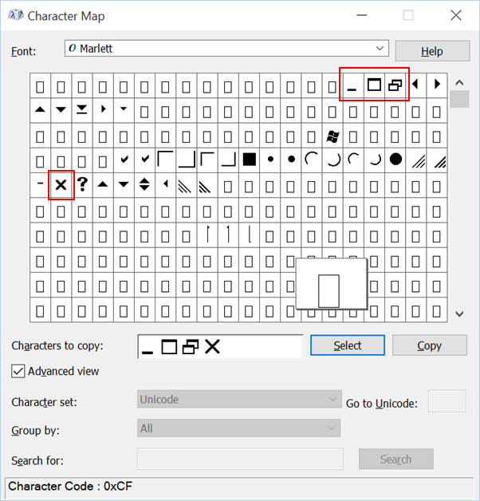

If you would like to manually add a Minimize, Restore Down, Maximize or Close characters to your application, you can do so by using the Marlett font. You can see the characters if you open Character Map and select Marlett, as seen below.

\[caption id="attachment\_134" align="aligncenter" width="602"\] Marlett character mapping\[/caption\]

If you would like to use these characters in your XAML, all you need to do is refer to the font and the text character position (the hex you see in the tooltip of the character mapping).

The code below shows all four symbols as seen in the picture above. Each starts with and ends with a semi-colon.

\[code lang="xml"\]

<TextBlock FontFamily="Marlett" Text="&#x 030;&#x 031;&#x 032;&#x 072;" FontSize="20" />

\[/code\]

Note that I intentionally added a space after as there is an issue with WordPress/HTML and the rendering. If you want to use it, remove the space.
