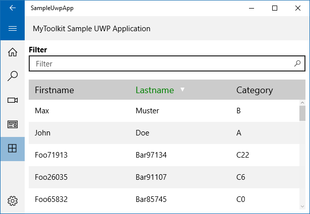

If you're coming from Windows Forms or WPF, odds are you'll have used DataGrid or DataGridView. Neither is available in UWP. The following are the alternatives available to you. EDIT - note that I'll be listing free alternatives. There are other paid alternatives out there.

#### EDIT 25 June 2017

I wrote this post back in Oct 2015, back when Windows Phone was still a thing.

MS still doesn't have a DataGrid control in UWP. The simple answer to readers today is to just get the [Telerik DataGrid control](http://www.telerik.com/universal-windows-platform-ui/grid). It's free. From what I understand, it's part of the [Windows Template Studio](http://developer.telerik.com/topics/net/announcing-windows-template-studio/).

#### Why DataGrid?

They are great for display a lot of information in a grid format. It also allows in-grid editing, sorting, grouping and more.

\[caption id="attachment\_224" align="aligncenter" width="676"\] Example DataGrid from an [MSDN Blog](http://blogs.msdn.com/b/vinsibal/archive/2008/08/25/wpf-datagrid-sample-add-a-preview-tooltip-to-a-scrollviewer.aspx)\[/caption\]

#### Why No DataGrid in UWP?

This control hasn't been around since Windows 8 was introduced. The reason for this is that Windows 8 was all about creating touch-based applications. DataGrid isn't touch friendly.

UWP is different Windows 8/8.1 app development. UWP is about catering to all types of devices and different inputs. That includes desktop (large screen) and mouse users. I had hoped there would be something like DataGrid but still nothing.

The following are the options I found. Note that I strongly recommend option 3.

#### Option 1: MyToolkit.Extended

This is available as a NuGet package within Visual Studio. It's also an open-source project ([here's the link to GitHub](https://github.com/MyToolkit/MyToolkit)). For the grid you want the [MyToolkit.Extended](https://www.nuget.org/packages/MyToolkit.Extended) nuget package.

\[caption id="attachment\_215" align="aligncenter" width="615"\] Sample grid using MyToolkit.Extended. [Photo taken from StackOverflow](http://stackoverflow.com/questions/12228119/create-a-table-datagrid-in-windows-8-metro-apps-c-xaml)\[/caption\]

I liked that it was open-source, you could sort columns and do other basic things like set alternate row colours.

In the end I found it was like a slightly more intelligent GridView. It's strength is primary displaying static content. It was possible to add editable cells, such as a Textbox, but it was problematic (i.e. the sort had issues) and it didn't look as good. There was also a whole host of other features I wanted.

That being said, it is open source so you can edit/extend it as you see fit.

Summary: I found it good for displaying dataand sorting columns but that's about it. I could use this for simple scenarios.

#### Option 2: Syncfusion

There are several control vendors with DataGrids. Syncfusion is one of them. As I write this, they have a collection of 35 controls for UWP.

The reason I suggest them is that they have a "community edition" licence - much like Visual Studio - meaning it's free for teams of 5 or less and with revenues under $1M USD. Otherwise it's $400 USD (as I write this).

\[caption id="attachment\_217" align="aligncenter" width="660"\] The Syncfusion demo application for their DataGrid\[/caption\]

The grid is impressive. It does pretty much everything I could ask for and plenty more. Using it and integrating it was a piece of cake, especially with all the same code.

In the sample application their DataGrid control is marked as being in preview. The one worrying problem I noticed was that it was slow in loading the first time. It's only a brief, but noticeable, lag on my relatively grunty Surface Pro 3. I could see in the VS2015 performance tool that there was a clear uptick in RAM usage. This made me wonder: how would it work on a lower-end device? And do I want to use this when it's only in Preview? Perhaps these two issues will get ironed out over time.

Another issue is that it is closed source. After spending years relying on third party controls, only to find out they have bugs in specific situations, I have to admit I feel a bit wary of committing to use it - especially as I'm not paying for it and may not have access to support or future upgrades in the future.

Summary: fantastic product and I'm sure they will iron out the speed issue in a future release. But keep in mind it's closed source and has limitations on number of users, etc.

#### Option 3: Use a Different Design

When I was initially researching a solution I saw this second answer on a [StackOverflow article](http://stackoverflow.com/questions/12228119/create-a-table-datagrid-in-windows-8-metro-apps-c-xaml). To quote from Jim O'Neil:

> You don't want to 'lift and shift' paradigms you've used before, but rather embrace the unique features of the platform, like its touch first nature, to rethink the navigation and build a new type of application

If we have this in mind, how should we approaching our problem?

Our primary goal with UWP should be to have content that can laid out / workable across different screen sizes and inputs types. A DataGrid, with lots of columns, will suck on small screens and those primarily requiring touch.

Why do we currently use the DataGrid? The functionality we want is:

- Handle a lot of data
- Enable adding
- Enable editing / deleting of specific data (once the user finds the record(s) they want)
- Have some form of functionality to enable a basic search

A better solution is to look at how you can use [UI Guides for GridView and ListView](https://msdn.microsoft.com/en-us/library/windows/apps/hh465465.aspx). A good model is the Master-Detail model you see in the People application.

\[caption id="attachment\_220" align="aligncenter" width="660"\] The People app in Windows 10 (aka Contacts)\[/caption\]

In the picture above, you'll see the area in white. This is the "Master" section containing a GridView, which shows a summary of the data (the person's name and photo). To help you search for data you have a Search field as well as a SemanticZoom. There is also an Add button. On a small screen, this Master pane could be displayed by itself.

On the right hand side is the Detail section where you can view all the information, edit the info and more. This too can be displayed by itself on a small screen. Best of all: we're free of the limitations of displaying and/or editing data within a cell.

Using this Master-Detail model we can meet all our basic requirements, be touch friendly and support different screen sizes.

This model can also be extended or tweaked to meet additional requirements. For example: if you want your customers to easily view People by their home country, you could have an option in the master pane to group by Country and change the item view so it clear indicates the country and maybe even displays a flag by their name.

Before you say ".... but what about situation X where I use DataGrid?", ask yourself why you want to use this model, how users primarily use your grid and if it really makes sense to just display all this info to users?

#### Conclusion

There are options available if you want something akin to a DataGrid but, before you use one, seriously consider an alternative design. I'm a long-time user of DataGrid and the like and, the more I think about it, the more I think I should be moving on.
