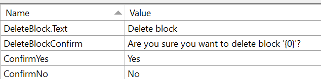

I'll demonstrate how to access strings defined in your resources via code.

#### Background

If you are writing a multi-lingual application or just want to have a central store of all your string resources, the use of resw is the way to go. The concept has been around for ages. In UWP we have resw files.

If you are using resw, you then hook up the resource strings to your UI using the x:Uid tag.

\[caption id="attachment\_257" align="aligncenter" width="634"\] Sample strings from resw\[/caption\]

If we wanted to use the DeleteBlock.Text on a label, it would look something like this. Note that it automatically applies the text to the .Text property. As such, you could

\[code language="xml"\] <TextBlock x:Uid="DeleteBlock" /> \[/code\]

As an aside, I highly recommend the use of the [Multi-lingual App Toolkit](https://dev.windows.com/en-us/develop/multilingual-app-toolkit). It allows you to easily manage your translations and can use Bing and pre-existing Microsoft translations to help translate strings in your app.

#### Accessing strings via Code

You need to access the ResourceLoader class. It's relatively straightforward - first get the resources for the current view and then call GetString. I collected the resource loader via code behind on my main page.

\[code language="csharp"\] var res = ResourceLoader.GetForCurrentView(); var deleteText = res.GetString("DeleteBlock/Text"); var confirmYes = res.GetString("ConfirmYes"); \[/code\]

If you want to access a string such as DeleteBlock.Text you cannot put a period. Instead, put a /
