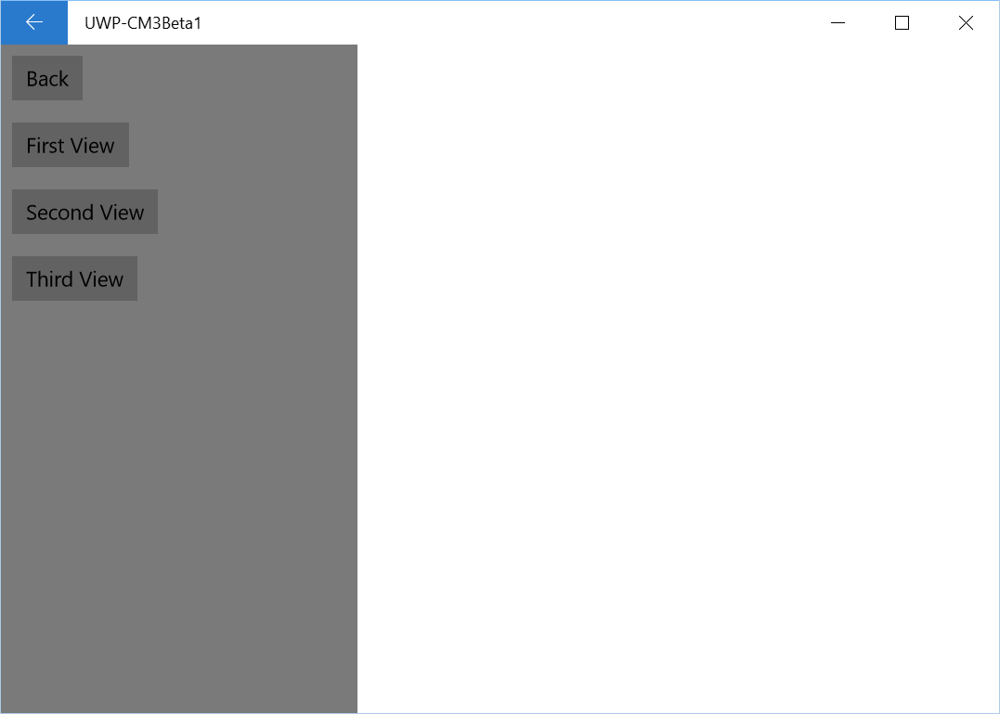
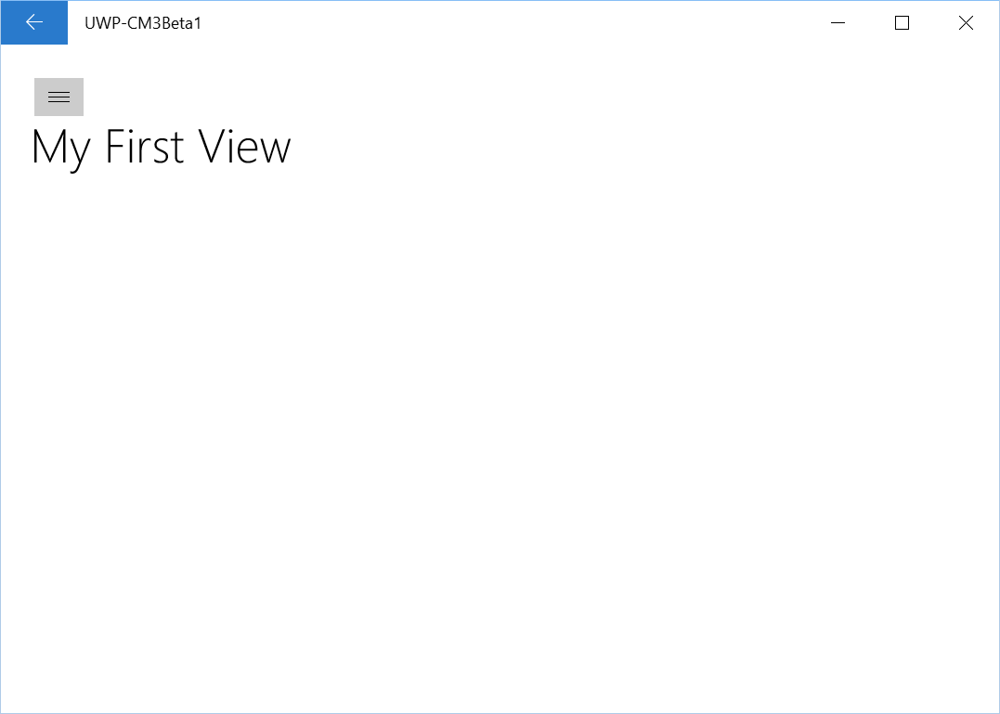
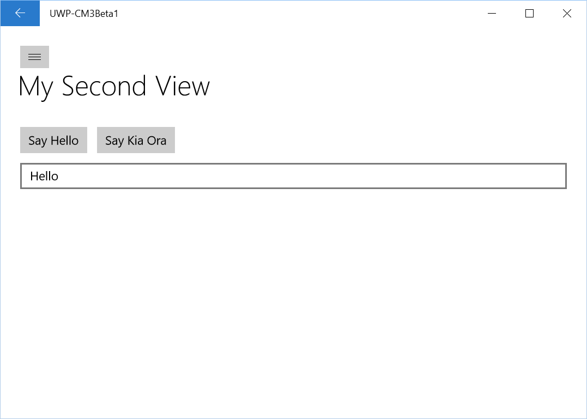

The SplitView is, in my opinion, the most important control in the new Windows 10 universe. Getting it to work with version 2.0.2 of Caliburn.Micro is not an option but you can as of 3.0.0 Beta 1. Let's walk through it.

The inspiration from this post came from working through the [HelloUWP](https://github.com/Caliburn-Micro/Caliburn.Micro/tree/3.0.0/samples/Caliburn.Micro.HelloUWP) sample project. I'll use what I learned from this sample project to demonstrate how to use the SplitView with Caliburn.Micro to display a bunch of different view models. [You can download the full code here](http://1drv.ms/1JxETbL).

If you are new to Caliburn Micro in UWP, [check out my previous post on how to integrate it in your project](http://liftcodeplay.com/2015/08/20/windows-10-uwp-and-caliburn-micro/) before you start!

**Update 14 March 2016:** You can use Caliburn Micro 3.0.0 (stable). You no longer need to use the Beta version.

#### Quick word about the SplitView

The SplitView has two main parts: the pane and the content. The pane contains your menu options and the content, as the name implies, is what you use your menu to display or manipulate. For example: if you have an option called "Users" in the pane, then show your Users page in the content.

The [SplitView UI guidelines](https://msdn.microsoft.com/en-us/library/windows/apps/dn997787.aspx) are worth a read. There's more detail [in the Microsoft documentation](https://msdn.microsoft.com/library/windows/apps/windows.ui.xaml.controls.splitview.aspx) but I find their example quite poor.

\[caption id="attachment\_105" align="aligncenter" width="300"\] Image by Microsoft\[/caption\]

I'm assuming you want your menu options to show different pages - that's the point of this article. If you're a Caliburn.Micro user, you want to do it by calling your ViewModels, with minimal code-behind while also having support navigation - back and forward. Thankfully 3.0.0 beta 1 has what you need.

#### Setting up your Project with 3.0.0 Beta 1

- Open VS 2015
- Start > New Project > Visual C# > Windows > Universal > **Blank App (Universal Windows)**
- Enter a name and path of your project
- Up to you if you want Application Insights. You can always add it later. Note that you need an Azure account for Application Insights
- Create folders called **Views** and **ViewModels**
- Open NuGet, get Caliburn.Micro 3.0.0 beta 1. If you don't see it, make sure to look for prereleases

#### Create some Views and ViewModels

So at this point I want to create three views, with their accompanying ViewModels. I'm going to keep it very simple. In two of the pages I'll just display some unique and only display some text but in the third I'll add some buttons and a textbox - just to demonstrate CM is working. The ViewModels inherit from Screen. So nothing fancy. [Checkout the sample project if you haven't already](http://1drv.ms/1JxETbL).

One thing to point out in this sample code is that we're using the "Overlay" style of SplitView, meaning the pane is hidden by default. That's why we have a separate button to open it. You don't need to do this in your project. I'm just too lazy, in my code, to set it up properly with some icons.

#### ShellView

The one key thing here, which the HelloUWP sample demonstrated, is their "ShellView". The purpose of this view is to hold the SplitView. From here we call the other views from this view.

\[code language="xml"\] &amp;lt;Page x:Class=&quot;Caliburn.Micro.HelloUWP.Views.ShellView&quot; xmlns=&quot;http://schemas.microsoft.com/winfx/2006/xaml/presentation&quot; xmlns:x=&quot;http://schemas.microsoft.com/winfx/2006/xaml&quot; xmlns:cm=&quot;using:Caliburn.Micro&quot; xmlns:d=&quot;http://schemas.microsoft.com/expression/blend/2008&quot; xmlns:mc=&quot;http://schemas.openxmlformats.org/markup-compatibility/2006&quot; mc:Ignorable=&quot;d&quot;&amp;gt;

&amp;lt;Page.Resources&amp;gt; &amp;lt;SolidColorBrush x:Key=&quot;AccentBrush&quot; Color=&quot;#FF34495E&quot; /&amp;gt; &amp;lt;/Page.Resources&amp;gt;

&amp;lt;Grid Background=&quot;{ThemeResource ApplicationPageBackgroundThemeBrush}&quot;&amp;gt; &amp;lt;SplitView x:Name=&quot;NavigationView&quot; DisplayMode=&quot;Overlay&quot; OpenPaneLength=&quot;150&quot;&amp;gt; &amp;lt;SplitView.Pane&amp;gt; &amp;lt;StackPanel Background=&quot;{ThemeResource AccentBrush}&quot;&amp;gt; &amp;lt;Button x:Name=&quot;PleaseGoBack&quot; Content=&quot;Go Back&quot; Margin=&quot;24&quot; /&amp;gt; &amp;lt;Button x:Name=&quot;ShowDevices&quot; Content=&quot;Device Specific Views&quot; Margin=&quot;24&quot; /&amp;gt; &amp;lt;Button x:Name=&quot;SecondView&quot; Content=&quot;My Second View&quot; Margin=&quot;24&quot; /&amp;gt; &amp;lt;Button x:Name=&quot;ThirdView&quot; Content=&quot;My Third View&quot; Margin=&quot;24&quot; /&amp;gt; &amp;lt;/StackPanel&amp;gt; &amp;lt;/SplitView.Pane&amp;gt; &amp;lt;SplitView.Content&amp;gt; &amp;lt;Grid&amp;gt; &amp;lt;Frame cm:Message.Attach=&quot;\[Event Loaded\] = \[SetupNavigationService($source)\]&quot; DataContext=&quot;{x:Null}&quot; /&amp;gt; &amp;lt;Button Click=&quot;OpenNavigationView&quot; Content=&quot;&quot; FontFamily=&quot;{ThemeResource SymbolThemeFontFamily}&quot; VerticalAlignment=&quot;Top&quot; Margin=&quot;24&quot; /&amp;gt; &amp;lt;/Grid&amp;gt; &amp;lt;/SplitView.Content&amp;gt; &amp;lt;/SplitView&amp;gt; &amp;lt;/Grid&amp;gt; &amp;lt;/Page&amp;gt; \[/code\]

The key thing to pickup above is the Frame element. We're define the content of the SplitView to be a Frame. Our pages will live within it and that means we can then navigate forward/back to other pages. The SetupNavigationService method registers the frame in the WinRTContainer object, as we'll see below.

\[code language="csharp"\] using Windows.UI.Xaml.Controls; using Caliburn.Micro;

namespace UWP\_CM3Beta1.ViewModels { public class ShellViewModel : Screen { private readonly WinRTContainer \_container; private INavigationService \_navigationService;

public ShellViewModel(WinRTContainer container) { \_container = container; }

public void SetupNavigationService(Frame frame) { \_navigationService = \_container.RegisterNavigationService(frame); }

public void PleaseGoBack() { if (\_navigationService.CanGoBack == false) return;

\_navigationService.GoBack(); }

public void OpenFirstView() { \_navigationService.For().Navigate(); }

public void OpenSecondView() { \_navigationService.For().Navigate(); }

public void OpenThirdView() { \_navigationService.For().Navigate(); } } } \[/code\]

#### End Result

Here's what my app looks like:

#### Questions

I'll be honest - there are a few things I don't quite get with this release. The main one is why I didn't need to add Behaviours SDK in order to get it working. **EDIT 02 Sept 2015** - I confirmed we don't need to add this anymore to our projects!
