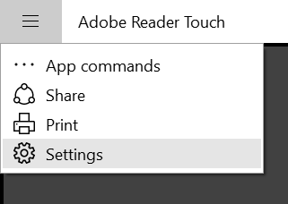
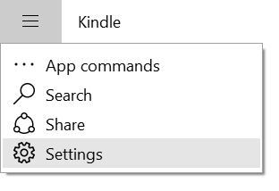

Want to know you can determine if an application in Windows 10 was written for the Windows 8 / 8.1 store? I'll show you an easy method.In Windows 8 and 8.1 we had the charms bar where you were meant to store settings, perform search and more.

These applications are still available in the Windows Store but the charm bar no longer exists (hooray). To provide backward compatibility in Windows 10, Microsoft simply moved those options into a default menu in the top-left of the application, as seen below.

Point is: if you see the following common menu, you're looking at an application written for Windows 8 / 8.1. It's not a UWP.  
