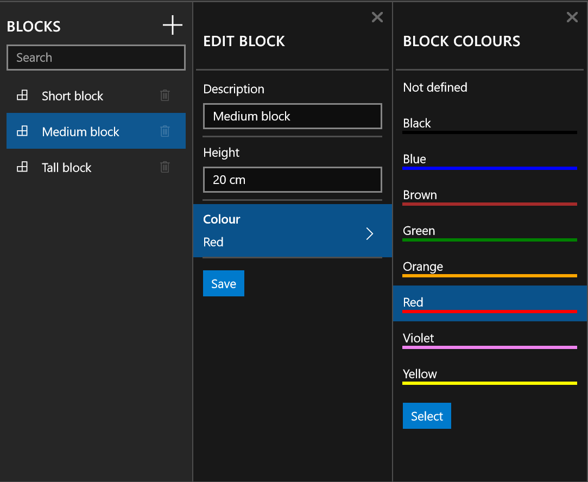

The following is a source code example of the “Blade” system demoed in an [earlier post](http://liftcodeplay.com/2015/11/12/design-pattern-blades-for-sequential-data-entry-wizards-in-uwp/) as well as a brief explanation.

#### Code

If you would like to get straight into the code, [click here](https://onedrive.live.com/redir?resid=A69EFEE89F2C010E!54085&authkey=!AMWUN7HmtpY3Bwc&ithint=file%2czip).

#### Sample Application

Following is what the sample app looks like. I’ll explain it piece by piece. It allows you to define a basic “Block” and then select it’s colour. Once done you can save it and it will show up in a list of all the blocks.

#### Pre-requisites

I’m using Caliburn Micro 3.0.0 Beta 1. It has support for UWP and I’m going to make use of the (very handy) event aggregator.

#### So how does it work?

We start by opening the BladeShellView. In the XAML file, it’s just a horizontal GridView which will display all the blades (each blade is a page). In the View Model, we handle the open/close events.

Events can be handled by multiple view models. In the case of the Colour select blade, the close event is handled by the Add/Edit Colour blade, in order to update the selected colour, but also by the shell view model to keep track of what blades are visible.

#### Search Blade

The first blade is automatically added. From here you’ll be able to search and delete for items. You can add an item or click an existing one to edit it.

#### Add Block Blade and Colour Blade

The add block requires the description is entered before you can save. I have UI validation code that I’m experimenting with so I didn’t include it with this demo. Note: if you don’t have a description, you won’t be able to save.

Where the two blades come together is in what I call the “expander”. It’s a listview with a single item. I did this because I wanted the default look & feel (i.e. it can be selected, you can hover it). It could have been done differently with a bit of styling. Anyway, the key point is that whenever you select a colour item, it updates the text within the expander.

#### Code

[Here you go – enjoy!](https://onedrive.live.com/redir?resid=A69EFEE89F2C010E!54085&authkey=!AMWUN7HmtpY3Bwc&ithint=file%2czip)
