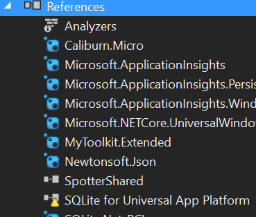
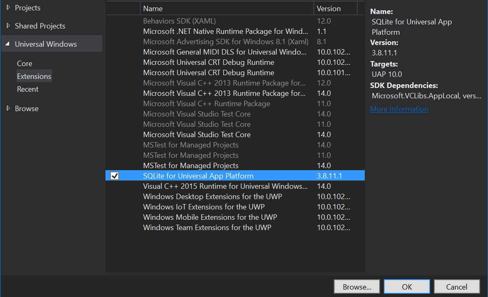

So Visual Studio has told you there's an update to SQLLite for UWP. You install it, restart Visual Studio and your project is broken. Here's how to fix it.

I'm writing these instructions mostly for myself. I keep going through a cycle of worry/confusion -> research/muck around -> solution/relief.

#### Steps

1. Download and install the SQLite update
2. Restart Visual Studio and re-open your project
3. Go into references and expand. Note the small yellow diamond. Right-click and remove **SQLite for Universal App Platform.** 
4. Re-add the reference (to the latest version) by right-click References -> Add Reference and select ****SQLite for Universal App Platform****
    
    \[caption id="attachment\_188" align="aligncenter" width="1180"\] The reference you need to add to your project\[/caption\]

Done!
