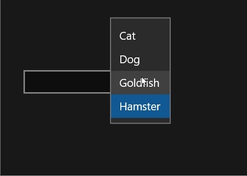

Looking for a ComboBox that has an editable textbox - allowing you to either pick a pre-selected item or enter something else? Here's a simple implementation.

## Background

Turns out that, as of WinRT (Windows 8) and onwards, ComboBoxes have a (read-only) textblock field. This is a pain if you wanted to handle the scenario where users could either select a pre-existing item or type in something different.

I have seen a few implementations floating around where, in the ComboBoxItems, the first item was always an editabled TextBox. If you entered text it would then add to the list. But this still wasn't the behaviour I was after.

## ComboBoxTextBoxControl

I created a user control that gives me behaviour I'm after, as seen below.

In a nutshell, what I did was:

- Create a UserControl I called ComboBoxTextBoxControl
- Added a ComboBox and TextBox
- Modified the TextBox template to remove the delete button (the X that shows up in the right when you have text)
- Modified the ComboBox template so that there is no border, background and the minimum width is 32
- In code-behind, if you selected an item it would put the content into the textbox
- Added properties to accept a binding (i.e. a list of pets) and to get what was selected (so we can bind this in the form)

## The Code

Here you go. It's long but only because of the custom templates. Once you get past that, you'll see that the rest of my code is quite simple.

Firstly, here is the code behind

\[code lang="csharp"\] using Windows.UI.Xaml.Controls; using Windows.UI.Xaml.Data;

namespace MyCode.Controls { /// 
 /// UserControl where a ComboBox also has an editable TextBox /// 

public sealed partial class ComboBoxWithTextBox : UserControl { public ComboBoxWithTextBox() { InitializeComponent(); }

public object ComboBoxTextItems { set { comboBox.SetBinding(ItemsControl.ItemsSourceProperty, value as Binding); } }

public object SelectedComboBoxTextItem { set { textBox.SetBinding(TextBox.TextProperty, value as Binding);} }

private void comboBox\_SelectionChanged(object sender, SelectionChangedEventArgs e) { textBox.Text = comboBox.SelectedItem as string; } } } \[/code\]

Here's the XAML

\[code lang="xml"\] <UserControl x:Class="MyCode.Controls.ComboBoxWithTextBox" xmlns="http://schemas.microsoft.com/winfx/2006/xaml/presentation" xmlns:x="http://schemas.microsoft.com/winfx/2006/xaml" xmlns:local="using:MyCode.Controls" xmlns:d="http://schemas.microsoft.com/expression/blend/2008" xmlns:mc="http://schemas.openxmlformats.org/markup-compatibility/2006" mc:Ignorable="d" d:DesignHeight="50" d:DesignWidth="300">

<UserControl.Resources> <!-- In this combobox style I stripped the borders and reduced the minimum width to just 32 --> 

<!-- Removed the delete button from the textbox --> 

</Grid.Resources> <Grid.ColumnDefinitions> <ColumnDefinition Width="\*" /> <ColumnDefinition Width="Auto" /> </Grid.ColumnDefinitions> <Grid.RowDefinitions> <RowDefinition Height="Auto" /> <RowDefinition Height="\*" /> </Grid.RowDefinitions> <VisualStateManager.VisualStateGroups> <VisualStateGroup x:Name="CommonStates"> <VisualState x:Name="Disabled"> <Storyboard> <ObjectAnimationUsingKeyFrames Storyboard.TargetProperty="Foreground" Storyboard.TargetName="HeaderContentPresenter"> <DiscreteObjectKeyFrame KeyTime="0" Value="{ThemeResource SystemControlDisabledBaseMediumLowBrush}" /> </ObjectAnimationUsingKeyFrames> <ObjectAnimationUsingKeyFrames Storyboard.TargetProperty="Background" Storyboard.TargetName="BackgroundElement"> <DiscreteObjectKeyFrame KeyTime="0" Value="{ThemeResource SystemControlDisabledTransparentBrush}" /> </ObjectAnimationUsingKeyFrames> <ObjectAnimationUsingKeyFrames Storyboard.TargetProperty="Background" Storyboard.TargetName="BorderElement"> <DiscreteObjectKeyFrame KeyTime="0" Value="{ThemeResource SystemControlBackgroundBaseLowBrush}" /> </ObjectAnimationUsingKeyFrames> <ObjectAnimationUsingKeyFrames Storyboard.TargetProperty="BorderBrush" Storyboard.TargetName="BorderElement"> <DiscreteObjectKeyFrame KeyTime="0" Value="{ThemeResource SystemControlDisabledBaseLowBrush}" /> </ObjectAnimationUsingKeyFrames> <ObjectAnimationUsingKeyFrames Storyboard.TargetProperty="Foreground" Storyboard.TargetName="ContentElement"> <DiscreteObjectKeyFrame KeyTime="0" Value="{ThemeResource SystemControlDisabledChromeDisabledLowBrush}" /> </ObjectAnimationUsingKeyFrames> <ObjectAnimationUsingKeyFrames Storyboard.TargetProperty="Foreground" Storyboard.TargetName="PlaceholderTextContentPresenter"> <DiscreteObjectKeyFrame KeyTime="0" Value="{ThemeResource SystemControlDisabledChromeDisabledLowBrush}" /> </ObjectAnimationUsingKeyFrames> </Storyboard> </VisualState> <VisualState x:Name="Normal" /> <VisualState x:Name="PointerOver"> <Storyboard> <ObjectAnimationUsingKeyFrames Storyboard.TargetProperty="BorderBrush" Storyboard.TargetName="BorderElement"> <DiscreteObjectKeyFrame KeyTime="0" Value="{ThemeResource SystemControlHighlightChromeAltLowBrush}" /> </ObjectAnimationUsingKeyFrames> <ObjectAnimationUsingKeyFrames Storyboard.TargetProperty="Opacity" Storyboard.TargetName="BackgroundElement"> <DiscreteObjectKeyFrame KeyTime="0" Value="{ThemeResource TextControlBackgroundHoverOpacity}" /> </ObjectAnimationUsingKeyFrames> </Storyboard> </VisualState> <VisualState x:Name="Focused"> <Storyboard> <ObjectAnimationUsingKeyFrames Storyboard.TargetProperty="Foreground" Storyboard.TargetName="PlaceholderTextContentPresenter"> <DiscreteObjectKeyFrame KeyTime="0" Value="{ThemeResource SystemControlPageTextChromeBlackMediumLowBrush}" /> </ObjectAnimationUsingKeyFrames> <ObjectAnimationUsingKeyFrames Storyboard.TargetProperty="Background" Storyboard.TargetName="BackgroundElement"> <DiscreteObjectKeyFrame KeyTime="0" Value="{ThemeResource SystemControlBackgroundChromeWhiteBrush}" /> </ObjectAnimationUsingKeyFrames> <ObjectAnimationUsingKeyFrames Storyboard.TargetProperty="Opacity" Storyboard.TargetName="BackgroundElement"> <DiscreteObjectKeyFrame KeyTime="0" Value="{ThemeResource TextControlBackgroundFocusedOpacity}" /> </ObjectAnimationUsingKeyFrames> <ObjectAnimationUsingKeyFrames Storyboard.TargetProperty="BorderBrush" Storyboard.TargetName="BorderElement"> <DiscreteObjectKeyFrame KeyTime="0" Value="{ThemeResource SystemControlHighlightAccentBrush}" /> </ObjectAnimationUsingKeyFrames> <ObjectAnimationUsingKeyFrames Storyboard.TargetProperty="Foreground" Storyboard.TargetName="ContentElement"> <DiscreteObjectKeyFrame KeyTime="0" Value="{ThemeResource SystemControlForegroundChromeBlackHighBrush}" /> </ObjectAnimationUsingKeyFrames> <ObjectAnimationUsingKeyFrames Storyboard.TargetProperty="RequestedTheme" Storyboard.TargetName="ContentElement"> <DiscreteObjectKeyFrame KeyTime="0" Value="Light" /> </ObjectAnimationUsingKeyFrames> </Storyboard> </VisualState> </VisualStateGroup> <VisualStateGroup x:Name="ButtonStates"> <VisualState x:Name="ButtonVisible"> <Storyboard> <!--<ObjectAnimationUsingKeyFrames Storyboard.TargetProperty="Visibility" Storyboard.TargetName="DeleteButton"> <DiscreteObjectKeyFrame KeyTime="0"> <DiscreteObjectKeyFrame.Value> <Visibility>Visible</Visibility> </DiscreteObjectKeyFrame.Value> </DiscreteObjectKeyFrame> </ObjectAnimationUsingKeyFrames>--> </Storyboard> </VisualState> <VisualState x:Name="ButtonCollapsed" /> </VisualStateGroup> </VisualStateManager.VisualStateGroups> <Border x:Name="BackgroundElement" Background="{TemplateBinding Background}" Grid.ColumnSpan="2" Margin="{TemplateBinding BorderThickness}" Opacity="{ThemeResource TextControlBackgroundRestOpacity}" Grid.Row="1" Grid.RowSpan="1" /> <Border x:Name="BorderElement" BorderBrush="{TemplateBinding BorderBrush}" BorderThickness="{TemplateBinding BorderThickness}" Grid.ColumnSpan="2" Grid.Row="1" Grid.RowSpan="1" /> <ContentPresenter x:Name="HeaderContentPresenter" Grid.ColumnSpan="2" ContentTemplate="{TemplateBinding HeaderTemplate}" Content="{TemplateBinding Header}" Foreground="{ThemeResource SystemControlForegroundBaseHighBrush}" FontWeight="Normal" Margin="0,0,0,8" Grid.Row="0" Visibility="Collapsed" x:DeferLoadStrategy="Lazy" /> <ScrollViewer x:Name="ContentElement" AutomationProperties.AccessibilityView="Raw" HorizontalScrollMode="{TemplateBinding ScrollViewer.HorizontalScrollMode}" HorizontalScrollBarVisibility="{TemplateBinding ScrollViewer.HorizontalScrollBarVisibility}" IsTabStop="False" IsHorizontalRailEnabled="{TemplateBinding ScrollViewer.IsHorizontalRailEnabled}" IsVerticalRailEnabled="{TemplateBinding ScrollViewer.IsVerticalRailEnabled}" IsDeferredScrollingEnabled="{TemplateBinding ScrollViewer.IsDeferredScrollingEnabled}" Margin="{TemplateBinding BorderThickness}" Padding="{TemplateBinding Padding}" Grid.Row="1" VerticalScrollBarVisibility="{TemplateBinding ScrollViewer.VerticalScrollBarVisibility}" VerticalScrollMode="{TemplateBinding ScrollViewer.VerticalScrollMode}" ZoomMode="Disabled" /> <ContentControl x:Name="PlaceholderTextContentPresenter" Grid.ColumnSpan="2" Content="{TemplateBinding PlaceholderText}" Foreground="{ThemeResource SystemControlPageTextBaseMediumBrush}" IsHitTestVisible="False" IsTabStop="False" Margin="{TemplateBinding BorderThickness}" Padding="{TemplateBinding Padding}" Grid.Row="1" /> <Button x:Name="DeleteButton" BorderThickness="{TemplateBinding BorderThickness}" Grid.Column="1" FontSize="{TemplateBinding FontSize}" IsTabStop="False" Margin="{ThemeResource HelperButtonThemePadding}" MinWidth="34" Grid.Row="1" Style="{StaticResource DeleteButtonStyle}" Visibility="Collapsed" VerticalAlignment="Stretch" /> </Grid> </ControlTemplate> </Setter.Value> </Setter> </Style>

</UserControl.Resources>

<Grid> <Grid.ColumnDefinitions> <ColumnDefinition Width="\*" /> <ColumnDefinition Width="Auto" /> </Grid.ColumnDefinitions>

<TextBox x:Name="textBox" Grid.Column="0" VerticalAlignment="Top" Canvas.ZIndex="-1" TabIndex="0" Style="{StaticResource UCTextBoxStyle}" />

<ComboBox x:Name="comboBox" Grid.Column="0" BorderThickness="0" Background="Transparent" Width="32" TabIndex="1" HorizontalAlignment="Right" Style="{StaticResource UCComboBoxStyle}" SelectionChanged="comboBox\_SelectionChanged" />

</Grid> </UserControl> \[/code\]

And finally here is the code showing how you could use it in your XAML page

\[code lang="xml"\] <Grid> <controls:ComboBoxWithTextBox ComboBoxTextItems="{Binding PetTypes}" SelectedComboBoxTextItem="{Binding SelectedPet, Mode=TwoWay}" Width="150" HorizontalAlignment="Left" />

</Grid> \[/code\]
