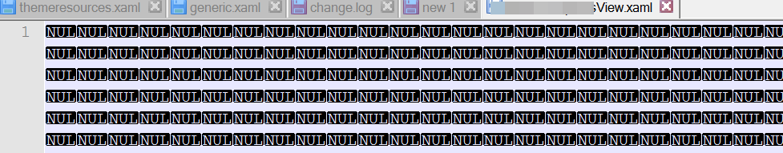

Encountered this error with Visual Studio? I'll show you what I've done to fix it.

'.', hexadecimal value 0x00, is an invalid character. Line 1, position 1

If you are getting this message, then I feel for you. It's happened to me twice and it's intensely frustrating. You may see this error as well as a whole bunch of other, nonsensical errors.

**The problem is Visual Studio has corrupted an XML or XAML file. You need to hunt down the particular file and either revert back to a preview copy or delete it.** Visual Studio will be of no help in narrowing down the source.

Below is a picture of a XAML page that became corrupt. In Visual Studio is looked empty but this is what it looked like in Notepad++. Whole lotta nulls.

