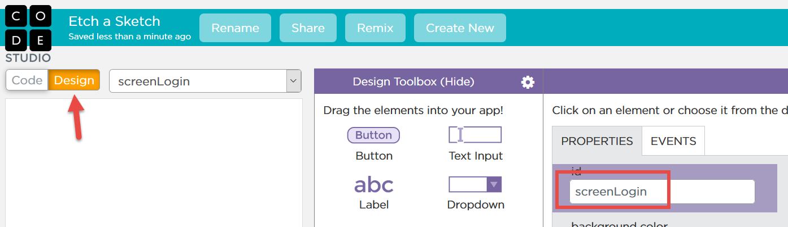
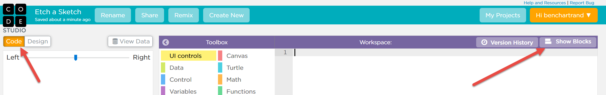
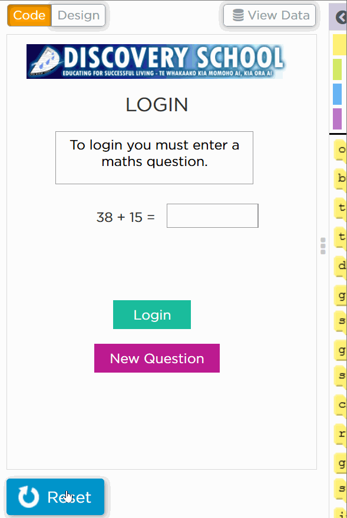

The following instructions will show you [how to create this game](https://studio.code.org/projects/applab/hzjXmsg8DK3pZpzQC8Rs_g). It's designed to work on your phone! Note that you need to select that you are 13 or older to run the application (don't worry - it's perfectly kid friendly!).

## Pre-requisites

You will need an account on code.org.

## The Application

There are two parts

1. A login screen where you must answer a maths question
2. If you answer correctly, you can run the etch-a-sketch application

That maths question is generated randomly. If you find it too difficult, click New Question.

\[gallery ids="595,596" type="columns"\]

## Log into Code.org

If you have an account already,  please login. Otherwise create an account.

[https://studio.code.org/users/sign\_in](https://studio.code.org/users/sign_in)

## Steps - Screen setup

Start by entering a name for your project: **Etch a Sketch**

\[gallery ids="606,607" type="slideshow"\]

Next we want to edit the screens. What you want to do is:

- Click **Design**
- Change the screen ID from screen1 to **screenLogin**

Next lets add another screen for the etch a sketch game

- Where you see screenLogin drop down (to the right of Design), click the drop down and select **New screen...**
- Change the screen name from screen2 to **screenGame**

\[gallery ids="622,625" type="slideshow"\]

## Steps - Login screen

At this point we are going to create the user interface for the login screen. There are numerous bits and pieces. The slideshow below will show you how I created it, step by step. Make sure to click Pause if you want to follow along.

The header image is optional. [This is the image I used](https://liftcodeplay.files.wordpress.com/2016/06/discovery-school.png).

\[gallery ids="636,637,638,639,640,641,642,643,644,645" type="slideshow"\]

You may be wondering why we have hidden labels. One is the error message, which we only display if the user makes a mistake. The others store the two number we will be adding.

## Step - Setup of Game Screen

Next we are going to setup the controls used in the game screen.

Select **screenGame** and add all these controls.

\[gallery ids="655,656,657,658,659,660" type="slideshow"\]

## Step - Code

This is where we put everything together.

Code.org allows you to drag and drop code, much like Scratch. Unfortunately it's difficult for me to grab pictures of this so I will show the code, piece by piece which you can copy and paste.

- Click **Code** (top left)
- Click **Show Text**. If you says Show Blocks, don't click it again
- Copy the code below and paste in the right part of the window

\[code lang="javascript"\] newQuestion();

function newQuestion() { setText("labelX", randomNumber(1,50)); setText("labelY", randomNumber(1,50));

setText("labelQuestion", getText("labelX") + " + " + getText("labelY") + " = "); }

onEvent("buttonLogin", "click", function(event) { console.log("buttonLogin clicked!"); var x = Math.abs(getText("labelX")); var y = Math.abs(getText("labelY"));

if (x + y == getText("textAnswer")) { console.log("Correct answer!"); setScreen("screenGame");

} else { console.log("Incorrect answer!"); showElement("labelIncorrect"); }

});

onEvent("buttonNewQuestion", "click", function(event) { console.log("buttonNewQuestion clicked!"); newQuestion(); });

// Whenever the value of the x-slider is being updated, // move the turtle to the x position specificied. onEvent("xSlider", "input", function(event) { hide(); penWidth(1); moveTo(getNumber("xSlider"), getY()); });

// Whenever the value of the y-slider is being updated, // move the turtle to the y position specificied. onEvent("ySlider", "input", function(event) { hide(); penWidth(1); moveTo(getX(), getNumber("ySlider")); });

\[/code\]

## Run the Program!

Click the **Run** button. The game should look something like this.

Make sure to click the Share link to try it on your phone. Get your parents to try it!

his..
