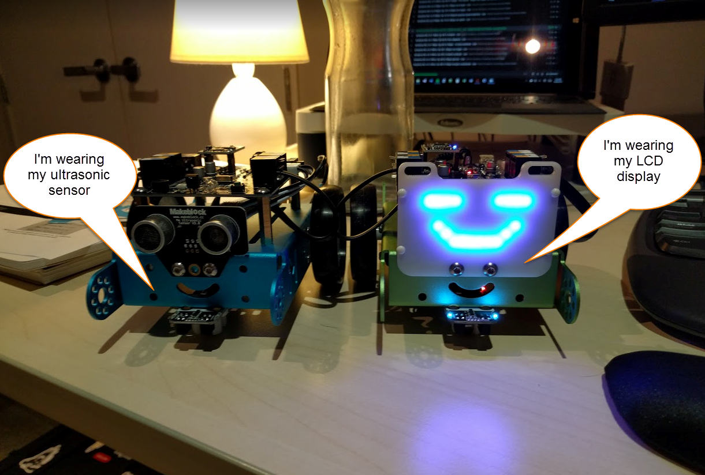
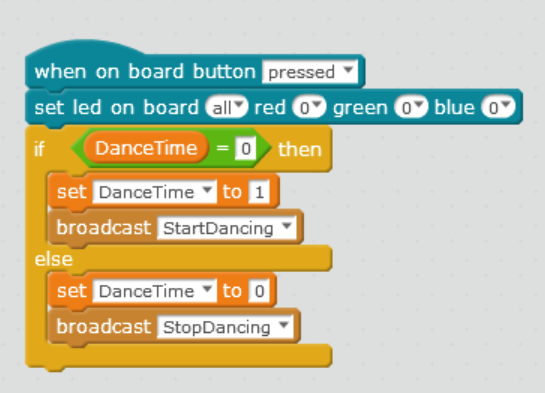
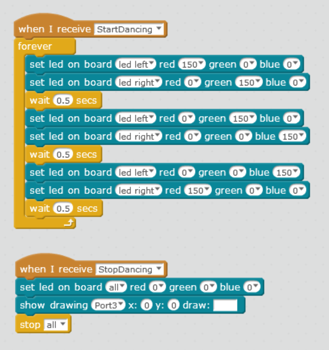
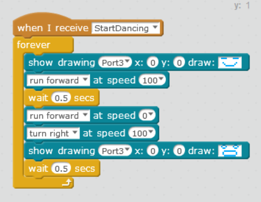
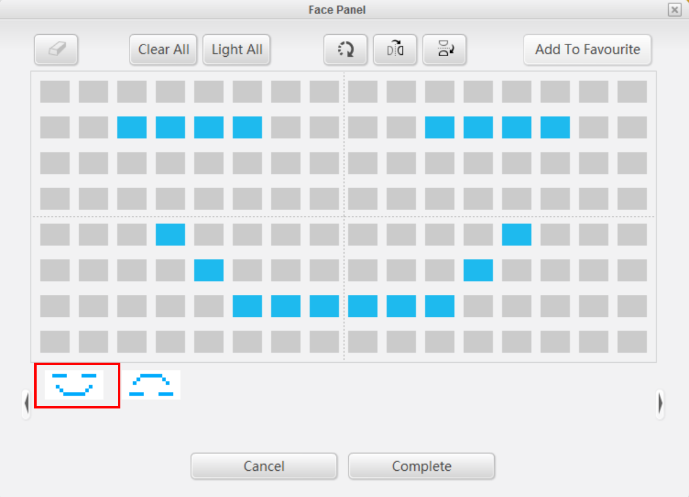
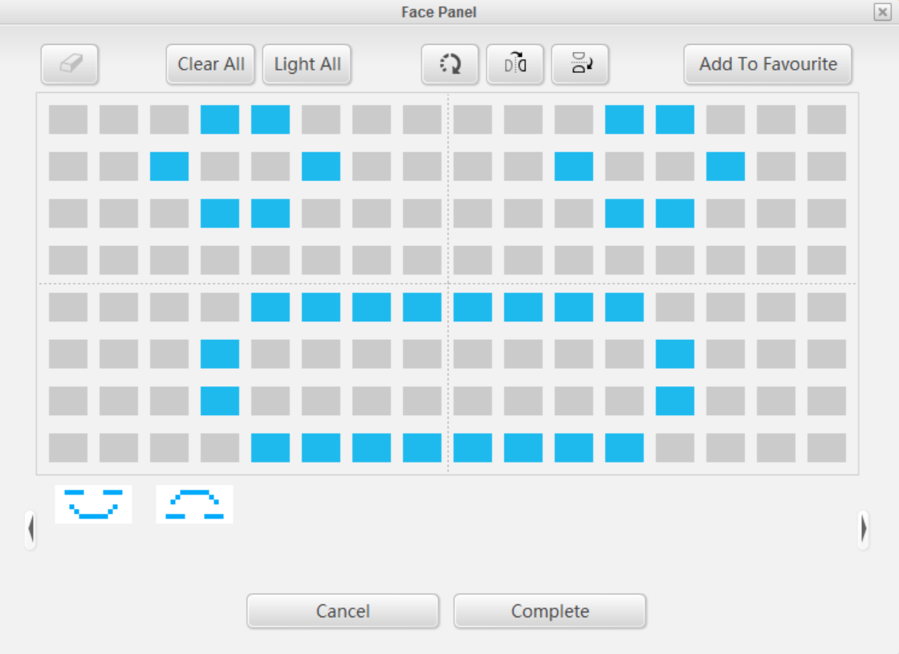

mBot loves to get it’s LED faceplace installed and go dancing. But first it needs the right program.

## Intro

This is what we'll be building - a dancing mBot with flashing lights and a changing expression (face) on the LCD display! All you need to do is press the button of the mBot for the action to begin!

\[wpvideo irVNqAmQ\]

## Hardware

mBot needs the correct faceplate installed. Make sure you have the LED display installed, not the default ultrasonic sensors.

\[caption id="attachment\_696" align="aligncenter" width="1221"\] We want the LCD display, seen on the right. By default, it won't be showing you a happy face but we'll fix that soon enough!\[/caption\]

Just make a note of which port your connect the LCD faceplate into. By that - I mean follow the wire from the back of the LCD display to wherever you plugged it in. They're all clearly numbered. In my case, it's port 3.

## First - some lights!

On the top of the mBot are some LEDs we can program. We need to handle the push button event.

Create a variable called **DanceTime** (under Data & Blocks).

Once you've done that, create this block of code

Once you've done that, we need to handle those two broadcasts - **StartDancing** and **StopDancing**

The StartDancing block changes the colours of the two LEDs. You can have fun changing it to whatever you like.

## Dance Face and Moves

mBot is only learning to dance. It (or perhaps he or she?) does a simple dance of moving forward, stopping, rotating about 90 degrees and repeating.

mBot is pretty happy each time it goes forward, which is why it's smiling. It thinks each turn is a bit crazy... hence the worried face!

Let's put it all together. We need to handle the StartDancing broadcast again.

**Make sure the port is set properly.** Remember: earlier I mentioned I'm using Port 3. You may be using something different

## How do you draw the face?

Good question! You add the show drawing item, then click on the square to the left of Draw. For the simply face I use  default smiley but for the worried expression, I drew my own.

## Let the Dance Party Begin!

Press the button on top of the mBot for the fun to begin!

\[wpvideo irVNqAmQ\]

Did you come up with some cool dance moves or light shows of your own? Tell me about in comments below!
