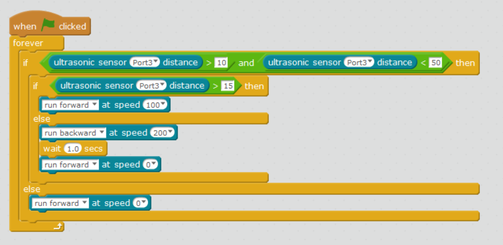

Our little mBot is having fun being a cat. She is willing to come close but.. doesn't want you to pet her.

\[wpvideo GFmz6Lo2\]

## Hardware

The first step is to install the ultrasonic sensor to the front of the mBot and connect it one of the ports (use the wire to connect it to port 1, 2, 3 or 4). **Make sure to note which port you are using**.

The ultrasonic sensors look like two eyes. You can also install a faceplate on the mBot, if you have one. It's also more if your mBot looks like a kitty!

## Ultrasonic Sensor?

Yep. The key word is "sonic" - sound! It works like sonar: send out a sound wave and see how long it takes back. You can then determine distance.

The following is the [more detailed description from Makeblock](http://learn.makeblock.com/en/me-ultrasonic-sensor/)

> The Me Ultrasonic Sensor comes with two “eyes”, one of which (marked with T) is an ultrasonic transmitter, the other of which (marked with R) is an ultrasonic receiver. The ultrasonic transmitter launches ultrasonic wave in a direction and start time-keeping at the launch. The ultrasonic wave spreads in the air, returns back immediately when meeting obstacles in the way, and stops time-keeping immediately when the ultrasonic receiver receives the reflected wave. The transmission speed of sonic wave in the air is 340 m/s. Use the time t recorded by the timer to calculate the distance s from the launching point to the obstacle, that is, s=340×t/2.

## Program

The program is relatively simple. The logic is:

- If mBot is far away do nothing
- If you are not too close or far away it will start come forward
- If mBot is too close it will run away (go backwards)

Remember to set your port to what you used on the mBot.

Also, the numbers you see (10, 50, 15) represent distance. Feel free to try changing these.

