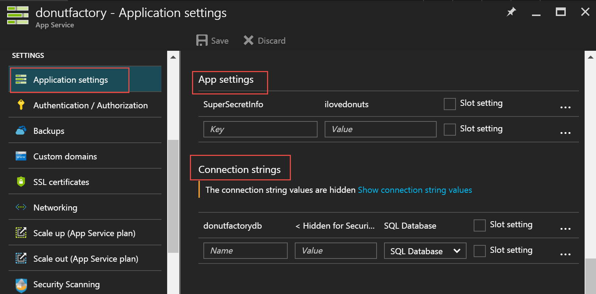

New to ASP.NET Core and not sure where to store configuration information in a secure fashion? Not how to implement this with Azure Web Apps? Let’s walk through it!

## TL;DR

- At a minimum, store your config info in appsettings.json
- DO NOT put in passwords and tokens in there. Instead, use the ASP Core Secrets function
- For Azure Web Apps, enter the sensitive info into the App settings area

## App Settings

When you are writing your application you will inevitably need to store configuration information such as a connection string to a database or an encrypted token for a third party service.

In ASP.NET Core you can specify numerous sources of configuration information, a common default being the appsettings.json file. [You can read more about the details here](https://docs.asp.net/en/latest/fundamentals/configuration.html).

Why is this cool?

- You can specify a hierarchy of sources
- You can use formats like JSON
- You can group config info into hierarchies
- You can configure the data to be stored in a nice settings class, to be provided via dependency injection
- You can also use the UserSecrets function to keep private information out of your source code

Here’s an example of a Startup:



The things to point out is that the configuration information is read according the order you set out. You’ll notice it will

- check an appsettings.json
- check one specific to my environment (defined by the ASPNETCORE\_ENVIRONMENT environment variable under Properties > Debug)
- check environment variables (more on that in a second)
- if it’s development mode, it will check your secrets

Here’s an example of a appsettings.json file



Before we go further – two quick side-notes.

## Quick note #1 - Environments

If you’re not familiar with environments in ASP.NET Core, think of it simply as a way of your code knowing you’re in development / staging / production, etc.

This is very useful in a bunch of scenarios. For example:

- If you’re in dev, you can tell ASP.NET Core to use un-minified JS you have locally BUT in production, used the minified version from the CDN
- You can setup different connection strings based on dev / staging / production
- Azure Web Apps have a very cool slot function. Each slot can have different environment variables and configuration information

[You can read more about it here.](https://docs.asp.net/en/latest/fundamentals/environments.html)

## Quick note #2 - User Secrets

Never put passwords or other sensitive information into source code and especially don’t commit it into source control.

A far better idea is to never put it in your source code in the first place. [You can read about in detail here](https://docs.asp.net/en/latest/security/app-secrets.html). TL;DR version: this tool stores the data in a separate file within your user profile.

In my code above you’ll see I told it to use secrets if I’m in development mode.

## Development mode – quick review

Let’s quickly review in development mode (on your PC): you’ll keep secrets in a separate file and other config info in something like your app.config.

If you wanted to test locally you could create an app settings file specific to that environment (i.e. appsettings.staging.json) and set the Environment Variable.

## What about Azure Web Apps?

When you deploy to Azure Web Apps, your app will be expecting the configuration information. If you do not provide it with the critical config info, you app may not run.

By default, the deployment tool within Visual Studio will not deploy your appsettings.json file. And let’s be clear: **DO NOT UPLOAD YOUR appsettings.json file**. You don’t want someone downloading the file...

Instead, go under your application, to Application settings. You’ll then see App settings and Connection strings. They store key pairs. Both are near identical in purpose except that Connection strings will automatically prefix the name with the type of the database.

- If you select “Sql Databases”, the prepended string is “SQLAZURECONNSTR\_”
- If you select “SQL Server” the prepended string is “SQLCONNSTR\_”
- If you select “MySQL” the prepended string is “MYSQLCONNSTR\_”
- If you select “Custom” the prepended string is “CUSTOMCONNSTR\_”

These settings will get loaded as Environment variables. Remember the code snippet: we got it to check environment variables. That’s how it will work.

If you look at our appsettings.json example above, you’ll notice it’s in a hierarchy. To enter it above, simply type one long string with colons separating each level i.e. ApplicationInsights:InstrumentKey

[You can read more about this on Scott Hanselman’s blog.](http://www.hanselman.com/blog/BestPracticesForPrivateConfigDataAndConnectionStringsInConfigurationInASPNETAndAzure.aspx)
