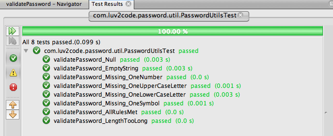

I spent years writing code but not writing unit tests. Feels like people had been doing it forever before I got into it. Now I do and so should you.

When I started my career many, as a new grad dev, testing primarily consisted of ensuring the code compiled. Back then the builds took all night on the fastest servers you could buy. If you broke that build you'd get a good spanking by your team.

As time went on I realized I wasn't that fond of creating bugs. Neither was my team or management. Plus there were those testers who seemed to get pleasure out of breaking my code so I had to put a stop to that!

I learned to write better code, to write more defensively, to test my code more vigorously and even (on occasion) writing test plans so I remember how to something again in the future.

Eventually I moved to smaller companies, which meant I was closer to the end user. I could feel their pain. They made of sharing it in phone calls and emails.

Bugs are inevitable. Especially as users find the most creative ways to break your software. The key is to resolve things quickly.

The problem was that, as the product got bigger and more complex, I realized I could easily break something I had already written. It was worse if I had written the code ages ago or someone else wrote it. Every change I made was a risk. How could I mitigate it?

**Wait a sec - QA will test it!** Yes, they will but it's not fair to assume it's "their problem" or that they'll know / catch everything or that they'll perform full regression testing every time. Manual testing is part of a larger series of tests steps including unit tests, integration tests, performance tests, etc.

Back in 2014 I watched a video on Channel 9 about [Unit Testing](https://channel9.msdn.com/Shows/Visual-Studio-Toolbox/Getting-Started-with-Unit-Testing-Part-1). I remember thinking: code that tests code? Interesting concept but I'm too busy trying to deliver code.

Clearly that wasn't a good excuse. I made time to learn and started getting into unit testing. They key tools were:

- a unit test framework (i.e. XUnit, NUnit, MSTest)
- a mocking tool (i.e. moq) and
- an tool or IDE (i.e. Visual Studio) to run the tests

I started by writing tests for new code or to 'document' small but important bug fixes. The latter is especially awesome. Turns out customers HATE IT when an old, nasty bug pops up again.

I'm the type of dev that likes to carefully debug code I've written, to ensure it's working precisely as expected. I realized I could "document" all these tests as unit tests! Then at any point I could then hit a button and, within seconds, find out if everything was good or not. Awesomeness!

**But it takes time to write unit tests!** Yes, they do, but I think of it as a basic investment. I already take the time to understand the requirements, the subject matter and to test the code as I write it. Why not spend a bit more time writing some unit tests? I'm sure your future self and coworkers will thank you.

As I worked through the [hype curve](https://en.wikipedia.org/wiki/Hype_cycle) I began to discover that unit tests aren't perfect. They won't catch everything nor should you spend huge amounts of time trying to write a perfect suite of tests.

To date unit tests have caught issues before the code left my PC and I've been very thankful for it.

I'm far from being an expert in unit testing and, one day, I might start using TDD (test driven development).

It's clear that, going forward, I can't imaging writing code without writing unit tests or working on projects without them. I'm just annoyed that I had started sooner.

BTW, check out Donovan Brown's post [No more excuses](http://donovanbrown.com/post/no-more-excuses).

