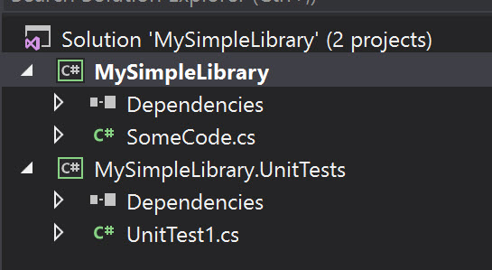
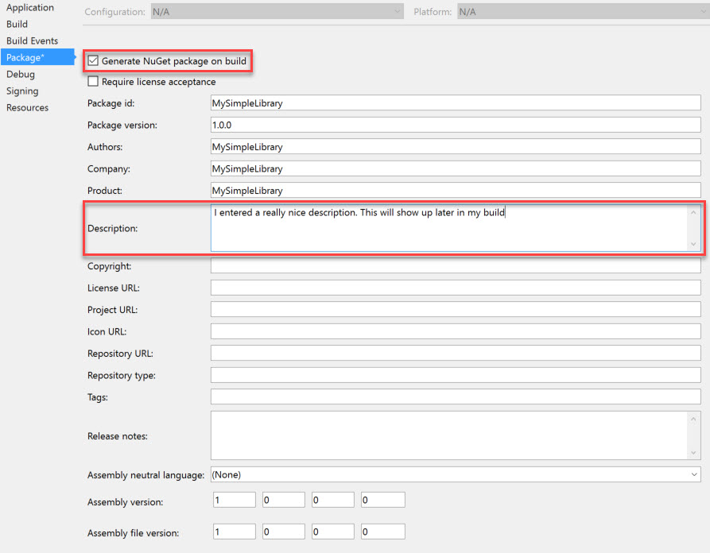
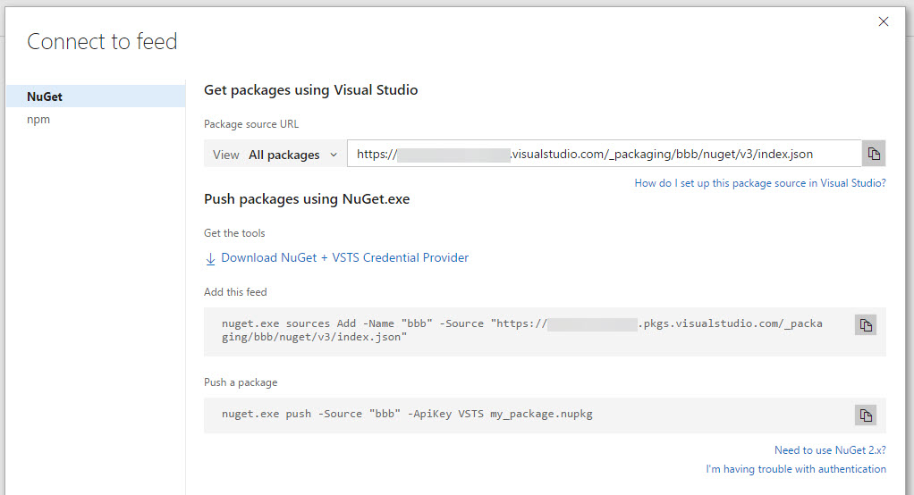
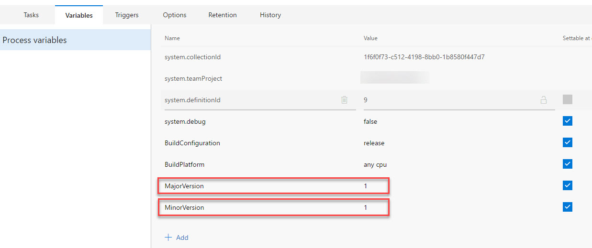
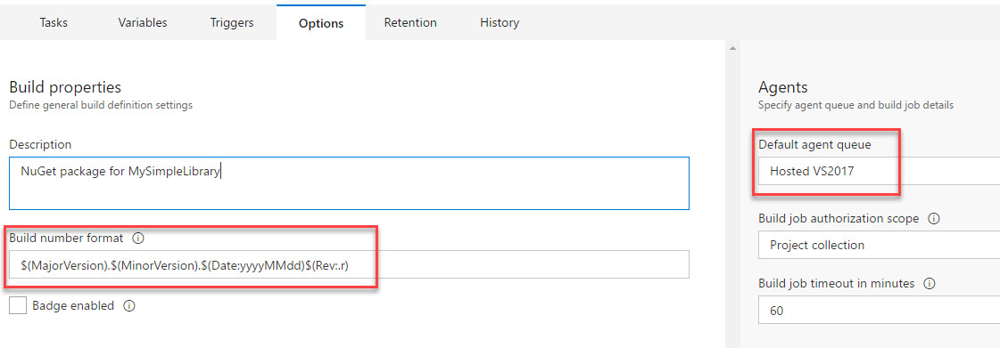
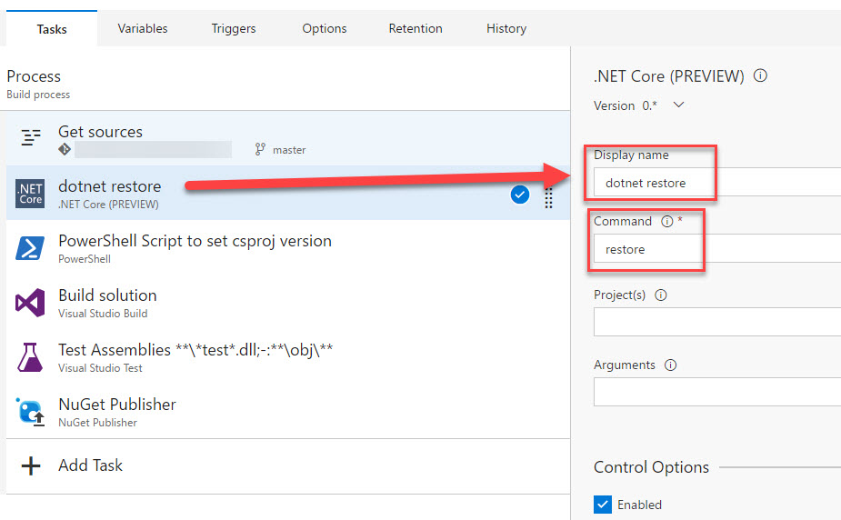
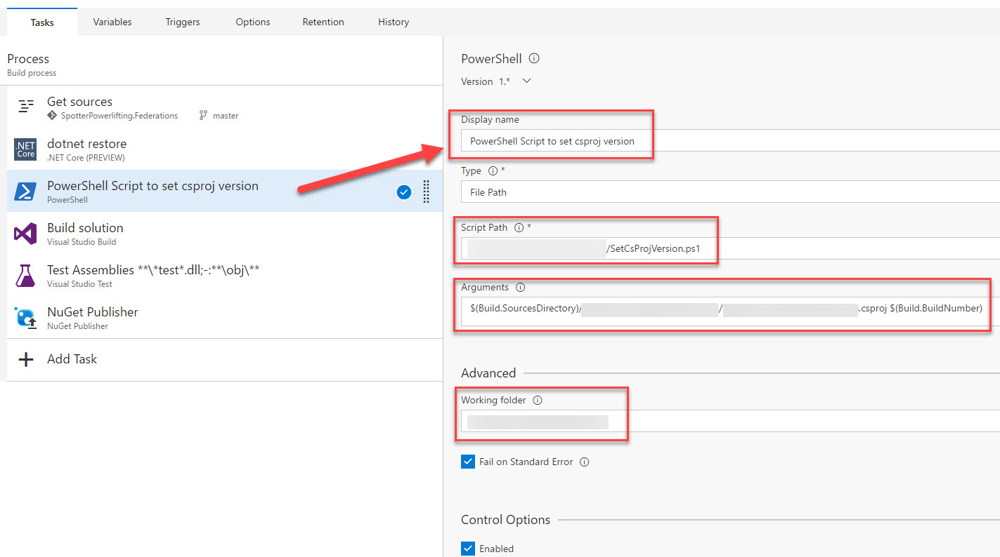
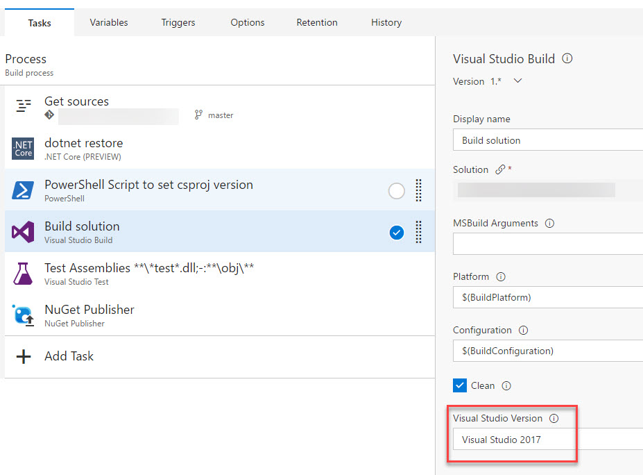
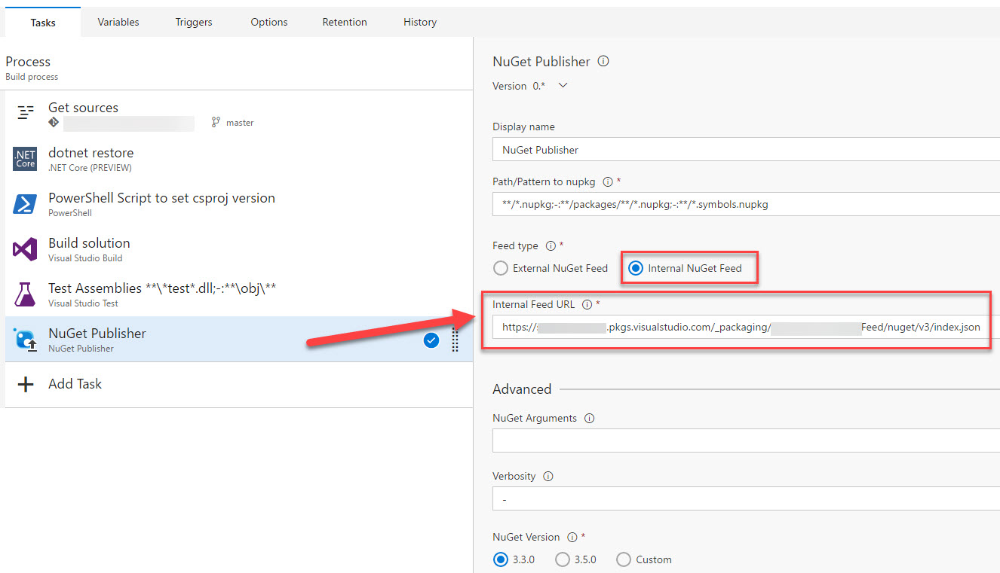
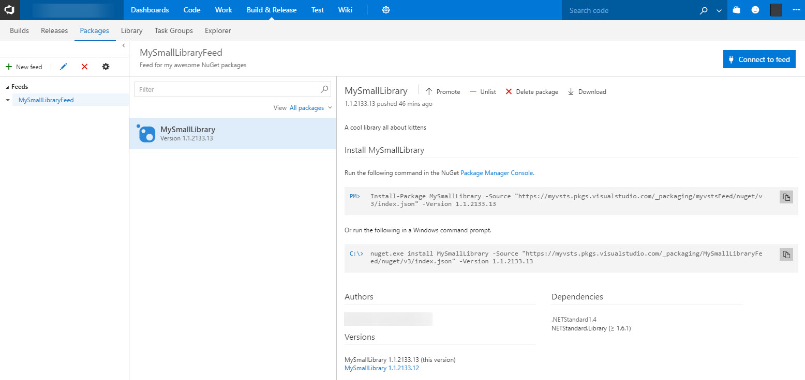

Creating a NuGet package in Visual Studio 2017 and getting it to build/deploy to Visual Studio Team Services was more difficult than I expected. Here's how I did it.

# NOTE: MAJOR UPDATE OF THIS POST AVAILABLE

I'm deprecating this post :) I've pretty much re-written this post to make use of the latest VSTS functionality and to support both .NET Standard 2 and .NET Core 2. Check it out!

[Build and Deploy a .NET Core 2.0 or .NET Standard 2.0 NuGet Package using VSTS](http://liftcodeplay.com/2017/11/17/build-and-deploy-a-net-core-2-0-or-net-standard-2-0-nuget-package-using-vsts/)

# Pre-requisites

- Visual Studio 2017. Anything from Community edition onwards is fine
- Visual Studion Team Services (VSTS) account
- A destination for your NuGet packages. MyGet is fine but I'm using VSTS

Package management in VSTS is free for up to 5 users. To get this functionality you first have to enable the trial. If you have 5 or less users you won’t be charged.

[https://marketplace.visualstudio.com/items?itemName=ms.feed](https://marketplace.visualstudio.com/items?itemName=ms.feed)

# Background

I had a small library, written in .NET Core. I wanted to re-use this library in another project so I decided to create a NuGet package.

The code was had no dependencies (it’s relatively simple) so it was a perfect candidate for .NET Standard. Continuing to use .NET Core would have been fine as well.

In my solution, I would also include the relevant xUnit tests as an additional project.

It looked something like this (except with more files)

Lastly, I wanted to setup the build & deploy to the package feed within Visual Studio Team Services (VSTS).

Once I started setting up VSTS I realized I had a bunch of problems.

## Problem 1: Incrementing Versions

With my NuGet package it’s important that the version number increments. It cannot exist already and we can’t go backwards.

## Problem 2: Where’s the AssemblyInfo.cs?!?

In Visual Studio 2017, when you create a .NET Core or a .NET Standard library, there is no AssemblyInfo.cs file. The version information is instead kept within the csproj.

There are many add-ons for VSTS that allow you to change the details in AssemblyInfo but these wouldn’t work. What do I do??

Here's what the csproj XML looks like. Note that if you leave the version at 1.0.0, it won't display the version tag.



## Problem 3: What version would I use?

In theory we have four components of the version number: major.minor\[.build\[.revision\]\]. For example: 12.4.30.2

Where would I get the major and minor versions?

The build number could come but VSTS but what exactly would I use?

VSTS can provide the build number but how I get it?

Ugh…

## Problem 4: NuGet Packager

The NuGet Packager item in VSTS wasn’t working. I forget the details but suffice to say I couldn’t get it to work.

# Solution

Here’s what I did to get it all working.

## Project configuration in Visual Studio 2017

In VS2017, I went into the project properties, Package settings and set the following:

- Clicked **Generate NuGet package on build**. This is important as it meant I could avoid using the NuGet packager in VSTS
- Entered a **description**. This will show in the package feed
- Make sure all the other info, such as author, company, etc was correct

## VSTS Packages

I had to create a package feed by going into:

- My project in VSTS
- **Build & Release** tab
- **Packages** option
- Clicked **New feed**, filled out the details
- Clicked **Connect to feed**. This gave me a URL I would use later in VSTS

## Powershell Script

I added the following file to my project. A few key things:

- It takes two parameters
    - Path to the csproj
    - The version generated by VSTS
- It users the major, minor and revision number
- It generates the build number by using the date. It was a way of getting a unique, incrementing value that would remain under 65,534
- Once it has the details it opens the XML, inserts the build number
- Writes to the console, which is useful to see in the logs



## Build Process

At a high level I created a build process as follows:

- Ran **dotnet restore**.
- **Powershell script** to set the csproj version
- **Build** block for the solution. Key things to note were:
    - Set the **Visual Studio Version** to 2017
    - Clicked the **Clean** checkbox, to be safe
- **Test Assemblies**, to run my unit tests
- NuGet Publisher

I also added some configuration in the build process

### Configuration - Variables

I added two variables – for the major and minor versions. I will set this manually going forward. The build does not increment these.

### Configuration - Options

Under options I entered the following **Build number format**

$(MajorVersion).$(MinorVersion).$(Date:yyyyMMdd)$(Rev:.r)

This would produce a value such as 2.5.20170324.8.

This value is great for me, in VSTS, to see all my builds but it’s no good for an actual version number as the date is too long. I also needed something unique.

I also set the **Default agent queue** to **Hosted VS2017**

### dotnet restore

Nothing fancy about this. I just called the restore command.

I originally forgot to do this and was getting all sorts of errors, saying it was missing basic things like System.Date.

### Powershell script to set the csproj

Remember how I added the ps1 file to the root of my project? Here’s how I would use it.

Note that I could have added this code directly in VSTS but, by having the ps1 file in source, I can manage it using source control

Assuming my project was called MySimpleLibrary, here’s how it would be configured:

- Entered a **Display name** of “PowerShell Script to set csproj version”
- Set the **Script Path** to **MySimpleLibrary/SetCsProjVersion.ps1**
- Passed two arguments as follows **$(Build.SourcesDirectory)/MySimpleLibrary/ MySimpleLibrary.csproj $(Build.BuildNumber)**
    - The first argument is the path to the csproj, of the code project
    - The second is the build number
- **Working folder** is set to **MySimpleLibrary**

Note: I couldn't just pass the revision number variable **$(Rev:.r)** as a parameter here. It wouldn't let me use it here. That's why I passed the ENTIRE build number and then parsed it. If you want a different build number format (i.e. you want to add the build name or branch name), it's just a matter of tweaking the Powershell script. I'm pretty sure I could have passed the major and minor versions as separate variables to my script.

### Build solution

This is standard. The only changes are:

- Set the **Visual Studio Version** to **Visual Studio 2017**
- Clicked the **Clean** Just to be safe – not required

### Test assemblies

Standard item. No changes

### NuGet Publisher

The only thing I did here was select **Internal NuGet feed** and pasted the URL from the Packages tab

# End Result - it works!

It worked! The package builds and deploys successfully. All I had to do was add the package feed URL within Visual Studio.

Hope this helps.

