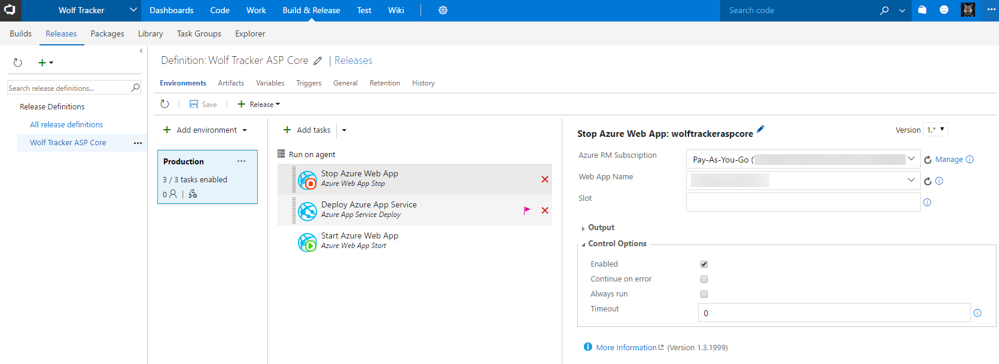
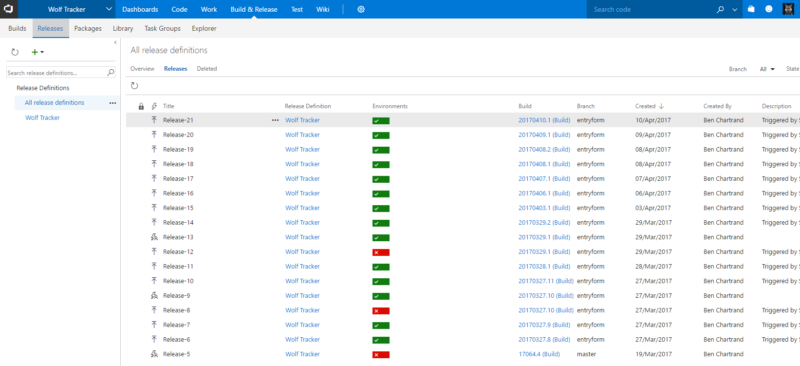
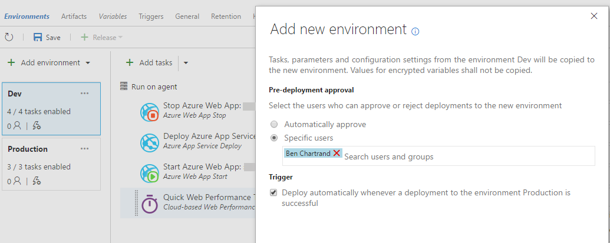

Visual Studio Team Services (VSTS) has great Continuous Integration (CI) and Continuous Delivery (CD) functionality. Let's walk through it.

## Why bother with Build and Release?

As a lone wolf you can build your software just fine on your PC. If it's a website, deploying it can be as easy as right click > Publish.

That's fine but there is risk: the only way for you to build and deploy involves a manual process from your PC, which has a specific configuration and versions of software installed.

Furthermore, you have to initiate a manual process. By the way, when you did that publish, did you remember to run all your unit tests? And you didn't deploy straight to production did you?

For a lone wolf, my message to you is simple: setting up builds and releases reduces risk, it's automated (lets you focus on writing code) and helps ensure quality.

### Continuous Integration, Continuous Delivery, DevOps?

If you're not familiar with these it can seem very confusing. The problem is that there are general concepts and then there is the terminology in use by VSTS. Let's start with concepts.

When you work in a team you will be doing work in parallel to your colleagues. How do you know your code didn't break the build or caused some tests to fail? You don't want to wait until an overnight build.

That's the purpose of [Continuous Integration](https://www.visualstudio.com/learn/what-is-continuous-integration/): you are going to constantly build and test code every time someone commits code to a certain branch (i.e. master).

That's great - you know it works. But how do you know it's ready for prime time? You could just deploy straight to product and find out. You could wait for your QA to come free to do manual testing. Or perhaps you could setup a an automated process (aka a release pipeline) that not only tests automatically but also deploys. This is [Continuous Delivery](https://www.visualstudio.com/learn/what-is-continuous-delivery/) (aka Continuous Deployment).

If your a lone wolf, [DevOps](https://www.visualstudio.com/learn/what-is-devops/) likely isn't an issue.

An example CI/CD workflow in VSTS could be:

- You commit code to master
- The commit triggers a build
- If the build is successful, unit tests are run
- If unit tests pass the code is bundled up and setup as a release (a version)
- This release could be automatically deployed to your dev environment
- The next automated step is running a bunch of additional tests (i.e. integration tests, functional tests, UI tests via Selenium, load tests)
- If the above passes the release, it will wait until someone selects it be deployed to a test environment for manual tests and exploratory testing.
- Once you and/or your appointed QA has signed off the release you press a button and the release is deployed to production
- If there's a problem in production you can go back to your release pipeline and re-install the last known working version

Note the only manual steps are for manual testing and approval. You could take this a step further and completely automate the entire process.

I've found it to be quite nice knowing that, the moment I commit code to master, this whole process will kick off. Since it is largely automated I can focus on what I really want to do: writing more code, developing more features.

## Build & Release

In VSTS you will notice there is a **Build & Release** menu item at the top.

### Hosted Build Agent

VSTS provides 240 minutes (4 hours) free build time per month on their hosted build agents. These are virtual machines (VMs) managed by VSTS. They [come with a bunch of software pre-installed](https://www.visualstudio.com/en-us/docs/build/concepts/agents/hosted). As a lone wolf, this is great - I'd suggest you use it.

If you need more than the 240 minutes you can [purchase additional minutes](https://www.visualstudio.com/en-us/docs/setup-admin/team-services/get-more-build-or-load-testing-vs).

### Private Build Server

You can setup a build server and configure VSTS to use it. VSTS provides you with one free build agent license. The build server could be almost anywhere. It doesn't need to be in Azure.

The advantages are:

- **Builds will be faster** as it can do incremental builds and used cached content
    - The hosted build agents always performs clean installs. This can be slow if you use lots of NuGet, bower and npm packages
- You can **install whatever you want** on the system
- The build server could also be used to **run Selenium tests**

The downside is that:

- you need a server or VM (likely means you need to pay for a VM)
- you have to manage the software
- you have to get it initially configured with VSTS

### Builds

Builds refers to the building (compilation) of your software. An extra step you should add is running of unit tests. If the code compiles but unit tests fail, the build should be marked as failed.

You can have multiple builds. For the [Wolf Tracker application](http://liftcodeplay.com/2017/04/16/vsts-for-the-lone-wolf-developer-getting-started-projects/) I would likely have builds for:

- Xamarin app
- Angular app
- ASP Core WebAPIs
- NuGet package(s)

Note that you can deploy immediately from your build. If you have a web application and are deploying to Azure, use the Releases functionality.

\[caption id="attachment\_2655" align="aligncenter" width="648"\] This is what the Wolf Tracker builds could look like\[/caption\]

### Releases

Clicking the Releases tab will show you all the release pipelines you have defined.

This is primarily used for deploying of web apps to Azure. I understand you can deploy to AWS but I'm not familiar with that.

If you want to create multi-step release processes, you will need multiple environments setup.

If you're using Azure Web Apps these environments could be slots. It's up to you to define these different environments.

Here's additional [documentation](https://www.visualstudio.com/team-services/release-management/). Let's jump straight into an example.

## Example: Building and Releasing an ASP.NET Core Application to Azure

Let's say the Wolf Tracker admin page was a ASP.NET Core application (previously we suggested it was an Angular app). We want to achieve the following:

- When we commit to master, automatically build and run unit tests
- If successful, create a release
- Upload that release to Azure Web Apps

### Creating the Build

The simplest way to get started is to go into **Builds** > **New** and select the project type.

In my case, since it's a .NET Core application, I need to run **dotnet restore**, **dotnet build** and **dotnet publish** commands so I chose to create this.

\[caption id="attachment\_2714" align="aligncenter" width="1357"\] Example of a ASP.NET Core build\[/caption\]

The continuous integration was setup under the **Triggers** tab. Any time I commit to the master branch it starts a build

\[caption id="attachment\_2718" align="alignnone" width="1271"\] The continuous integration was setup in the Triggers tab\[/caption\]

If you go back to the builds tab you will see something like the picture blow. You'll see the last commit that triggered the build and, most interestingly, the green bar chart on the left.

If the build passes it will display a bar in green. The height indicates the relative time it took. If it fails the bar will be red. You'll notice I have a 100% pass rate at the moment.

\[caption id="attachment\_2726" align="aligncenter" width="1041"\] The build setup. You'll notice I have a 100% pass rate, which is why all the bars in the graph are green\[/caption\]

### Creating the Release

Let's say I use Azure to host my app and, since I'm cheap, I only use the free tier of Azure Web Apps. That means I have only one environment to deploy to: Production.

What I need to do is:

- Click the + button to Create a new Release Definition
- Select Azure App Service Deployment
- Choose my build project and source
- Click Continuous Deployment
- Click Create
- In the window that pops up I need to enter my Azure subscription and App Service name.

I chose to add some additional tasks - to stop the web app and restart it once done. I could have added all sorts of tasks in there. Ideally I really should have a bunch of tests running.

Here's what it looks like:

Sample release, which goes straight to production

If we go back to the releases screen then, over time, you will see something like the image below.

In each row is a green or red square. That indicates the environment and whether or not it passed. If I had multiple environments I would see multiple squares per row.

All my recent releases. Note that I only have one environment

That's great but to REALLY make use of releases we should:

- Have more environments
- Run more tests in each environment
- Potentially have some manual stop points, that require authorization (i.e. a QA sign off before it touches production)

Let's correct that. I will create a Dev and QA environment. The destinations will be separate Azure Web App sites.

I clicked **Add environment** and **cloned** the Production environment. Afterwards I renamed it to Dev and added a Quick Web Performance task

I ran the process again but this time I specified a **Pre-deployment approval** and added my account. The logic behind the approval is: I don't want the application to change, incase someone is in the middle of testing.

\[caption id="attachment\_2932" align="aligncenter" width="1035"\] I've added a Dev environment and am specifying an approver for the QA environment\[/caption\]

Notice how the QA step has a number one beside the icon of a person? That means there is one person to approve. You'll notice I added a bunch of additional tests.

\[caption id="attachment\_2937" align="aligncenter" width="709"\] Release pipeline now has three steps\[/caption\]

* * *

Next: [Service Hooks and Package Management](http://liftcodeplay.com/2017/04/16/vsts-for-the-lone-wolf-developer-pt3/)

Previous: [Stakeholders and Testing](http://liftcodeplay.com/2017/04/16/vsts-for-the-lone-wolf-developer-stakeholders-and-testing/)
