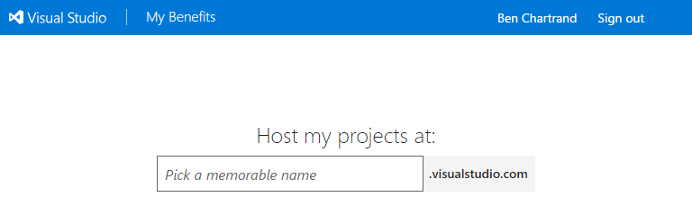
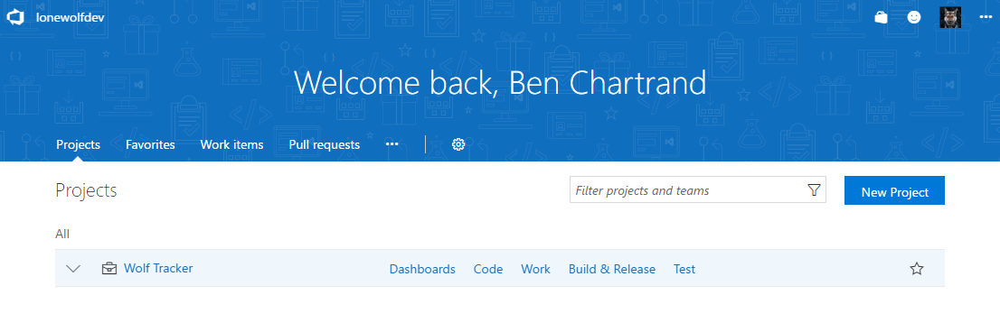
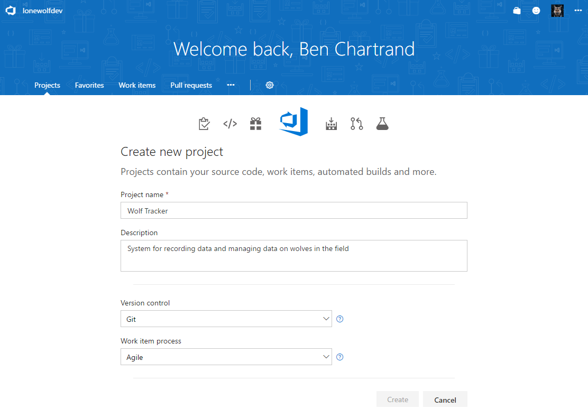

Let's go over how to get started and discuss the concept of Projects in Visual Studio Team Services (VSTS).

## Understanding the Per-User Pricing

You get 5 free "basic" user accounts. Despite the moniker of "basic", it means you will have a fully-fledged account. Here's [information on costs per user](https://marketplace.visualstudio.com/items?itemName=ms.vss-vstsuser).

Stakeholders are free and unlimited. We'll cover that more when we talk about [testing](http://liftcodeplay.com/2017/04/16/vsts-for-the-lone-wolf-developer-stakeholders-and-testing/).

## Getting Started

You will need a Microsoft account.

Next, you will need to create the VSTS account to host your projects. [Click here](https://www.visualstudio.com/team-services/) and then click the **Get started for free** button.

You will need to pick a memorable name for your account. If you're anything like me, you'll likely agonize all night over this!

Be aware you can always delete this account and start again. You can even create multiple VSTS accounts under your Microsoft account!

\[caption id="attachment\_1556" align="alignnone" width="768"\] If you're anything like me you'll spend all night trying to come up with name!\[/caption\]

## Projects

A key concept in VSTS is that of a **Project**. You can think of this as your product. It should contains all the source code, work items, build definitions, etc.

Let's say you have a product called **Wolf Tracker** (used by help track wolves in the wild). It might consist of:

- Xamarin application, for data entry in the field
- Angular app, for when you're back in the office
- Two ASP Core WebAPIs
- Maybe some internal-only NuGet packages.

You can create 5+ projects but the work items, builds, tests, etc would be completely separate. I suggest you keep them all the repos together, under the one project.

\[caption id="attachment\_1568" align="alignnone" width="1106"\] VSTS Dashboard\[/caption\]

### Creating a Project

Click the New Project button to get started but be aware there are a few key decisions to make:

1. You must enter a unique **project name**
    - You can change this later but VSTS will warn you of the potential issues and send you a nice email explaining everything after you've done it
2. Must select a **Version control** method.
    - You cannot change this later
    - Either method works for a lone wolf but I strongly suggest you use Git
3. Must select a **Work item** process.
    - You cannot change this later
    - VSTS has some great [process guidance documentation](https://www.visualstudio.com/en-us/docs/work/guidance/choose-process).
    - I'm not familiar any of the options, use [Agile](https://www.visualstudio.com/en-us/docs/work/guidance/agile-process). I feel it's the best long-term option for you. I'll explain this later in the [Work Item](https://liftcodeplay.com/2017/04/22/vsts-for-the-lone-wolf-developer-work-item-management/) section.

* * *

Next: [Source Control and Extensions](http://liftcodeplay.com/2017/04/16/vsts-for-the-lone-wolf-developer-source-control-and-extensions/)

Previous: [Overview](http://liftcodeplay.com/2017/04/16/vsts-for-the-lone-wolf-developer/)
