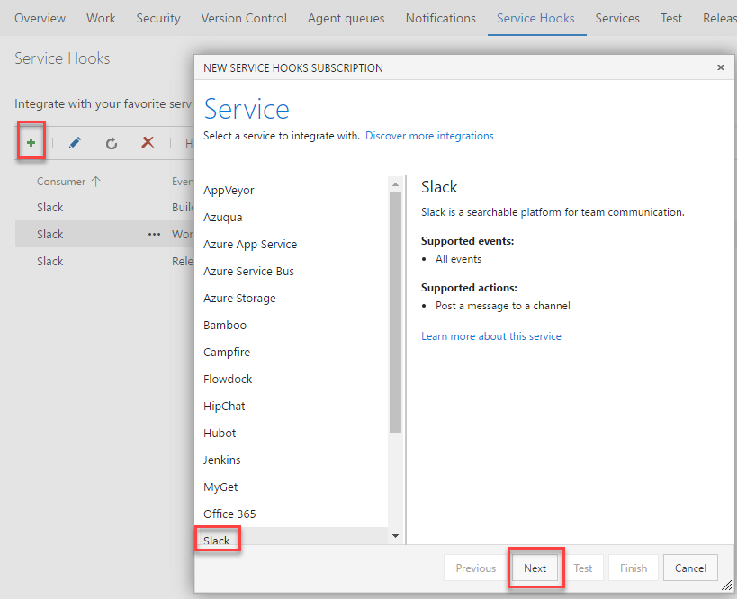
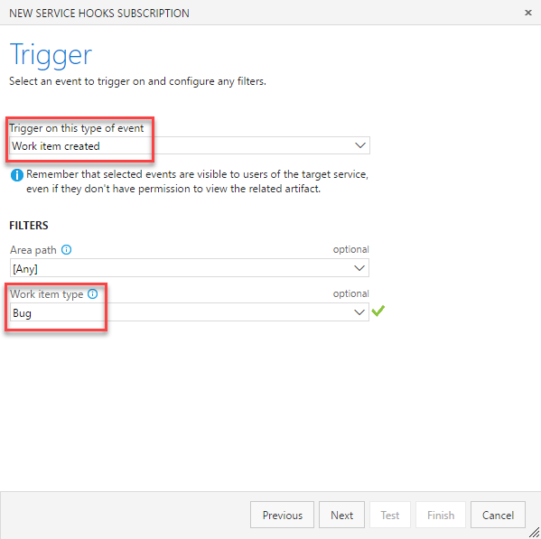
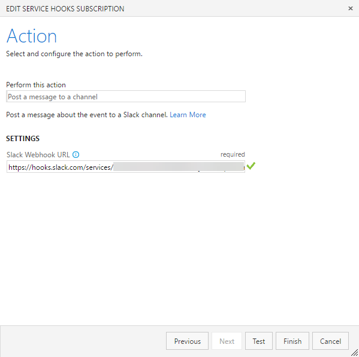
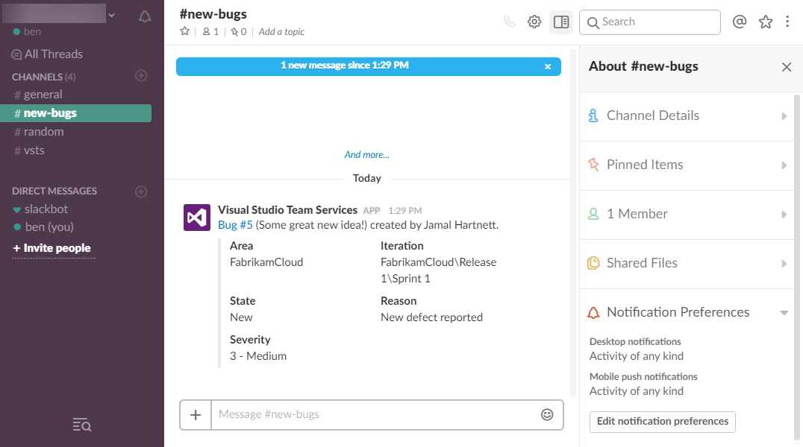

Let's go over the Package Management functionality in Visual Studio Team Services (VSTS) and how we can use Service Hooks.

## Service Hooks

Service hooks allow you to integrate with other products and services. They are available under the Gear icon > **Service Hooks**. If you click add you will notice you can integrate with many different services.

### Example: Notifications of new Bugs

When my stakeholders started do testing I realized bugs could be coming in and I wouldn't be aware of it. I didn't want emails - I wanted push notifications sent to my phone. I accomplished this using Slack and a Service hook.

#### Slack Setup

1. I did was setup a new Slack team, just for myself. Eventually I could invite my stakeholders
    - Note that VSTS has a "Team room" for chatting but its being phased out
2. I setup the team on my phone
3. Within the Slack team I created a channel called **Bugs**
4. In the bug channel I set it to send me push notifications for Any kind of activity

#### VSTS Setup

1. Clicked the Gear icon > **Service Hooks**
2. Clicked the green **+** icon to add
3. Selected **Slack** from the list
4. Clicked **Next**
5. For the Trigger on this this of event I selected **Work item created**
6. For Work item type I selected ****Bug****
7. Clicked **Next**, entered the **Webhook URL** from Slack
8. Clicked **Test**, to confirm it worked
9. Clicked **Finish**

#### End Result

\[caption id="attachment\_2430" align="alignnone" width="1076"\] My slack channel with my test bug. Note that I set the Notification Preferences > Mobile push notifications to **Activity of any kid**\[/caption\]

 

\[caption id="attachment\_2447" align="aligncenter" width="271"\] Sample notification on my phone\[/caption\]

## Package Management

Suppose you want to create a NuGet or npm package for internal use. You can use something my MyGet but it's yet another product/service.

As I write this, the package management service is relatively new and it's free for up to 5 basic users. That's great for us!

### Installing the Package Management functionality

Technically this is an extension which [you must install](https://marketplace.visualstudio.com/items?itemName=ms.feed&targetId=78a2590f-6695-40c6-b833-d323e531918d). It doesn't come with VSTS by default.

Once you've set it up you will see a new menu option under **Build & Release** > **Packages**

### So... how do I use it?

Once it's setup you will have a feed URL. You can manually publish packages or get the VSTS build system to do it for you.

If you have a NuGet package you can setup Visual Studio to point to the URL.

### More info on Package Management in VSTS

As a lone wolf, I'm not sure how much use this will be. I've only ever created one NuGet package. If you'd like more information [check out this page](https://www.visualstudio.com/team-services/package-management/).

## Wrapping Up

I hope this series of blog posts has helped.

Many of the people I've spoken to have no idea what VSTS can offer them. They view it as something big, scary and expensive. But worse of all: some people instantly dismiss it the moment they see it's from Microsoft. I've been using VSTS since the day it came out and have enjoyed using it and watching it improve over time.

Congrats on reading this far! You have unlocked the "white wolf" achievement for reading the whole blog series!

\[caption id="attachment\_2823" align="alignnone" width="1920"\] Geralt of Rivia (aka The White Wolf) from The Witcher: Wild Hunt\[/caption\]

 

* * *

Previous: [Builds and Releases](http://liftcodeplay.com/2017/04/16/vsts-for-the-lone-wolf-developer-builds-and-releases/)
