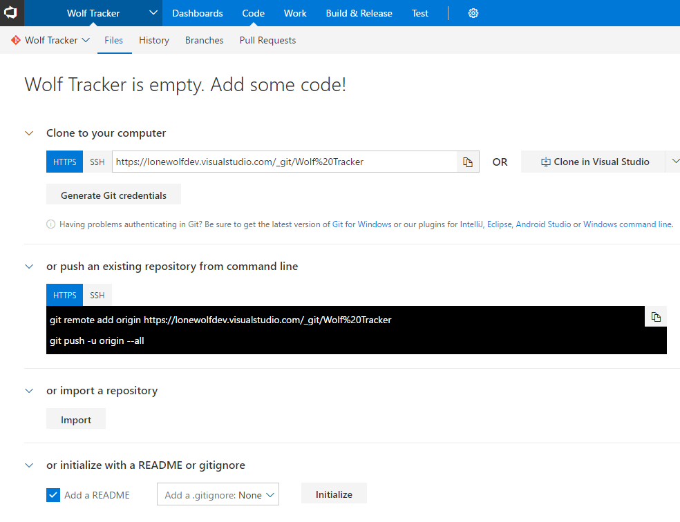
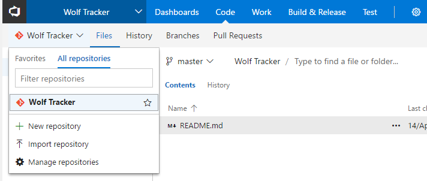

Let's go over how to get you up and running with your own private repositories and show you some cool extensions in Visual Studio Team Services (VSTS).

## Source Control

The key thing so stress is that, in VSTS, repositories (aka repos) are **private**. If you wanted a public repo I would suggest you use GitHub. I believe you can make a repo public in VSTS but clearly isn't meant for that.

When you created the project it created a default repo.

For many a lone-wolf, all we're after is a remote repo - a place to backup your code. If so then great - it's up and running and not costing you anything!

If you're using Git, getting up and running should be straightforward. Even more so if you're using Visual Studio.

\[caption id="attachment\_1670" align="alignnone" width="984"\] New Project using Git, without any code uploaded\[/caption\]

### Creating additional Repositories

If you go into Files, click the repo name on the left you will have the option to create a new repo or import.

Import is there to help you clone from an existing online repository (i.e. GitHub).

\[caption id="attachment\_2796" align="aligncenter" width="712"\] How to create a new report or import an existing from another service\[/caption\]

## Extensions

VSTS has a large collection of extensions. The vast majority are free, many are awesome. If VSTS doesn't do something you need, checkout the extensions. You can find them by clicking the shopping bag icon in the top right and selecting **Browse Marketplace**.

The following are my favourites:

[Wiki](https://marketplace.visualstudio.com/items?itemName=ms-devlabs.wiki&targetId=78a2590f-6695-40c6-b833-d323e531918d). It's very similar to the Wiki functionality in GitHub. I find it useful for creating internal documentation for myself.

[Package Management](https://marketplace.visualstudio.com/items?itemName=ms.feed&targetId=78a2590f-6695-40c6-b833-d323e531918d). This allows you to create, host and share packages (i.e. NuGet, npm). I'll talk more about that in an [upcoming post](https://liftcodeplay.com/2017/04/22/vsts-for-the-lone-wolf-developer-pt3/).

[Code Search](https://marketplace.visualstudio.com/items?itemName=ms.vss-code-search&targetId=78a2590f-6695-40c6-b833-d323e531918d). Allows you to easily search across the different projects  via the web UI

[Countdown Widget](https://marketplace.visualstudio.com/items?itemName=ms-devlabs.CountdownWidget&targetId=78a2590f-6695-40c6-b833-d323e531918d). This is for your dashboard. I like to use it to track milestones I set for myself or important dates.

[Team Calendar](https://marketplace.visualstudio.com/items?itemName=ms-devlabs.team-calendar&targetId=78a2590f-6695-40c6-b833-d323e531918d). It provides a calendar. Might be useful as you can enter events

[Personas](https://marketplace.visualstudio.com/items?itemName=agile-extensions.personas&targetId=78a2590f-6695-40c6-b833-d323e531918d). In Agile you create Stories (i.e. As Jane (a Field Scientist) I want to log wolf daily positions on my phone so that I can see how far they roam). Stories relate to a persona (i.e. Jane). Using this extension you can create a persona and add them to a story using Tags.

[Estimate](https://marketplace.visualstudio.com/items?itemName=ms-devlabs.estimate&targetId=78a2590f-6695-40c6-b833-d323e531918d), to enable you to do Planning Poker (an Agile concept). Ok, this isn't much use at all for a lone-wolf but it is cool

* * *

Next: [Work Item Management](http://liftcodeplay.com/2017/04/16/vsts-for-the-lone-wolf-developer-work-item-management/)

Previous: [Source Control and Extensions](http://liftcodeplay.com/2017/04/16/vsts-for-the-lone-wolf-developer-source-control-and-extensions/)
