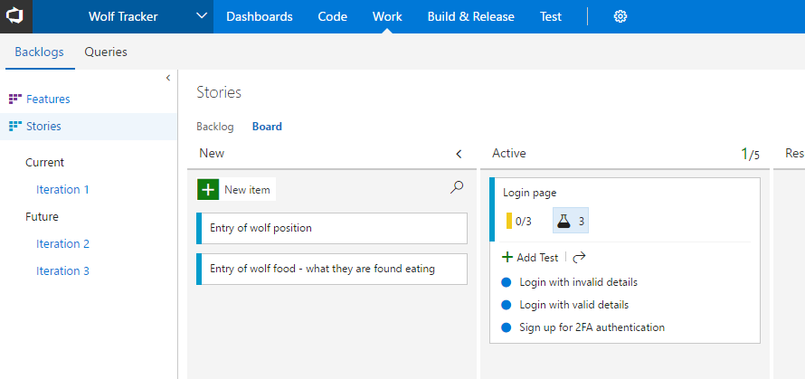
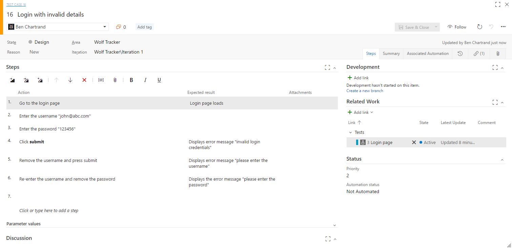
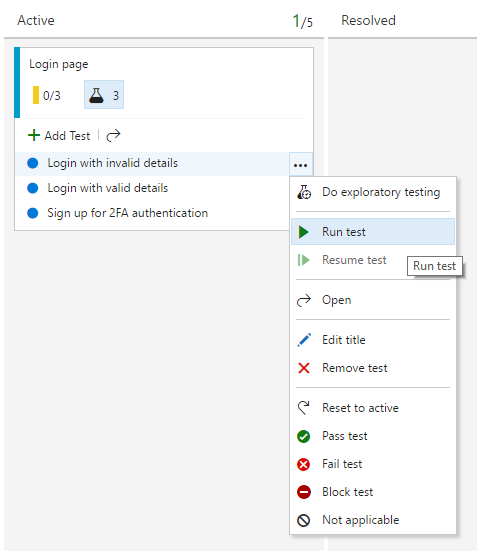
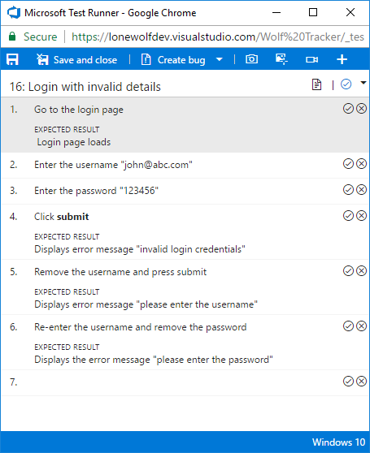
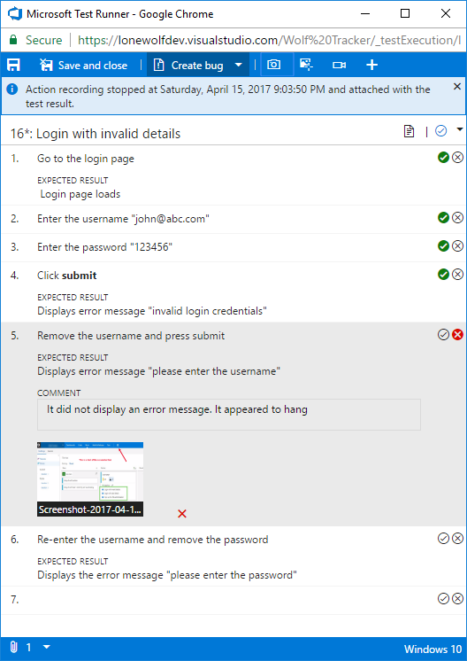
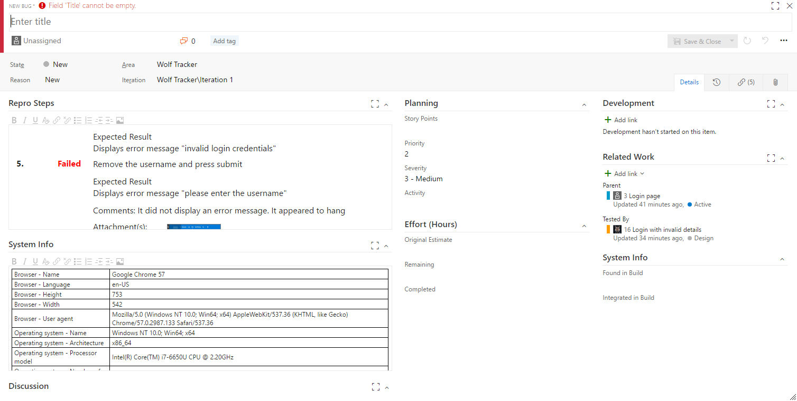
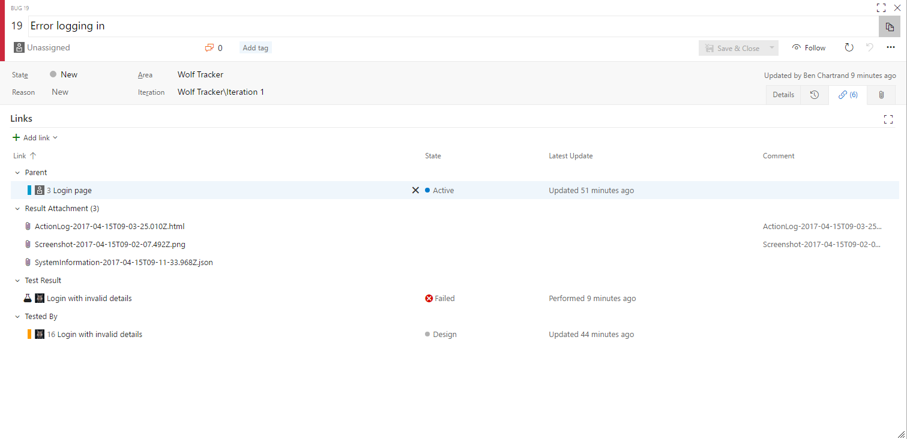
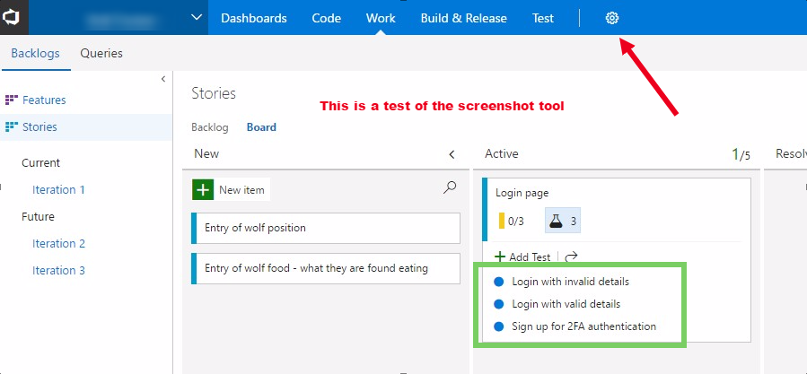
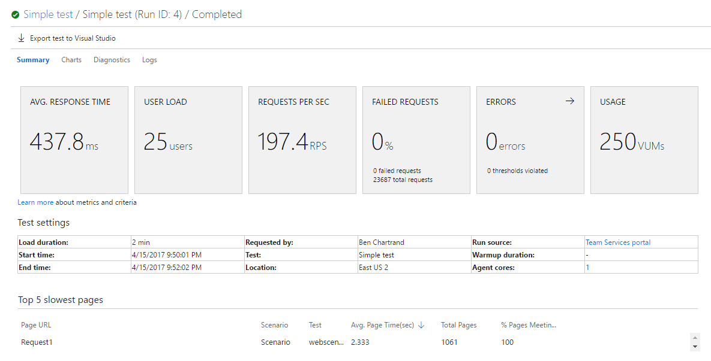
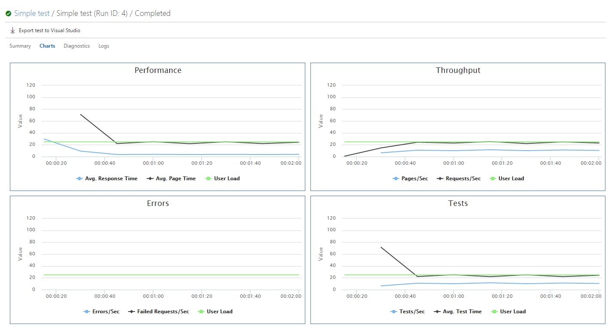

Let's go over the concept of Stakeholders and discuss testing in Visual Studio Team Services (VSTS). This is where a lone wolf might have to call in some help!

## Stakeholders

Recall how, in the [first post](http://liftcodeplay.com/2017/04/16/vsts-for-the-lone-wolf-developer/), we mentioned you get 5 free basic users? You also have unlimited free Stakeholders. This is awesome.

Stakeholders can't access code but they can access the work items, which is really handy for logging bugs. Check [this page](https://www.visualstudio.com/team-services/compare-features/) for more detail on what they can/can't do.

## Testing

There are numerous features related to testing in VSTS.

### Test Cases

When you create a user story you can assign tasks and bugs. You can also define **test cases**.

To create test cases for a user story you MUST first navigate to the Stories section. You can't do enter test cases via your current iteration. I always find this confusing.

Once you are at the board click the ... button in the top right of the user story and select **Add Test**.

You will be able to quickly enter test cases, just like tasks. But unlike tasks, make sure you open each one and enter the step-by-step instructions.

Remember: you could be assigning these tests to your stakeholders so be explicit and clear.

\[caption id="attachment\_2100" align="aligncenter" width="890"\] A user story with some test cases\[/caption\]

\[caption id="attachment\_2099" align="aligncenter" width="1511"\] Sample test case\[/caption\]

### Running Test Cases

This is where it gets fun. Wait a second... I'm a dev who said testing is fun?

If you hover over to the right of the test you will get the ... for the menu. Click it, then click **Run test**.

\[caption id="attachment\_2118" align="aligncenter" width="477"\] The menu to run a test\[/caption\]

VSTS will try to open a pop-up window. Make sure you have enabled pop-ups. Chrome likes to block it by default.

\[caption id="attachment\_2128" align="aligncenter" width="455"\] The Test Runner, with the test case created earlier\[/caption\]

#### Using the Test Runner

Before you use the Test Runner have a separate window with the application open, ready for testing.

Caveat: some of the advanced features here are only useful for web-based applications. You can still use the test runner for other apps. I'm going to assume you have a web app.

Recall this is the test we created earlier. Go through everything step-by-step. Press the tick if the step has passed. Otherwise press the X.

If it fails, you have a wealth of options available. You can:

- Enter a **comment**
- Take a **screenshot** and attach it
    - The screenshot tool is powerful. You can take a clip of the area of interest, add arrows, circles/squares to identify areas, add test, blur content and more
- Record a **video** and attach it
- Capture **user actions** as an image action log
    - This is so awesome. It will record every precise click along with images. In my opinion, this is better than video.
- Add **more comments**
- Attach **files**
- You can **create a bug**. I highly recommend you do this.
    - If you click the test again you can see where it's left off but you can lose that info if someone restarts the test. Best save that info in a bug

\[caption id="attachment\_2144" align="aligncenter" width="528"\] Completed test plan with a screenshot and more attached\[/caption\]

The bug report it generates is fantastic. Notice how it automatically captures system information?  You don't have to ask basic questions such as "what browser did you use? what OS?". It also links to the user story.

\[caption id="attachment\_2159" align="aligncenter" width="1508"\] The bug we created. Note that we have to provide a title in order to save. Look at that glorious detail!\[/caption\]

Make sure to check out the attachments. I chose to include a screenshot and an action log

\[caption id="attachment\_2164" align="aligncenter" width="1511"\] The files attached to this bug report\[/caption\]

The item below is a screenshot I took using the Test Runner.

\[caption id="attachment\_2170" align="aligncenter" width="899"\] The screenshot I created using the Test Runner\[/caption\]

Below is a brief video demonstrating the Action Log. This is fantastic

\[wpvideo iBWZGKH0\]

## Exploratory Testing

Exploratory Testing is another way of saying "just use the app, try to break it and/or spot anything that doesn't make sense". They're not following a pre-defined test plan.

Caveat: this is only useful for web-based applications.

To do Exploratory Testing VSTS provides a free add-on to Chrome. It works a lot like test runner in that it will allow you to:

- Automatically record device information
- Automatically keep an action log
- Allow you to take pictures, videos, add comments
- Based on your actions you can create use it to create bugs
    - You can also use it to create tasks and test cases. The former doesn't work for me - says it can't find it - and the latter isn't that useful IMO

[This page](https://www.visualstudio.com/en-us/docs/test/manual-exploratory-testing/stakeholder/provide-stakeholder-feedback) from VSTS provides more information. Just remember that anyone using it must have a Stakeholder account (at a minimum) and the tool has to be setup to point to your VSTS account.

I really like this tool. It's great for users as well. I was very happy when Microsoft announced this tool was going to be free.

## Load Testing

Load testing is a great concept - simulate lots of users suddenly showing up. Afterwards you can see how quickly your app responded and, using your other monitoring tools, see when / where your app would fails.

Your VSTS account provides you with 20,000 VUMs (virtual user minutes) at no cost. If you were to get 25 virtual users to hit a URL for 2 minutes, that would consume 250 VUMs.

First off, click on the Test menu item at the top and select **Load test**. You have a few options for generating load tests.

### HTTP Archive based test

There are four options but, as a lone wolf, this is likely the easiest. I believe the Visual Studio Test option requires an advanced version of Visual Studio (Enterprise?).

The basic concept is you get your browser to record what you're doing. Once you're done it spits out a .HAR file. VSTS can use this .HAR file to do the load testing.

Checkout [this article](https://www.visualstudio.com/en-us/docs/test/performance-testing/getting-started/record-and-replay-cloud-load-tests) for more information.

### Example Results

* * *

Next: [Builds and Releases](http://liftcodeplay.com/2017/04/16/vsts-for-the-lone-wolf-developer-builds-and-releases/)

Previous: [Work Item Management](http://liftcodeplay.com/2017/04/16/vsts-for-the-lone-wolf-developer-work-item-management/)
