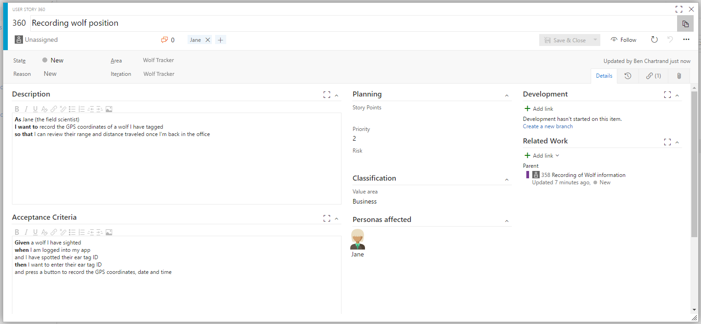

The work item functionality may seem a bit complicated if you're not familiar with TFS or Agile. Let me show you how to use it for simple projects, as well bigger ones, in Visual Studio Team Services (VSTS).

## Work Item Management

When I started my side project I knew what I was building. It was all in my head. Over time I :

- kept coming up with ideas for future development
- needed to prioritize and phase in features
- had a constant list of small items to-do items, which I had to come back to

All this information needed a home.

When I first looked at the Work item area it didn't make sense. A while later I went on an Agile course and everything made sense.

### How I would use Work Items for a small project (aka using it like Trello)

If you have a smaller project or want to keep things really simple, I suggest you do this:

- Go into Work > Backlogs > Stories. Make sure you click the **Backlog** link.
- Once there, create some basic Stories
    - At a minimum, enter a name
    - If needed, open it up and enter more detail in the description field

\[caption id="attachment\_1807" align="alignnone" width="1166"\] Stories backlog\[/caption\]

- If you're working on an item, click on **Board** and drag the item from the New column to the Active column.
    - Pro tip: don't have too many items under Active at any one-time. You'll notice, under Agile, you're limited to 5. You can change that

\[caption id="attachment\_1817" align="alignnone" width="1105"\] Stories board\[/caption\]

- From the backlog, drag-and-drop the items so they're in a priority that makes sense
- Once you're done, put it under **Closed**

You can add/remove/edit the columns by clicking the little gear icon. [See this article for more info](https://www.visualstudio.com/en-us/docs/work/kanban/add-columns). You can also create horizontal [swimlanes](https://www.visualstudio.com/en-us/docs/work/kanban/expedite-work).

If you're new to this, I would suggest you leave it as-is and customize it later, once you're more familiar with it.

### How I would use Work Items for a larger project

#### Epics, Features, Stories, Tasks

We want to create a logical hierarchy of tasks, similar to this picture.

\[caption id="attachment\_1860" align="alignnone" width="636"\] Example of the hierarchy from the [VSTS site](https://www.visualstudio.com/team-services/agile-tools/)\[/caption\]

##### **Epics**

I treat these as very high-level goals. I only have a a few. With our Wolf Tracking app we could have Epics for:

- Xamarin mobile App
- Angular admin app
- Reporting

You can click Epics, select Backlog and quickly enter them. I usually don't bother with anything other than a name.

##### **Features**

These are children to Epics and describe the high level features you want to build. Don't be too specific at this point.

For example: assuming an Epic of "Mobile App" a feature could be the Login page.

I keep the features pretty simple. I usually only enter a title.

You can add Features easily from the Epics backlog or board. Notice the green **+** sign. The advantage of doing it here is it automatically links the feature to the Epic.

\[caption id="attachment\_1883" align="aligncenter" width="1223"\] Epic with features, under the Backlog view\[/caption\]

\[caption id="attachment\_1884" align="aligncenter" width="539"\] Epic with features under the Board view\[/caption\]

##### **User Stories**

A user story explains what the user expects from the feature. It's told from the **user's point of view**.  In my opinion, that is something we devs can lose sight of.

Recall the feature "Recording of Wolf Information"? Let's add some user stories. Notice I'm still under the Epic tab. I could have gone to the Features tab and added them there or have gone into Stories, entered them there and manually linked them back to the Epic.

\[caption id="attachment\_1903" align="aligncenter" width="1028"\] We have some user stories under the Feature\[/caption\]

In my opinion there are three key things to do when you create a user story:

1. Give it a meaningful **title**
2. In the **description enter the user story**. I suggest you use the story method of "As ... I want to... so that...". Checkout the example below or [have a read of this](https://www.mountaingoatsoftware.com/blog/advantages-of-the-as-a-user-i-want-user-story-template).
3. Enter **acceptance criteria**. Enter at least one and use the method "Given a... when... then..." seen in the example below or [in this article](https://www.agilealliance.org/glossary/gwt/).
    - This method of writing acceptance criteria is a really nice way of describing how it should work. It's practically a test plan
    - You can create multiple acceptance criteria (i.e. scenarios when it should work, when it shouldn't, etc)
    - This info is essentially what you need to write functional tests with SpecFlow, Cucumber, etc
4. Optional: use the **Personas** add-on and add their name as a tag. It's a great way of remembering who will use it

By the way, here's the example Persona. You need to install the [Persona add-on](https://marketplace.visualstudio.com/items?itemName=agile-extensions.personas&targetId=78a2590f-6695-40c6-b833-d323e531918d) in order to do this. I was able to see the Jane persona by clicking her image in my user story.

\[caption id="attachment\_1930" align="aligncenter" width="264"\] Jane's persona. Click to see a bigger version\[/caption\]

In the user story you can use the **Planning** and **Classification** section if you want to. Personally, I don't bother.

##### Tasks

Tasks are very important. Without tasks the iteration functionality may not make much sense / be of much benefit.

It's up to you when you enter tasks. The tasks are the specific to-do items - for you - to implement that story.

As a lone wolf I tend to write the tasks just before I start the work or at the start of an iteration. They're useful to remind me of where I'm up to, document bits and pieces I need to come back to and are great motivation (I love marking things as closed).

Note that, for a task, I usually don't enter anything more than a title.

We now have Tasks against a feature

#### Iterations - where it all comes together

The purpose of the iteration is to decide what user stories you will tackle within a period of time (i.e. 2 weeks). Iterations are also known Sprints.

As a lone wolf, you don't want to take on too much at one. Decide on a small slice of functionality, get it built and into the hands of your users. Then move on.

You will have an iteration waiting for you to use (Iteration 1). You can assign the user story to the iteration by:

- Opening the story then setting the iteration or
- Right clicking the story, select Move to Iteration and selecting the iteration

\[caption id="attachment\_1974" align="alignnone" width="998"\] Our first iteration!\[/caption\]

If you click over to the **Board** you will see the tasks in a board. You can drag and drop the items between the columns.

The end goal is to have all the tasks marked as closed and the state of the user story set to Complete.

\[caption id="attachment\_1989" align="alignnone" width="1058"\] The task in board view. Notice how you can drag and drop items between columns and add more tasks\[/caption\]

#### What about Bugs?

Bugs are entered under a user story, like tasks. The one key difference is that bugs can **only be entered if the user story is in an iteration**.

We'll talk about bugs in more detail, in the [Stakeholders and Testing](http://liftcodeplay.com/2017/04/16/vsts-for-the-lone-wolf-developer-stakeholders-and-testing/) section.

\[caption id="attachment\_2020" align="aligncenter" width="1141"\] Example of a bug entered by hand. Note that bugs MUST be under a user story which is part of a iteration\[/caption\]

#### Closing Iterations, Creating new ones

Let's say you finish the current iteration and want to create a new one. This is where it's not so obvious.

On the top blue menu bar hover over the **gear** icon then select **Work**. From here you can edit an existing iteration, create a new one, etc. You can also give the iteration a more meaningful name.

\[caption id="attachment\_2855" align="aligncenter" width="930"\] To edit the iterations click the Gear icon, then select Work\[/caption\]

 

* * *

Next: [Stakeholders and Testing](http://liftcodeplay.com/2017/04/16/vsts-for-the-lone-wolf-developer-stakeholders-and-testing/)

Previous: [Source Control and Extensions](http://liftcodeplay.com/2017/04/16/vsts-for-the-lone-wolf-developer-source-control-and-extensions/)
