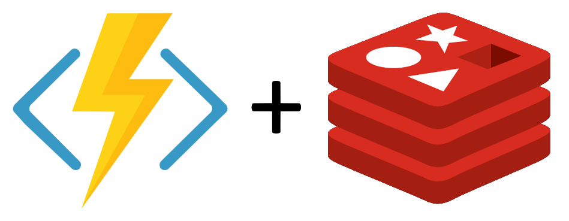
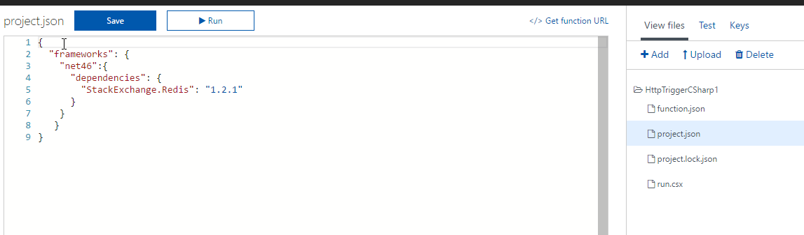
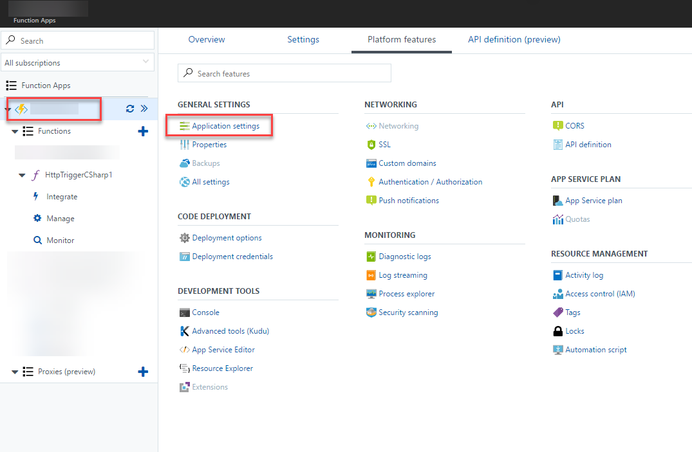
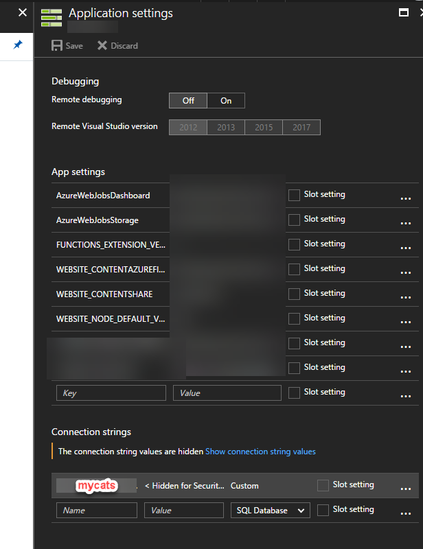

Quick explanation of how to use Redis and, specifically, the StackExchange.Redis package in an Azure Function.

## Assumption

I'm going to assume you have a Redis cache. Make sure to have the connection string handy. We will need it shortly. It should look something like this

> mycats.redis.cache.windows.net:6380,password==,ssl=True,abortConnect=False

## Add a project.json

- Select your function
- Click **View Files**
- Click **Add**
- Type **project.json**

This is what you need to enter in your project.json. Note that the version may be different in the future (it was current when I wrote this).

Once done, make sure to click **Save**

https://gist.github.com/bcnzer/4c82a254087fa252b2a0609daf189ee5

ddd

## Add the Connection String

You could put your connection string in code but you can store it centrally, as you normally do with an Azure Web App.

- In the list of functions, click the topmost element
- Click **Platform features**
- Click **Application settings**
- A blade will pop up on the right. Scroll down and, under Connection strings, enter
    - A name for your connection string i.e. mycats
    - Enter the connection string
    - Where it says SQL Database, select **Custom**
    - Press **Save**

## Putting it Together

In your .csx file, you need to:

- Add a **using StackExchange.Redis** statement
- Access the connection string
- Create a connection multiplexer using your connection string
- The rest is up to you!

Here's the start of some of some code. Doesn't do anything; it's just some sample code I grabbed but checkout Lines 2, 9 and 10, which I added.

If you have any questions on how to do something with StackExchange.Redis, [checkout the docs](https://stackexchange.github.io/StackExchange.Redis/).

https://gist.github.com/bcnzer/6530b7b31500b3727c8003cb73c332d9
