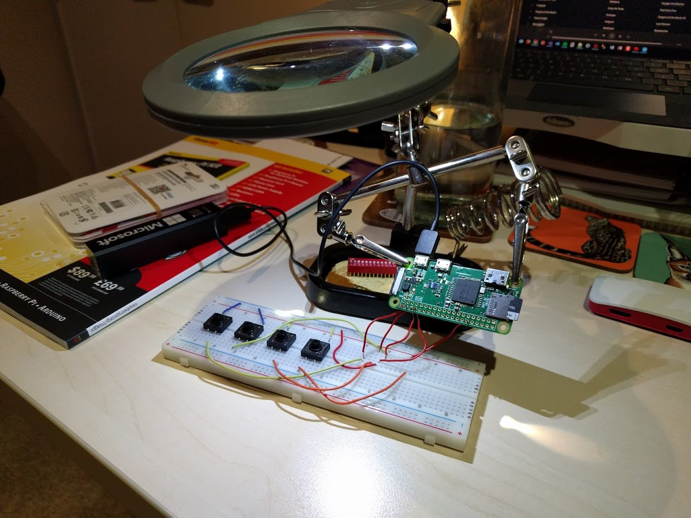
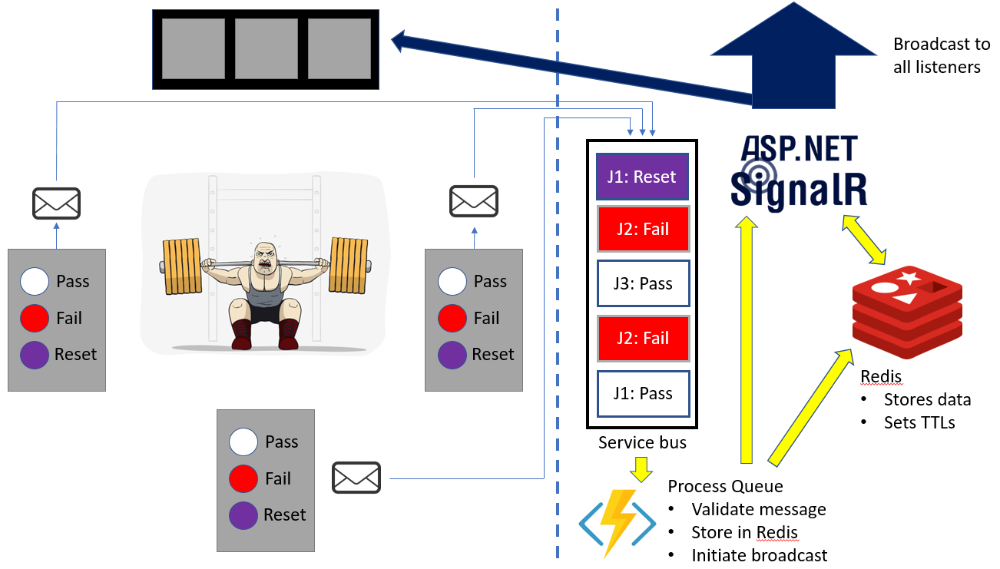

What is the coolest thing I've ever built (to date)? It's a wireless powerlifting judging unit. In this post I'll explain the motivation for building this and provide an overview of how it works.

## Why is this THE coolest?

The primary reason is because it uses a wide range of technology including hardware, software and cloud technologies:

- Raspberry Pi
- Linux
- Python
- Hardware / electronics
- Azure for
    - Service bus
    - Azure Functions
    - Web Apps
    - Table storage
- Redis (hosted in Azure)

The secondary reason that I've wanted to build this for AGES. I've gone through several iterations to get to this point.

Here's the current prototype unit.

## Caveat

This is a fun side-project for me and I'm using it to learn. It's not done - I need a few more iterations, including some real-life usage / feedback.

## Background

### What is Powerlifting?

The definition, from [Wikipedia](https://en.wikipedia.org/wiki/Powerlifting), is:

> **Powerlifting** is a strength sport that consists of three attempts at maximal weight on three lifts: [squat](https://en.wikipedia.org/wiki/Squat_(exercise) "Squat (exercise)"), [bench press](https://en.wikipedia.org/wiki/Bench_press "Bench press"), and [deadlift](https://en.wikipedia.org/wiki/Deadlift "Deadlift").

Every lift is judged by three judges who will either PASS or FAIL you. You need at least 2/3 for your lift to pass.

A powerlifting event is usually referred to as a **comp** (competition).

### Light boards

Each judge has a handset to indicate pass / fail and a light board to display the overall results.  White is reserved for pass, red for fail. Some examples:

\[gallery ids="3080,3081,3082" type="rectangular"\]

These systems tend to have the following characteristics:

- There is usually **only one light board at a comp**. Imagine a large crowd of people - plus the people at the desk recording the result - all trying to see that one light system. It's a pain
- They rely on **lots of wiring**, which is a hazard
- They tend to be one off / custom builds

Checkout this example. Judges are seated. Once the lifter finishes his squat the result is displayed on light board in the background. You can also see the mess of wires in the background.

https://youtu.be/lZc7q0EYvGs?t=48s

## Problems I'm trying to solve

1. Handsets to be **wireless**
2. Display the results on **many screens**
3. **Anyone** should be able to build a handset with minimal skill, cost and effort
4. **Secure**. I don't want people spoofing results
5. Eventually **provide an API** so results are automatically recorded. At the moment, in competitions there is someone that sits there ALL day, recording results. It's dreadfully dull (I've done it many times). I'd like to automate this

### The challenge of wireless

Infra-red is an option but you need line-of-sight. The judges shouldn't have to be pointing their handsets at some distant sensor.

In the maker community we have a wide range of wireless options available to us which operate at different frequencies. Surely we can use that? Well...

The first problem is the radio frequency bands. Some require you to be licensed while others, such as 2.4 GHz does not. Ok, so what if you stick to those safe frequencies?

The second, very serious problem has to do with approval. The components we buy have been individually approved. That's why they have the FCC or CE logo. In the US there are specific provisions for hobbyists but it's limited. If you want to sell your kit you must get certified and the costs are in tens of thousands of dollars.

The third problem is that the rules and frequencies vary by country. In my country (New Zealand) there is no provision at all for hobbyists so I'd be on the hook for all those costs. There's also the general risk that, if you mess up and interfere other devices or unauthorized frequencies, you could be prosecuted.

[Checkout this post from Sparkfun](https://www.sparkfun.com/tutorials/398).

Suffice to say, **it's best to avoid building any wireless equipment**. That's why I want something pre-built. Note that I did spend time / money on other hardware designs, which I have since canned.

## Architecture

The following is the high-level overview of how it works.

One key assumption is that the competition will have WiFi. If it doesn't a WiFi hotspot via a phone would do the job. It sends very little data.

## Judging Units

These are running a [Raspberry Pi Zero W](https://www.raspberrypi.org/products/pi-zero-w/) with buttons, a battery and a memory card. Pretty simple.

There is a python program running to capture the button click events and send them to the Service Bus queue. They can only send messages.

There is also logic/functionality to initially setup the device against the competition.

## Service Bus & Azure Function

All incoming goes here. Service Bus was chosen to guarantee the ordering of messages.

The Azure Function reads each message and does a bunch of validation work i.e. is this device against a competition?

## Redis

I already had a Redis instance so I decided to use it to store results processed by the Azure Function.

Problem is the AF cannot do the SignalR broadcast. What it can do is hit a URL in the ASP.NET app but the only thing I want to pass is the competition ID. I needed a fast, temporary storage area: Redis!

The Time to Live (TTL) functionality is very handy. I can essentially set expiry times. I believe I am setting the expiry of results to 1 minute from the time of the last result.

I'm also using Redis as part of the device setup process and the TTL functionality is also very useful (i.e. the setup code is only good for a few minutes).

Note that I am permanently storing the data in another location (table storage).

## Lightboard webpage

If you want to setup a lightboard you setup a screen, connect it to some type of PC (i.e. a Raspberry Pi or an old laptop) and get internet access setup.

Afterwards browse to a specific URL for that competition, set the browser to full screen and you're done! You can setup as many devices as you like.

Note that the lightboard web page is an ASP.NET app and is hosted out of Azure Web Apps.

## SignalR app & Broadcasting

When we have results from all three judges the Azure Function calls the ASP.NET app with SignalR to send a broadcast request. It will only send the broadcast request to those that have subscribed to that particular competition.

## Videos

Here is my current setup in action. This device corresponds to judge 2, in the middle.

Judges 1 and 3 are hard-coded to always send a pass result. I'm broadcasting to three different devices/browsers.

\[wpvideo q1Stkomy\]

Here's a video of me explaining the above setup better

\[wpvideo UmJFoqws\]

## Where to from here?

It's still early days. This is just the first iteration.

The next step is to get everything into a case. To date I've assumed the power will be a small USB battery pack. They're increasingly common and cheap. I got three small battery sticks as swag from Microsoft Build 2017.

Once I got everything in the case, next step will be to get it into the hands of users to see what they think.

Afterwards I think I will:

- review the setup process, to ensure it's secure / can't be spoofed.
- see if I can simplify the backend further.
    - review the use of service bus. Given I'm using Azure Functions I'm not sure it's needed
    - reconsider the use of Azure Functions as well. I believe my current free tier of app service only allows 5 websocket connections. The standard plan would give me unlimited websockets and plenty of power so I could just have the devices hit a URL on the ASP.NET app instead.

I'll write up another blog post once I have further progress. Thanks for reading!
