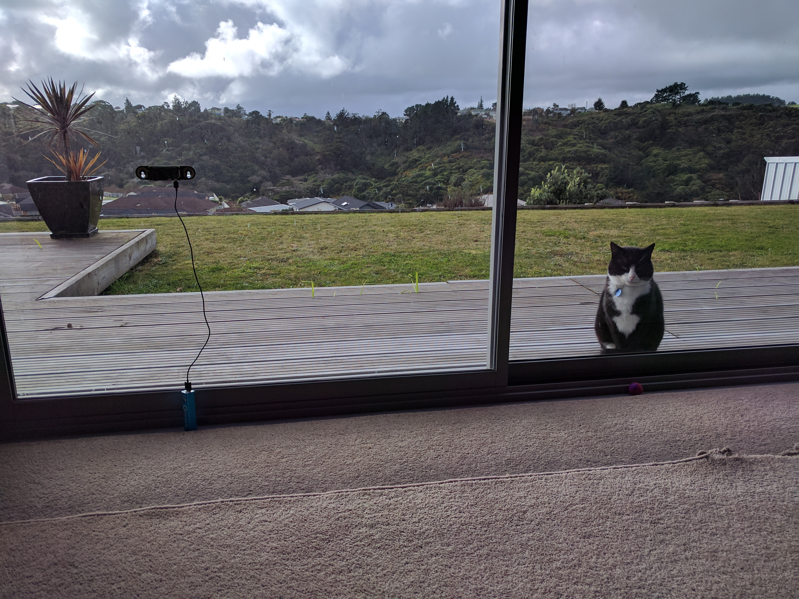
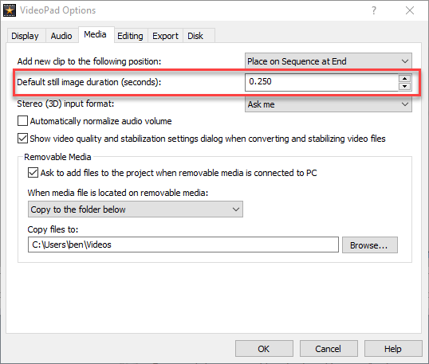

Do you have a Raspberry Pi and the hardware camera? If so, it's easy to take time lapse photos and then stitch them together into a video.

## Requirements

- Raspberry Pi. I'm using a [Raspberry Pi Zero W](https://www.raspberrypi.org/blog/raspberry-pi-zero-w-joins-family/)
- Memory stick with [Raspbian](https://www.raspberrypi.org/downloads/raspbian/) loaded
- [Camera module](https://www.raspberrypi.org/products/camera-module-v2/)
- Power such as a USB adapter or battery stick
- Video editing software

## My setup and sample video

Here is my setup. Note that I'm using a battery pack as the wall outlet is a fair distance away.

In the video below I took pictures for 12 hours, 1 minute each and displayed each photo for 0.25 seconds in the video.

https://www.youtube.com/watch?v=frLT6kNUXXc

## Hardware setup

The first step is to install the camera module. If you are using a regular Raspberry Pi, just connect the ribbon cable into the slot. You may also need to enable the camera in the Pi settings (I had to on my Pi Zero W).

If you are using a Raspberry Pi Zero then you will need to use the smaller ribbon cable that came in the case.

### Optional Hardware

The Raspberry Pi Zero has a case that works perfectly with the camera module.

\[gallery ids="3410,3411" type="slideshow" link="file"\]

I'm using the [Zero View](https://thepihut.com/products/zeroview) from The Pi Hut. It's a small board that enables me to stick the camera module and Pi Zero onto a window, with suction cups.

Please note that if you use the ZeroView you will need the [longer camera adapter cable](https://core-electronics.com.au/raspberry-pi-zero-camera-adapter.html).

\[gallery ids="3408,3409" type="slideshow" link="file"\]

## Software on the Raspberry Pi

Open the command prompt, create a directory to store all your photos then go to it. Once there, start the process!

https://gist.github.com/bcnzer/8bbf59dc7504d57b94b94d6af488879e

A few notes about the raspistill command:

- **\-o picture%04d.jpeg** means you want to output to a file with a file format with four digits. For example picture0001.jpeg, then picture0002.jpeg and so on.
    - Have a think about this and perhaps do the math. If you're running this for 12 hours and taking a photo every 10 seconds you will run out of numbers!
- **\-tl 10000** is the time lapse period in milliseconds. There are 1,000 milliseconds in a second (hence the term "milli") so this command is telling it to take a picture every 10 seconds
- **\-t 7200000** is the time period it will run for. It's also in milliseconds. If you do the math you'll see it's set to 2 hours (7,200,000 / 1000 / 60 = 120 minutes or 2 hours)

When you start the command it will sit there until it's done. You can see how it's going by opening the file explorer and seeing the photos.

Once it's done the command line window will be available for input again.

**NOTE:** if you stop the command and start it again, it will overwrite any pictures you already have! I found this out the hard way...

## Creating the Video

Let's not have our little Raspberry Pi create the video. My poor Raspberry Pi Zero W struggles to the basics at time!

### Copying the Files

I plugged in a USB stick into my Raspberry Pi and the contents of the entire directory onto the memory stick.

### Video editing software

There are many different packages out there. I found a free one called [NCH VideoPad](http://www.nchsoftware.com/videopad/index.html) for Windows.

In NCH VideoPad I had to do into **Tools** > **Settings** > **Media** and set the **Default still image duration (seconds)** and change it from the default 3 seconds. Change this value to whatever works for you.

Why change this setting? When you add all these photos, this is how long you will see them for in the video. Three seconds was too long for me and I had hundreds of images so I didn't want to individually change them.

Once you have changed the setting, select all your photos in file explorer and drag them onto the main timeline.

The last step is to export the video and share with your friends!
