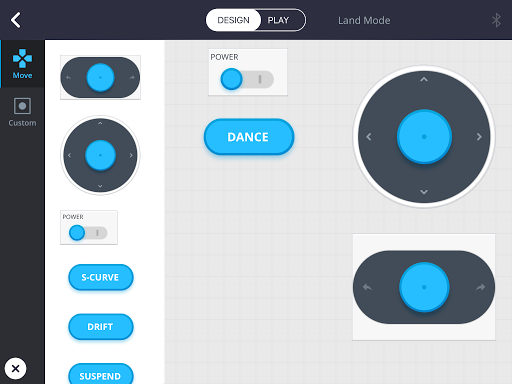
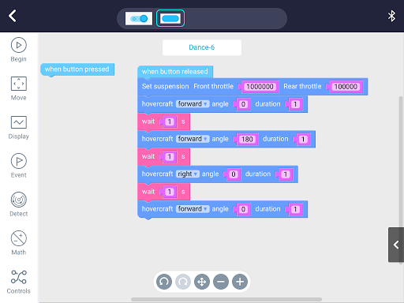
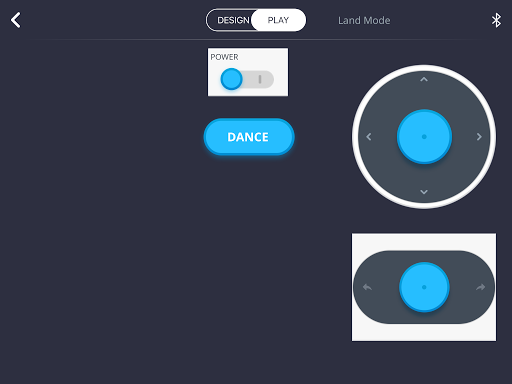

I recently received Makeblock Airblock. It's a drone / hovercraft you can program using a Scratch-like language and I've been keen to create my first project. Took me a while to learn a few key things but I've now got my hovercraft doing a 'dance move' (I wanted it to move a certain way).

## Requirements

- [Makeblock Airblock](https://www.kickstarter.com/projects/1818505613/airblock-the-modular-and-programmable-starter-dron) setup in hovercraft mode
- A tablet, such as an iPad (what I'm using)
- Makeblock software installed on the tablet ([here's the current iPad version](https://itunes.apple.com/us/app/makeblock-play-stem-robots-visual-programming/id918804737?mt=8))

## Creating the Code

- Open the Makeblock app
- Pair your Airblock to your tablet
- Click **My Projects**
- Click the Add + icon and select **Land Mode**
- Click the **Design** tab
- Add the following from the **Move** menu option
    - **Power**
    - The two direction palettes
- In **Custom** add a button
- Touch the button and change the name to **Dance**

So far you should have something that looks like this. You can arrange it however you like.

Once you have that setup click the button again and select **Code**. You will see two blocks. Enter the code similar to what you see below.

### About the code

A few key things to notice in the picture above:

1. We used the **Set suspension** block. This is important because this defines the power the Airblock will use to go back and forward. I entered huge numbers meaning it will go fast!
2. We also used a **wait** block. You need to give your Airblock time to complete an operation before jumping into the next one
3. The **button released** event was used. That means it will only take off once you take your finger off the button. If you hold down your finger but don't release the button, nothing will happen

## Let's Play!

Once you're done, click the **PLAY** button. It should look like the following.

To make it go, flick on the power and press **DANCE**

Here's a video of my Airblock in action.

Note that the control items we added were there purely to give us manual control, incase we needed it. I used it because, when testing, sometimes I was too lazy to get up, bring my drone back to the start position.

https://www.youtube.com/watch?v=2Zb7VzXrjS0
