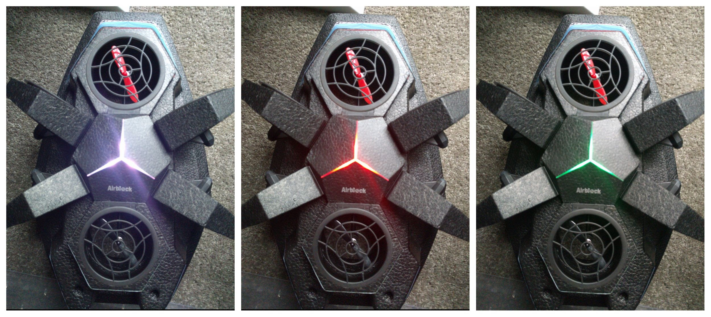
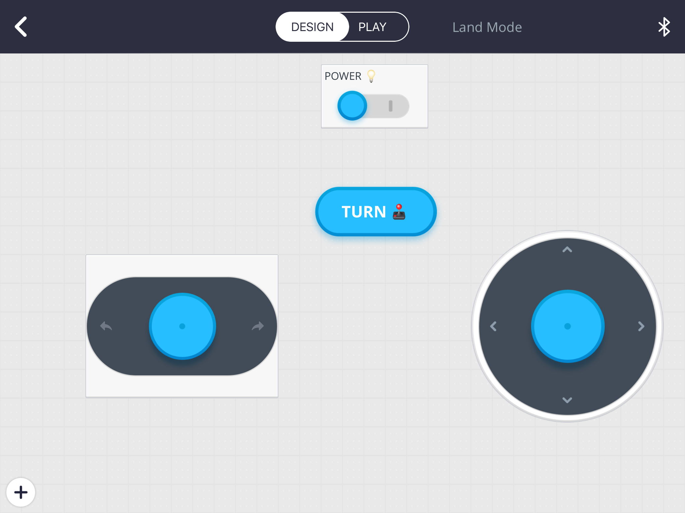
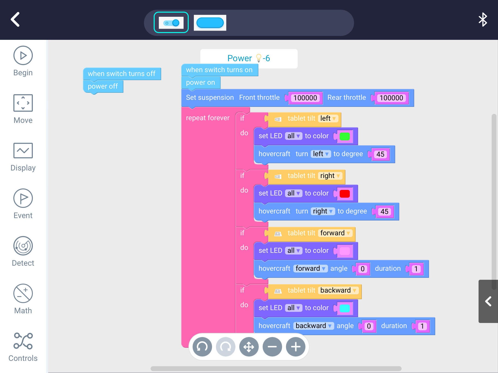
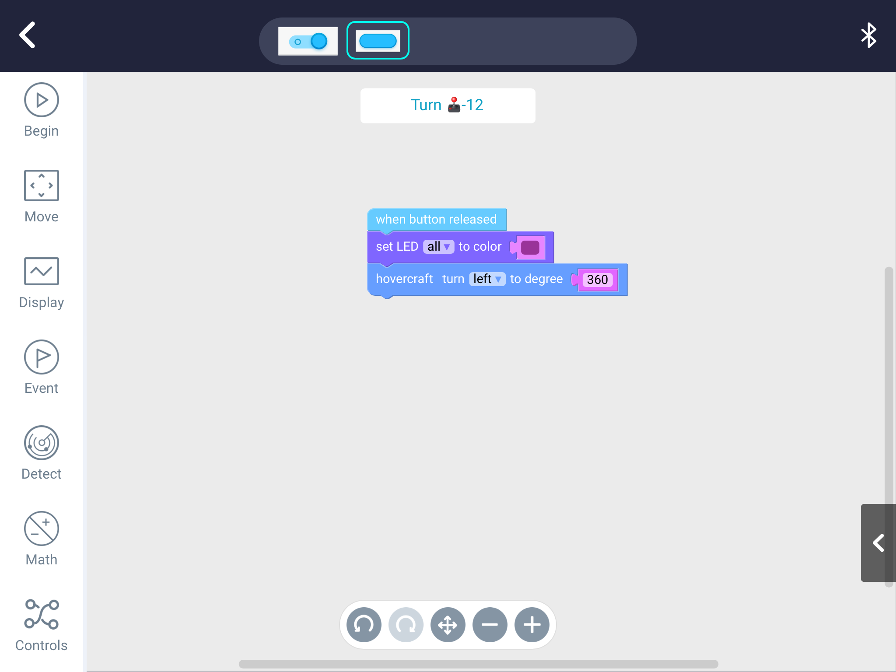
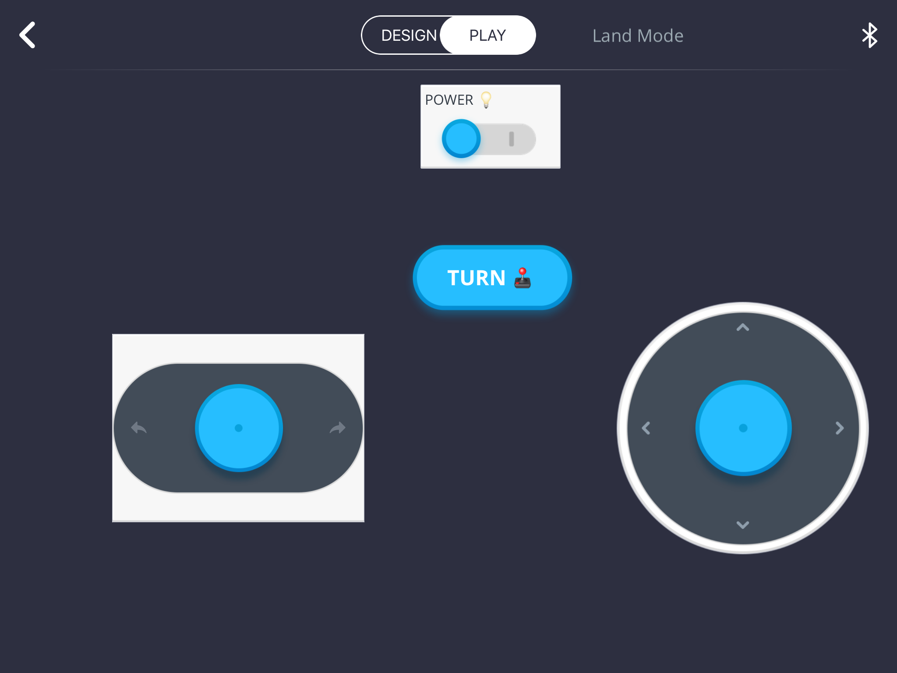

In this project we are making use of the Makeblock Airblock's tilt and LED functions, in hovercraft mode.

## Prerequisites

You will need an Airblock setup with your tablet. [Checkout this project](http://liftcodeplay.com/2017/06/28/makeblock-airblock-hovercraft-dance-project/) for basic instructions.

## Background

Before you jump into coding, here's a few key concepts to understand.

### Tilt Event

If you tilt your tablet left/right or forward/back, Airblock will fire (aka invoke) a Tilt event. That means we can "capture" that event and run some code.

Unlike a button press event, which can come with it's own code, we need to add functionality to constantly check for the tilt events. We'll do that the moment we power on the Airblock.

One important thing to note is that you only need to tilt the tablet for a moment. If your iPad remains tilted for a prolonged period of time the event may fire many times. There may be a small delay before the event is processed.

### LEDs

On the main module of the Airblock there are three LEDs. You can set them to a variety of colours.  In the picture below you can see #1 is set to red while #2 and 3 are green.

There are two ways to set LEDs:

1. by explicitly picking a colour
2. doing it programmatically (i.e. by defining the amount of red, green and blue with numbers).

In this project we'll keep it simple. We will set the same colour for all LEDs and we'll just pick a colour for each tilt event

Examples of purple, red and green

### Emojis!

This is not at all required but it's fun!

When you name the controls, you can include emojis. We've added some, to make it a bit more fun. Feel free to do so but don't worry if you can't find the emojis in the pictures.

## Code

### Designing our controls

- Open the **Makeblock** app
- Click **My Projects**
- Click the **add +** button to create a new project
- Select **Land Mode**
- Click **DESIGN** and add the following items
    - Power
    - The two direction palettes. We're adding these to enable manual control. As such, it's optional
- As a bonus, add the following
    - Under custom, select **BUTTON**
    - Touch the button and rename it to **Turn**. You can also add an emoji to the name, as we did

Once you're done it should look something like this.

### Code within the Power control

- Touch the Power slider and select **Code**
- Enter the following code under the **when switch turns** on item

What this code is doing is:

1. It starts when the power is switched on
2. Turns on the power for the Airblock (some of the fans will turn on)
3. We set the suspension to something big. This is essentially telling the Makeblock what speed we want: fast!
4. In the repeat loop we check for tilts in the four different directions and, if we find a tilt event, we set the LEDs to a colour and move the hovercraft.

### Bonus button

My daughter felt we needed a special button, to do a finishing move. That's why we added the turn button.

As you can see from the code, it will set the LED to purple and change

## Let's Play!

**Remember** that this app uses the tilt function so, when you start the app, have your tablet level / lying flat.

This is what the app looks like in PLAY mode. Flick the Power switch on and start tilting your tablet!

Here's it is in action. We test all four directions and, in the end, we push our special button. In each case the LEDs change colour (which is also a really handy way of knowing the command has been received, especially since we display the color before doing the movement command).

https://youtu.be/wTwv74holxA
