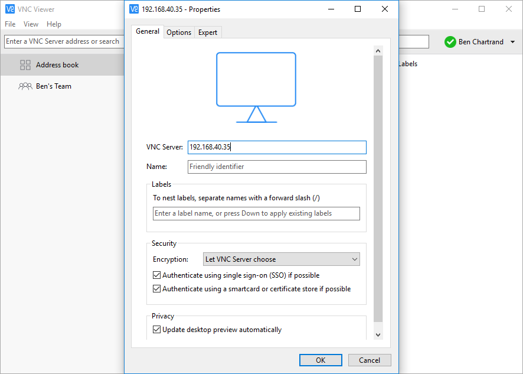

I love coding on my Raspberry Pis but I don't like having to plug in a separate monitor, keyboard, mouse, etc. I would much prefer I remotely access my Pi from my main PC which has a large screen. I use VNC Viewer to do it and I'll show you how to do it!

## Prerequisites

- Raspberry Pi. I'm using a [Raspberry Pi Zero W](https://www.raspberrypi.org/blog/raspberry-pi-zero-w-joins-family/), which has WiFi
- Up to date version of [Raspbian](https://www.raspberrypi.org/downloads/raspbian/) on the memory card
- Power supply or, if you have a Pi Zero W, perhaps a battery pack
- A device you will use to remote into the Pi. Can be a PC, Mac, Chromebook or device running Linux.

## Background

Let's go through some terminology.

### Headless?

I like to run my Raspberry Pis in headless mode which means no keyboard, mouse or monitor. I find it can be a real pain having all that seperate kit just to use your Pi, especially when I have a really nice keyboard, mouse, screen, etc at my main PC.

This is my [current project](https://liftcodeplay.com/2017/06/10/coolest-thing-ive-ever-built-part-1-overview/). The blue stick is a battery pack. This computer is on - it's running headless! The only hint it is on is the slight glow in the battery pack and a single LED on the Pi Zero W (currently hidden by the case).

### RDP

[RDP](https://en.wikipedia.org/wiki/Remote_Desktop_Protocol)  (Remote Desktop Protocol). It's how people in the Windows world remote access, say, a Windows Server.

When I started searching I wanted an RDP-like solution. Just want to stress: the ultimate solution we'll be using is **NOT** RDP but, conceptually, it's very similar.

### SSH

In the Linux world you can remotely access systems via the command line. This is great if you're familiar with the command and happy to use ONLY the command line.

We won't be using SSH in this blog post but, if you pay attention, you'll see where to easily activate it.

### RealVNC and VNC Viewer

[RealVNC](https://www.realvnc.com/) - it's a company that provides remote access software called VNC Viewer, available on Linux, Mac, Windows and more. . Checkout their website for details. The summary points which is great for us makers / Pi enthusiasts is:

- If you are devices on the same local network (i.e. the Pi sitting beside me on my desk) then there's no cost and you can connect to many units. The catch is you must know the IP address
- You can create an account have up to 5 devices for free, which means you can securely access the device from anywhere!

## Setting up your Pi with Real VNC

### Step 1 - network access

If you have a classic Pi plug the device into your local network.

The Raspberry Pi Zero W is a bit of challenge to get setup. [Here's a good blog post](https://core-electronics.com.au/tutorials/raspberry-pi-zerow-headless-wifi-setup.html) on how to set it up but it assumes you're not afraid to use SSH.

Alternatively, you can do what I've done:

1. Plug the Raspberry Pi Zero W into a TV. Note that you'll likely need a HDMI micro adapter
2. Get a **powered** USB hub. If it's not powered you won't be able to use your keyboard and mouse at the same time (or at least I couldn't!). How do you know it's a powered USB hub? Because you plug it into the wall
3. Plug in your keyboard and mouse into the hub
4. Connect the power

### Step 2 - Get the IP address

You need to get the IP address of the device.

If you have logged into the device the easiest thing to do is open the terminal and type **ip addr show**. As seen below, you should be able to see your IP address. 

 

When I first started out I logged into my router and found the IP address.

### Step 3 - Enable VNC

Let's enable VNC

- Click the Pi icon > **Preferences** > **Raspberry Pi Configuration**
- In the Raspberry Pi Configuration window click the **Interfaces** tab

### Step 4 - Security

We always need to think security-first! At a minimum, you need to change the default password.

In Raspbian the default username and password are **pi** and **raspberry** respectively.

To change the password in Raspbian:

- Click the Pi icon > **Preferences** > **Raspberry Pi Configuration**
- In the Raspberry Pi Configuration window click **Change Password**
- Follow the prompts, click OK. It may ask you to reboot

### Step 5 - Download VNC Viewer

Install the [VNC Viewer](https://www.realvnc.com/download/vnc/) appropriate for you.  I'm using the Windows version.

### Step 6 - Connect to your device

Open your VNC software. You want to Add Connection. Here's what, precisely, I did in the Windows version

- Open **VNC Viewer**
- Clicked **File** > **New Connection...**
- In the **VNC Server** field I entered the IP address from Step 2
- Pressed OK

Once it's setup double-click the item. It will ask you for a username and password. Recall the default username is **pi** and you changed the password. It's up to you if you want VNC Viewer to remember the username/password

## You're logged in! Woo hoo!

Once you've logged in successfully entered your credentials you should be able to login!

If you have used RDP you will find it is very similar. Note that copying and pasting between your PC and VNC Viewer works.

## But wait... there's more! Remotely accessing the device from anywhere

Early on in the post I mentioned you can have up to 5 devices you access from anywhere for free. Note that it's only for non-commercial use.

I once went to a Coder Dojo session and was able to show the team my Pi, running live at home, which was taking pictures as part of a time lapse photography project.

To enable this feature you need to:

1. Create an account on the RealVNC website
2. Go back into your Pi configuration screen and change the host name. I have several devices. I just append something to the default "raspberrypi" hostname
3. On your Raspberry Pi you'll see a VNC icon.
    1. Click on the icon
    2. Click sign-in and enter your credentials
4. In the VNC Viewer software setup a new connection. Instead of the IP address enter the hostname

Done!
