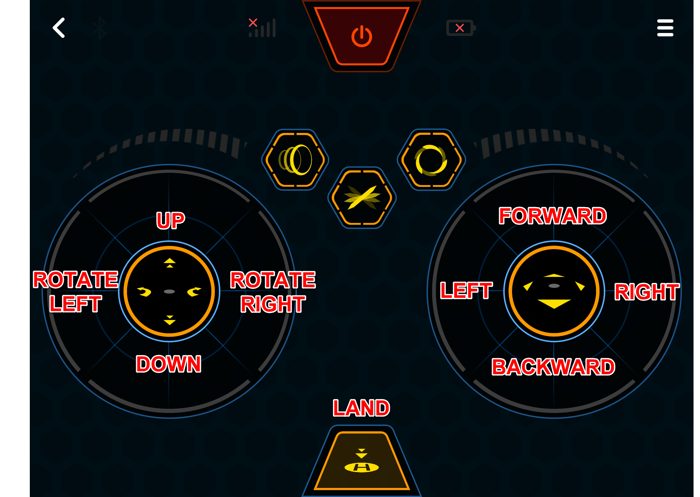
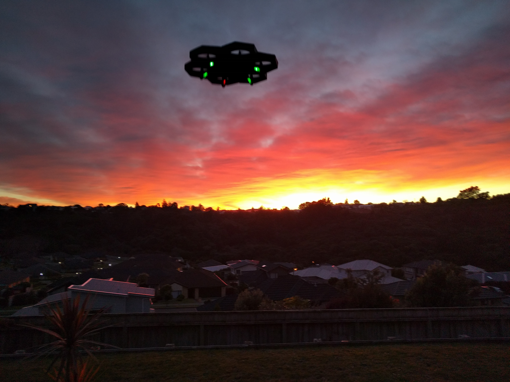
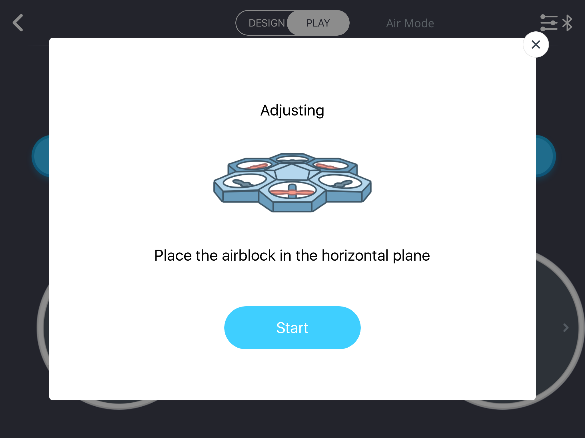
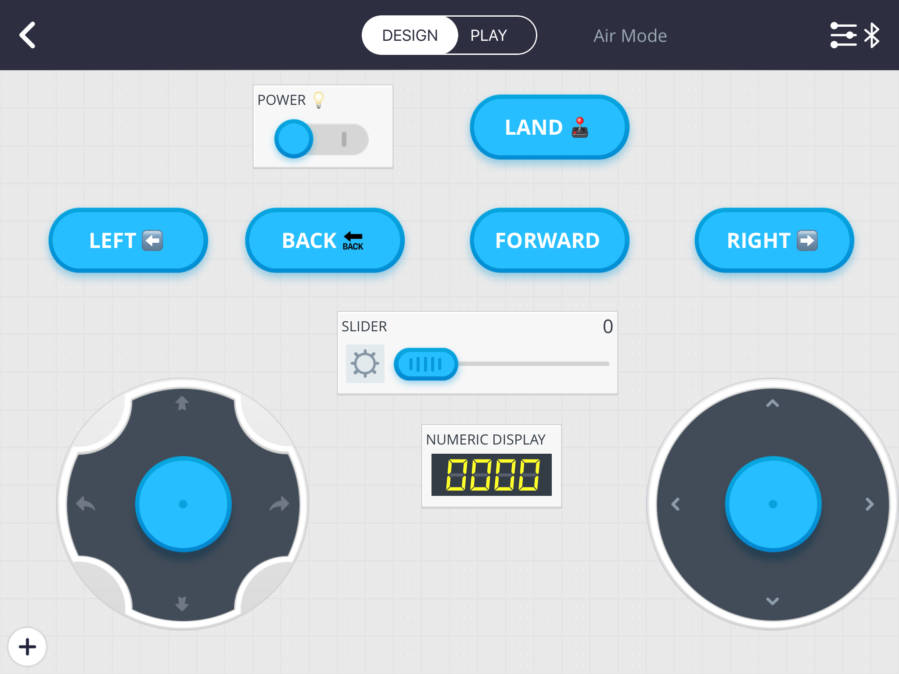
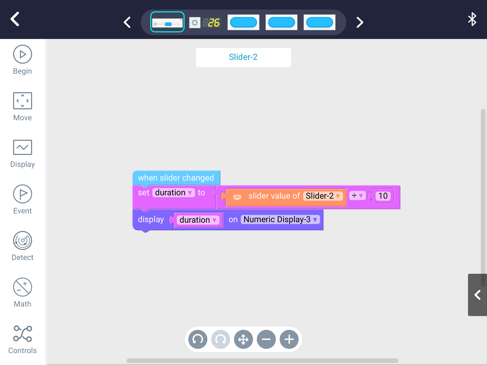
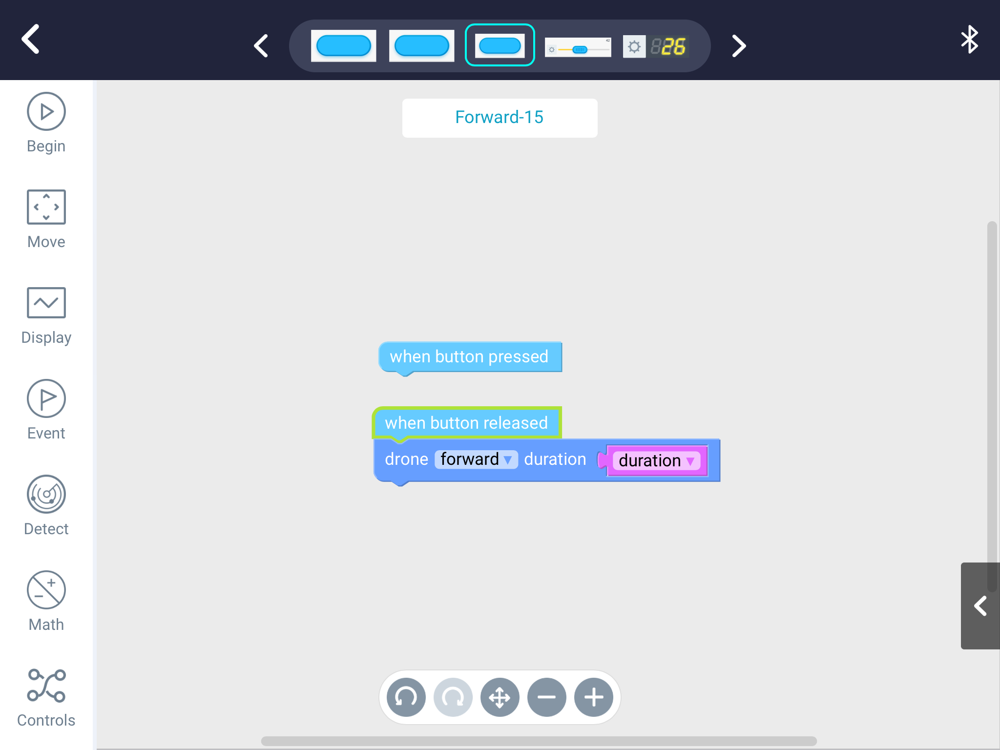
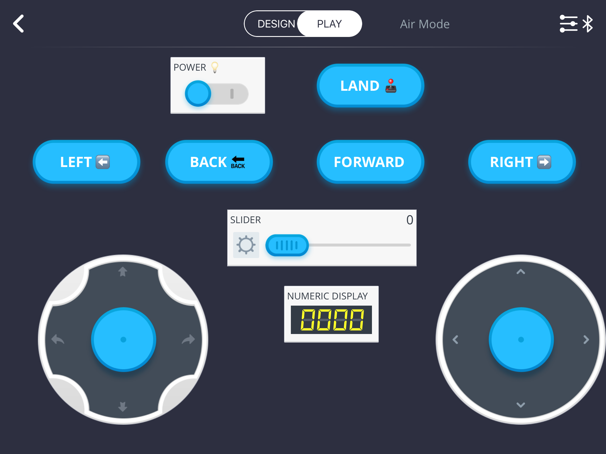

Let's programmatically take to the air with this Airblock.

## Prerequisites

You will need an Airblock setup with your tablet. [Checkout this project](https://liftcodeplay.com/2017/06/28/makeblock-airblock-hovercraft-dance-project/) for basic instructions.

## Background

The Airblock is a lightweight, modular drone. It's a very forgiving device but there are things to be aware of before we get started.

### Piloting a drone is challenging

It takes some effort to control a device in a three dimensional space with both hands. Before you get started I suggest you try learning the manual controls. I've explained the two controls below.

\[caption id="attachment\_3911" align="aligncenter" width="2160"\] The manual control panel with all the basic controls explained\[/caption\]

### What if I crash?

The Airblock is it is very forgiving. It's lightweight, modular and primarily made with Styrofoam so, worse case, if you slam into a wall the unit will fall to pieces but it will be fine. You can put it back together. Here's my drone assembled and disassembled.

\[gallery ids="3940,3941" type="rectangular" link="file"\]

### Environment

The Airblock can be used indoors and outdoor but, in my opinion, it's better for use indoors. The unit is very light so a gust of wind can easily toss it around. I had a hard time taking this photo outside because of a light breeze.

### Safety

The Airblock software mentions a few safety items:

- Remove the shields as it disrupts flight functions
- Fly in calm weather and not over water
- Keep 2 meters (6.5 feet) distance from other people and objects

\[gallery ids="3924,3925,3926" type="rectangular" link="file"\]

What I would add to this are:

- Be mindful of pets. They could be scared of the drone
- Be mindful of your surroundings. If you're flying indoors, is there anything that you could crash into? If you're outside, is there something like electrical lines nearby?

## Calibrating the drone

Before you take off make sure to go into the top right hamburger menu for Settings and click **Adjusting**. Set the drone flat and click start. This will ensure the drone flies level.

### How do you know which way is forward?

When you assemble the Airblock it's important that the fan with the red dot on the foot is at the top.

How do you know what section is the "top"? If you turn on your Airblock the three LEDs will light up. The red LED points to the top.

When you are flying the underneath of the propellers will light up green except for that one special one, which will light up right. That's how you can tell what direction is forward.

\[gallery ids="3966,3965" type="rectangular"\]

## Let's write some code!

### Controls

Start a new project and layout the following controls:

- Power
- Pre-created LAND button
- Add custom buttons for:
    - LEFT
    - BACK
    - FORWARD
    - RIGHT
- Slider
- Numeric display
- The two manual control pad

It should look something like this. Note that we found some emojis, which we added to the button names and power switch. Those are purely optional.

### Code

In the slider enter the following code blocks. The code is doing the following:

- Takes the value of the slider and dives by 10. The slider goes from 0 to 100 but I want a value from 1-10
- Stores the value in a variable called **duration**, which I created
- Displays the value of duration in the numeric display

An example: if you drag the slider to 47 it will produce a duration of 4 (seconds) which will apply to any direction.

For the FORWARD, BACKWARD, LEFT and RIGHT buttons enter the following. Where it says "drone forward", change it to the appropriate direction (i.e. for the left button, set drone to left)

## Let's fly!

Once you're done you should have something that looks like this.

To take off:

- Flick the power switch on
- Set the slider. I suggest you start with 10-19, which will give you a value of 1 in the numeric display
- Manually take the drone up to an altitude that makes sense for you
- Try the left, right, back and forward buttons
- One done, click the land button

Here's a video of me flying the drone.

I suggest you enable the closed captioning (CC) to see the commentary, as I fly it. I had trouble controlling it once it got close to my heater, which was blowing warm air.

https://youtu.be/GoeLPgMS3yk
