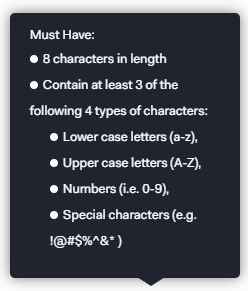
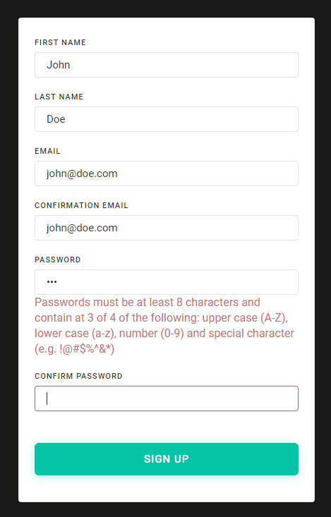

Let's walk through how to use the RegularExpression attribute in a ASP.NET Core View Model to validate a complex password requirement during registration, in which users must use 3 of 4 different types of characters.

I'm using [Auth0](https://auth0.com) and have configured passwords in the systems to have the following requirements. I want to ensure my front end is enforcing these requirements.

In my ASP.NET Core project, which has jQuery validation, I was able to use the **\[RegularExpression\]** attribute in my view model. I could then add the regular expression and error message.

There is no simple, elegant regex to solve the above. What I have is long because it effectively checks for each of the possible scenarios.

Here's the code and a screenshot showing it in action.

https://gist.github.com/bcnzer/9ec872a30551bfb358324c83fc9579d9

\[caption id="attachment\_4046" align="aligncenter" width="469"\] Example of the password validation in action\[/caption\]
