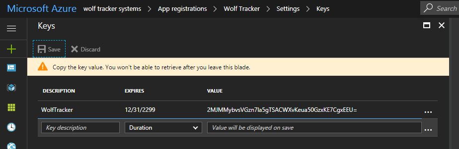

Let's walk through how to get setup with Azure Key Vault, step by step and using only the new Azure portal (no Powershell or old Azure portal).

## My motivation for this post

I'm not a fan of the documentation provided by Azure and the ASP.NET Core team on how to get Key Vault setup. My key complaints are:

1. The Azure Key Vault documentation initially focuses purely on Powershell (the command line) despite there be a UI in the Azure portal. Originally Key Vault was only available via Powershell. It's as if the documentation was never updated
2. The ASP.NET Core documentation refers users to Active Directory via the old Azure portal. Everything can be done in the new Azure Portal. Another case of old documentation in my opinion.
3. The ASP Core article links to an article, which links to an article. It's a pain, having to cross reference three posts.

So this blog post will cover how to do everything using the new Azure portal.

## Requirement: Active Directory

Before you get excited about Azure Key Vault please be aware there is one very important requirement: you must have an **Active Directory** setup with your Azure account.

If you don't have one you will need to get one setup (sorry, I can't help with this). That being said, it was pretty easy in my case. Turns out my Office 365 email account, which I use for my Azure account, is backed by an AD! I was able to use that. The AD showed up in my Azure account.

## Why Azure Key Vault?

Managing secrets can be a pain - and a risk!

- You need to keep these keys out of code. They should NEVER touch version control
- Secrets must be setup on your PC for development purposes
- Secrets must be setup online, in Azure.
    - You could end up setting up the same secret several times (i.e. a Google Maps API key for several different Azure Web App instances)

In ASP.NET Core we have the concept of [user secrets](https://docs.microsoft.com/en-us/aspnet/core/security/app-secrets). This is great for keeping key secrets out of your code. The downside is the user secret file (secrets.json) is an unencrypted file sitting in a folder on your PC.

Below is a picture of my secrets.json from my PC It was getting long, with increasingly sensitive info. Note that all this info was also in the Application settings of my Azure web app.

With Azure Key Vault I'm getting rid of everything except the connection strings. The connection strings have sensitive info but I'm usually developing against local instances so it's not a problem.

## Step 1: Create a Key Vault in Azure

- Click the green **+** to add a new resource
- Type **Key Vault**
- Enter details such as a **Name**, **Resource group** and more
- Click **Create** when done

At this point we'll leave it to get setup. We'll come back to this later to setup our secrets.

## Step 2a: Application setup in Active Directory

- Open **Azure Active Directory**. I've got a small diamond shaped icon on the toolbar in the Azure Portal. Looks something like this

- Click **App registrations**

- Click **New application registration**

- Enter a **name** and the **sign-on URL**. Don't stress about the sign-on URL. Appears you could put about anything in there

## Step 2b: Application ID

- Once created, click on the application to expand the registered application
- Copy the **Application ID**. You will need later so I suggest you store it somewhere temporarily (i.e. in Notepad)

## Step 2c: Keys

- Click **Keys** under Settings for the registered app.
- You will need to create at a key for application.
    - I chose to name mine after my main app and set a expiry of Never expires.
- Copy the **value** it generates. I suggest you put this in Notepad temporarily. **THIS IS IMPORTANT** as you can't access this key again.

## Step 3: Key Vault Config

- Go back to the Key Vault you created
- Click **Access policies**
- Click **Add New**
- Click **Select Principal** and find your application. Once you have click it and press Select
- Once you have selected it you will need to configure permissions. I chose the Key, Secret & Certificate Management in this example but, in hindsight, that wasn't very smart. It's better to select minimal set of permission wherein the app can only read (no writes, updates, deletes, etc).
- Once done, click **Save**

## Step 4: Setup Your Secrets

You can setup different types of secrets in Azure Key Vault but I'm interested in what will replace values in secrets.json. Here's what I did:

- Click the **Secrets** tab
- Click **Add**
- In **Upload options** select **Manual**
- Entered a **Name**
- Entered a **Value** (the secret)
- Click **Create**
- Repeat for all your other secrets

Remember my secrets.json? It's easy entering a value such as the SendGridEmailAPIKey but you'll notice I have some values in a hierarchy. For example: under Auth0 I have ClientID.

In my code I would access one of the Auth0 items like this: **Auth0:ClientId** but you can't use that the colon character in key vault names. Instead, seperate them with two dashes -- i.e. **Auth0--ClientId**

 

## Step 5: Get the Key Vault DNS Name (aka the URL)

- While you're still in the Key Vault click the **Properties** tab
- Copy the **DNS NAME**. It should be **https://<name of your vault>.vault.azure.net**
    - Example: https://wolftrackervault.vault.azure.net/

## Step 6: Configure your Startup.cs

- Open your ASP.NET Core project
- Add the NuGet package **Microsoft.Extensions.Configuration.AzureKeyVault**
- You need to modify the startup code so it's something like this. A few things to note:
    - I'm checking user secrets if I'm in development mode. This is how I'll get the connection string to local resources
    - Afterwards I'm getting the secrets from the vault



## Step 7: Setup Key Vault secrets

- Go into your secrets file, on your local PC, and add the KeyVault secrets. I chose to set them up like this. Please note
    - ClientId comes from **Step 2b**
    - ClientSecret comes from **Step 2c**
    - SecretUri comes from **Step 5**



- Once you've done this go into all the relevant Azure Web App instances and make the corresponding changes:
    - Open the web app
    - Click **Application settings**
    - Under App settings add:
        - KeyVault:ClientId
        - KeyVault:ClientSecret
        - KeyVault:SecretUri
    - Click **Save** once you're done

## Done!

If you found this useful please let me know in the comments :)
