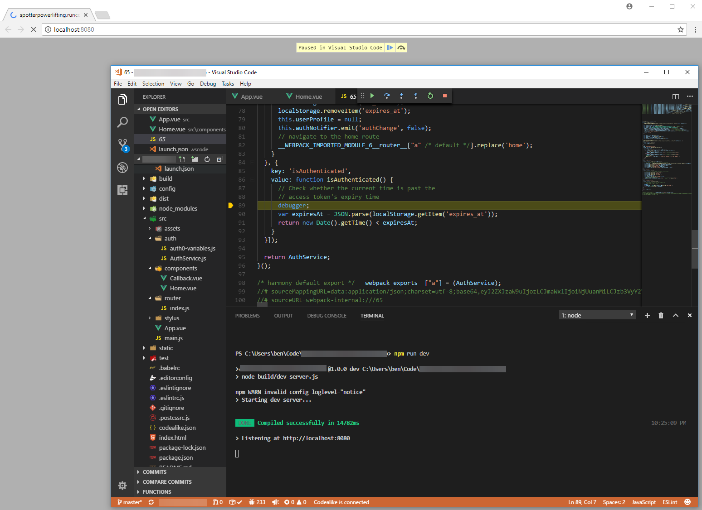

Trying to get some basic debugging working with your Vue.js app and VS Code? Here's how you can do it!

I did not figure this out on my own. Credit for that goes to [jvanburg on the Vue.js forum](https://forum.vuejs.org/t/debugging-vue-files-with-visual-studio-code/8022/7). The purpose of this post is to expand on his message and explain it in more detail.

The following isn't ideal but I tried a lot of options and found this was the only thing that worked. I'd love to be told there is a better way, to get full/proper debugging.

# Getting Setup

VS Code uses a launch.json file to define how you debug. I've tried a bunch of options but the only one that really works is to tell Chrome to launch AND set **sourceMaps** to true like this

https://gist.github.com/bcnzer/b57023584031ae90112970cb89798bb5

# Setting Breakpoints

Don't bother setting breakpoints - the red dots. They won't work.

Instead, add the `debugging` (line 24) statement in your code like this in your vue or js file(s). These statements will act as your breakpoint.

https://gist.github.com/bcnzer/b948fb4b245c43af7cad3e406acdf68a

# Debugging

There are two steps here:

1. From the command line start your app in dev mode i.e. `npm run dev`
2. Afterwards press `F5` in VS Code to start the debugger. You will notice Chrome and VS Code will stop on the debugger statements

 

## Why does the JS look different?

I'm not a JS dev expert but from what I understand it is debugging the JS used in the browser - which was prepared by babel/webpack, etc.

**_Happy debugging!_**
