Are you using Robot Framework for your Selenium UI tests? Would you like to know how to get it all working in Visual Studio Team Services (VSTS) as part of your release pipeline? Let me show you how!

# Overview

The key steps described here are:

1. **Creating a build server**. I figured out how to do it on the cheap (great for learning in my spare time)
2. **Setup tests on the build server** so they're always available to run when I run my release my other applications
3. **Add steps to run tests** as part of my continuous deployment (CD) release pipeline

# Background

## It all started as a dream...

I was writing a big, complex page in my application. I wanted to wrap it in a series of tests - including Selenium UI tests.

In the past I used the Selenium tests, written in C# and as part of my ASP.NET Core project. That worked well enough but I was after something completely agnostic of the language as I was also planning to write a Vue.js SPA.

A friend recommended the [Robot Framework](http://robotframework.org/), showed me how to use it and I was quickly up and running!

I was already using VSTS to build and deploy my application. The basic process went like this:

- If I commit to the **master** branch, I kick off a build
- If the build is successful (compiles and all unit tests pass) I deploy to **dev**
- Ask for permission to deploy to **test**. Once approved, I deploy and then I can test manually
- Ask for permission to deploy to **production**

I kept thinking: wouldn't it be freaking awesome if I could put all my automated tests in the test step and have it report back to me? That way I don't need to run them purely on my PC.

## The dream quickly became a nightmare

I was using the VSTS agents but I quickly realized I couldn't Selenium tests on them. You need a build server.

Trouble is I couldn't afford anything remotely decently/grunty. I'm doing all this in my spare time, with my own money.

I also discovered that VSTS doesn't natively support Robot Framework tests.

I really wanted to do this but I decided to park it.

## Then the flicker of hope...

Then came my first realization: build servers can be cheap (for me, as a hobbyist!) and can do everything I want!

# Build Server

## Yes, you need a build server

VSTS agents are great. They come pre-loaded with a bunch of software and provide 240 minutes per month.

Trouble is you you don't own the agent. You get one assigned. If you need more software you must install it every time. For Selenium we need all the different browsers, Python and more.

Even if we did take the time to install all that every time we got an agent, they can't actually run the tests. They're effectively a "headless" device (little more than a command prompt).

## Get a build server for cheap

If you're a business or have a team with more then two people, skip this section and just get a VM. Something with an SSD, 2+ cores and 8+ GB of RAM.

If you're like me - using your own money to pay for everything and only using it for a few hours a day - use [Azure DevTest Labs](https://azure.microsoft.com/en-us/services/devtest-lab/). Big benefit: it can auto shut-down VMs! **This is important because you only pay if the VM is running**. You can even get it to auto-start but I suggest you just kick it off manually.

Checkout [this article by Peter Hauge](https://blogs.msdn.microsoft.com/peterhauge/2016/08/14/how-to-create-a-monster-build-agent-in-azure-for-cheap/) for more info.

My VM has to be activated manually but it automatically shuts off by 11 PM. If I'm not using it for a while I turn it off.

[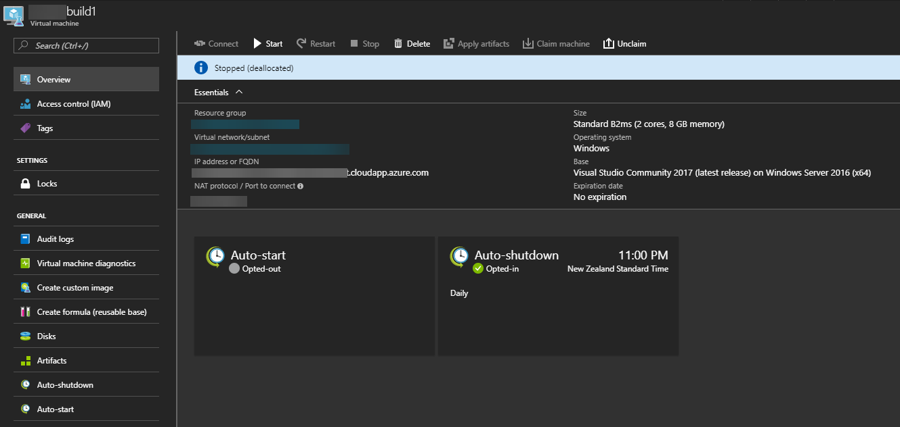](https://liftcodeplay.files.wordpress.com/2017/11/build-server-details.png)

## Software Setup in my VM

- In DevTest labs I selected a Windows server image with the latest Visual Studio Community Edition installed.
- I chose the following 'artifacts' (apps that will get installed as part of the image):
    - Chrome
    - Firefox
    - Selenium
- I also chose the additional artifacts, just incase:
    - Notepad++
    - Visual Studio Code
    - Node JS
- **DO NOT CHOOSE TO INSTALL THE BUILD AGENT.** We need to install it manually and set it up differently, in order to configure it in **Interactive** mode. The artifact setup does not support interactive mode

[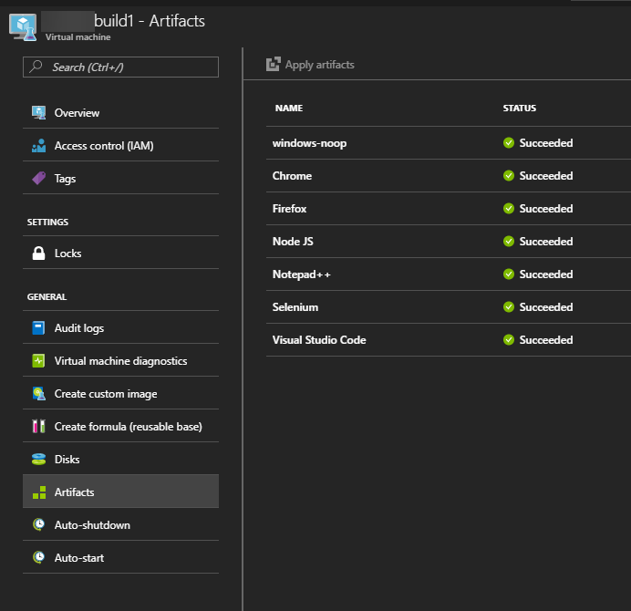](https://liftcodeplay.files.wordpress.com/2017/11/build-server-artifacts.png)

### Software setup - once the VM is created

- Click **Start** to boot up the VM
- Download the RDP file (click the **Connect** button in the VM details page)
- Log in using the RDP file
- Install Python 2.7.14
    - Add a PATH environment variable to C:\\Python27
- Run a bunch of pip commands as seen below. The last command is to test the robot framework is working.
    - **TIP**: if the version test is not working try closing and and re-opening your command prompt. That seems to be the trick with newly added PATH variables



### Software setup - create a queue and download the agent

At the moment you just have a server. You need the VSTS agent installed so you can use it for all your CI/CD awesomeness - including our Selenium tests!

You need to access to your VSTS account.

1. Go to your project and select the Gear icon, then **Agent Queues**
2. Create a **new queue**. Call it whatever you like it. I called it Private i.e. "Build Private".

[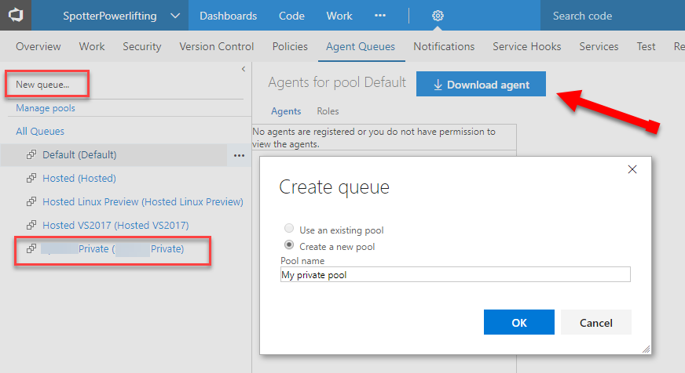](https://liftcodeplay.files.wordpress.com/2017/11/queues.png)

Now we need to install the agent on our server:

1. Click the copy icon (top red arrow, in the picture below), then jump into your VM and start downloading the agent. It's a zip file
2. Unzip the file contents somewhere i.e. to C:\\agent
3. Open a PowerShell or Command Prompt and run the **config.cmd** file

[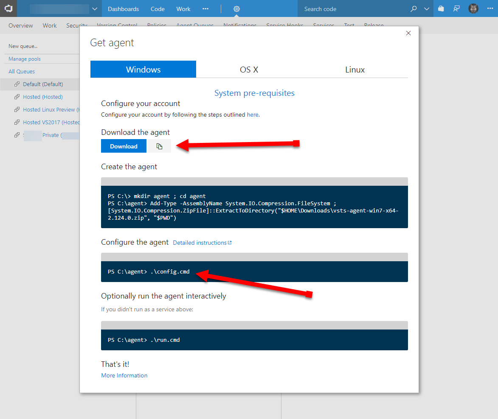](https://liftcodeplay.files.wordpress.com/2017/11/agent-setup.png)

### Software setup - install the agent

The [instructions from Microsoft](https://docs.microsoft.com/en-us/vsts/build-release/actions/agents/v2-windows) are quite good. You will need to create a PAT (personal access token).

**MAKE SURE TO SELECT INTERACTIVE MODE.** This is absolutely critical - you need this in order to run your Selenium tests. The other mode will not allow you to run the Selenium tests.

### Software Setup complete!

When I log into my VM I see there's always a command prompt running. That's how I know it's running in interactive mode. You can see below it's listening for jobs.

[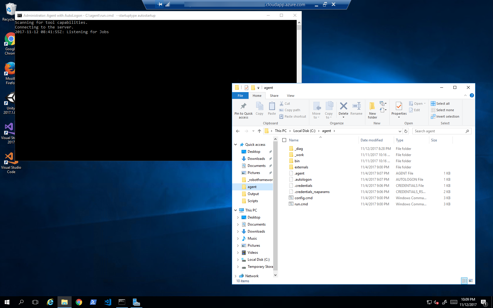](https://liftcodeplay.files.wordpress.com/2017/11/vminteractivemode.png)

# Installing Tests on the Server

Great, we have our server ready to go!

This step is completely optional. I chose to have them installed on the server for two reasons:

1. I always want to test against the latest robot framework tests
2. The code for my app is in a different repo to the robot framework tests

## Why load them on the server?

A CI/CD (build and release) pipeline in VSTS only really wants to work with one repo at a time. It's not easy to run a release for one app and pick/use the latest build from another build / code base.

Because my tests are in a different repo I have created a setup simple build step (to bundle up all my tests) and then a simple release step (to deploy to the server)

### Build step

- Go into Builds
- Create a new, empty build
- In **Get Sources** select
    - Repository - your repo
    - Branch i.e. master
    - Clean - set to **true**
    - Clean options - set to Sources directory

[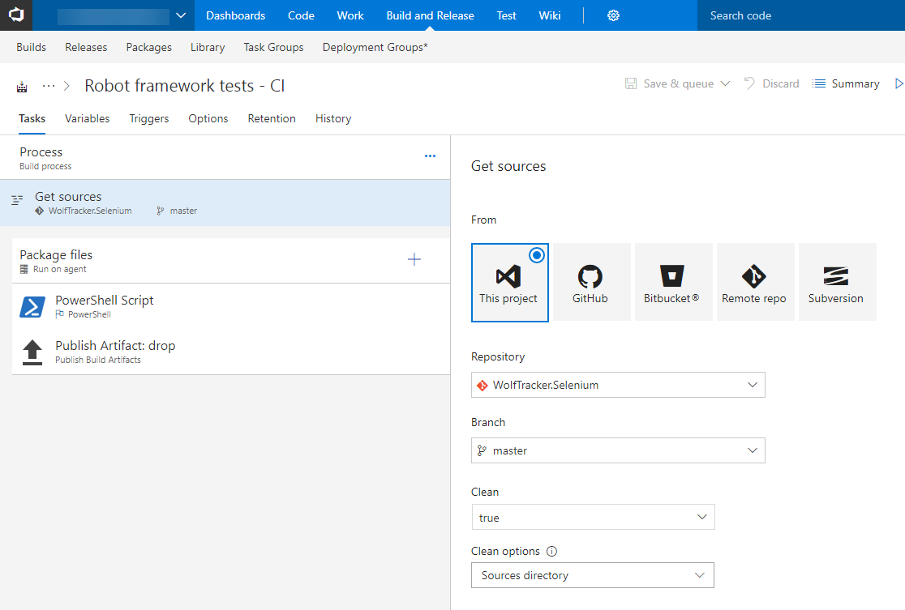](https://liftcodeplay.files.wordpress.com/2017/11/robotframeworkbuild11.png)

- I would recommend you go into **Triggers** > **Continuous Integration** > **Enable**. Whenever you commit to master it will kick off a release
- Add a PowerShell task, select Inline Script and enter the following



What we're doing is copying all the files in the repo.

The clean step we created earlier is important to ensure it only grabs the latest stuff (i.e. won't add something you deleted in an earlier build)

The next step will take all that content and bundle it up into a build.

[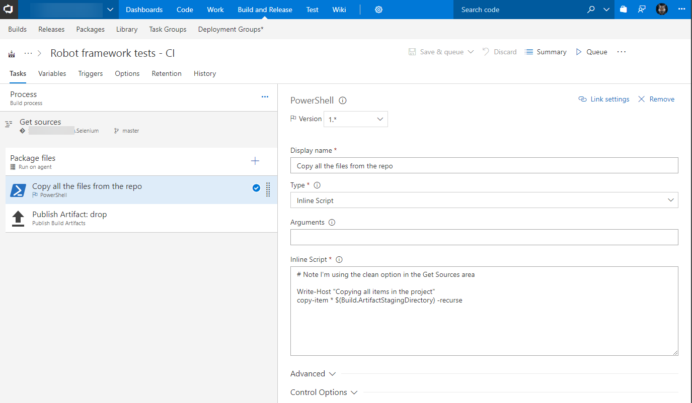](https://liftcodeplay.files.wordpress.com/2017/11/robotframeworkbuild2.png)

- Add a standard **Publish Artifact: drop item**
- Click Save

### Release step

- Go into **Releases**
- Create a new, blank release definition
- If it asks you for an environment, choose a name. I called mine **Update Server**
- Click **Pipeline**
- - Select your build step you created earlier. You want it to use the latest
    - Click the little lightning bolt in the build artifact square
    - In the blade that opens up, you will see the **Continuous deployment** **trigger**. Flick it to **Enabled**. This means it will release whenever there is a build
    - Click the **Run on Agent** task
        - Under **Agent Queue** select your build server

[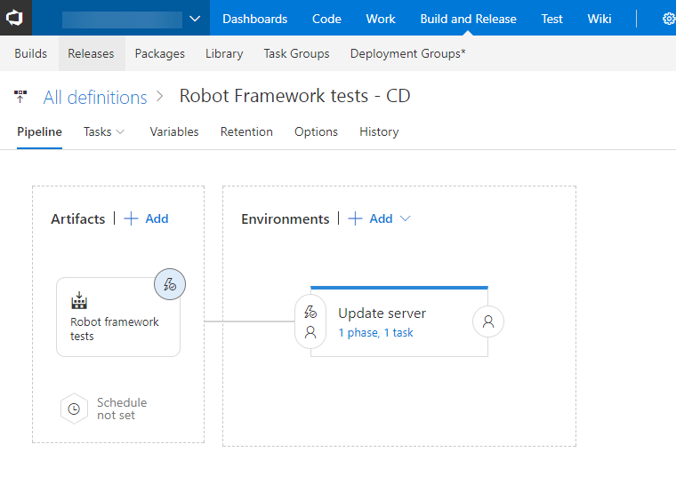](https://liftcodeplay.files.wordpress.com/2017/11/release1.png)

- Click **Options**
    - Under Release name format, enter a nice format for yourself. Not necessary, just a nice to have. I chose to use a prefix so I entered this **RobotFramework-Release-$(rev:r)**
- Go back to Tasks, select your one task
- Create a single **PowerShell** task with an **inline script** type, then enter the following script

What this script does is delete any tests that are already there, then it copies in the new ones from the build - the latest from your repo.

It's up to you where you want to store the tests on your build server. Feel free to change the path.



[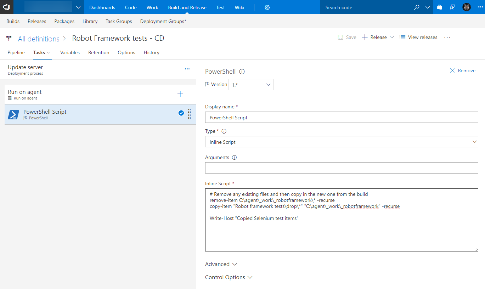](https://liftcodeplay.files.wordpress.com/2017/11/release2.png)

 

 

# Adding my Tests to my Release Pipeline

To recap we've setup our server and our tests are on it. All we need to do now is call these tests from our release pipeline!

## Setup for app in VSTS

A quick overview of my app: it's an ASP.NET Core application.

I've got a build step which builds the app and runs unit tests. Nothing fancy about this. It's also setup to trigger on every commit to the master branch.

[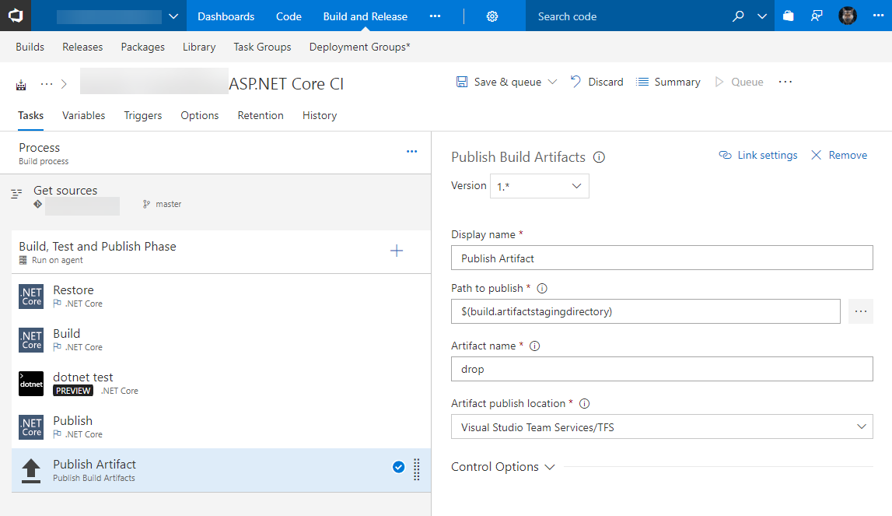](https://liftcodeplay.files.wordpress.com/2017/11/buildstep.png)

My release pipeline has three steps: dev, test and production. I explained it earlier in my post but here's a picture.

[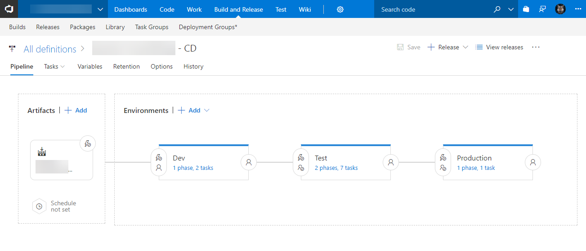](https://liftcodeplay.files.wordpress.com/2017/11/releaseprocess.png)

The key thing to note is the **Test** step. That's where I'm running my Robot Framework tests. It's up to you what precise environment the tests will run against.

## Test Environment

There are several steps and pieces of detail here.

### Variables

Under the Variables tab I created two variables: one called `OutputFolder`, the other called `RobotFrameworkFolder`. I did this to make life easier and avoid constantly re-entering those paths.

[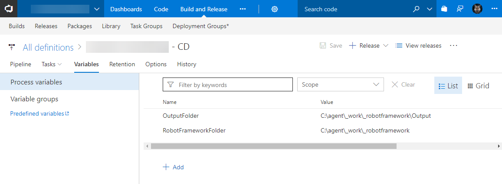](https://liftcodeplay.files.wordpress.com/2017/11/releasetestvariables.png)

### Agent Phase

I want to clearly indicate that we are to use my build server in the Agent Queue. I made sure to select it.

[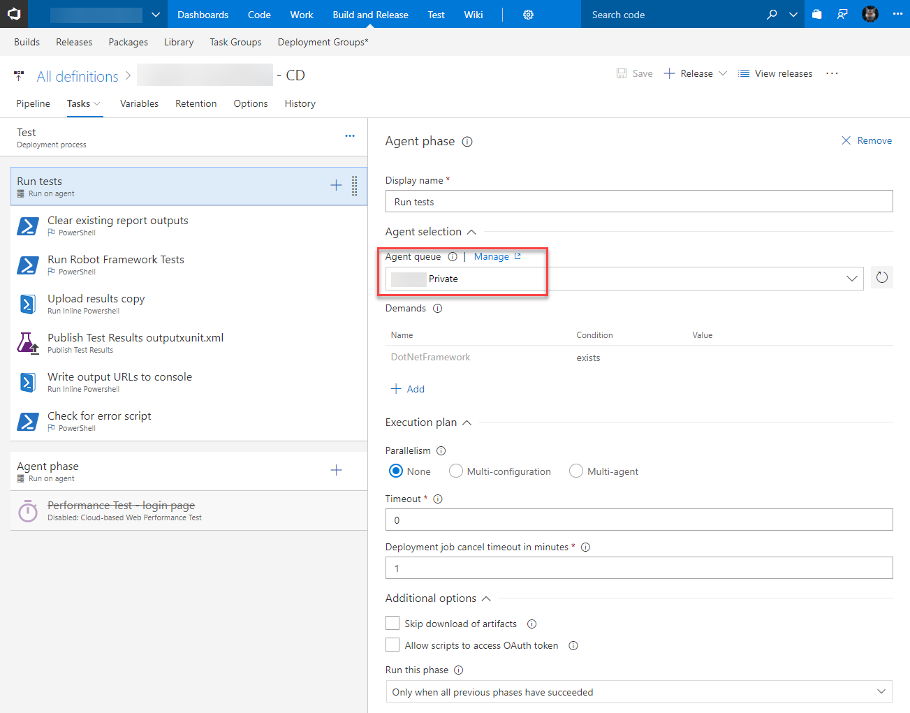](https://liftcodeplay.files.wordpress.com/2017/11/releasetest0.png)

### Clear existing report outputs

When I run my Robot Framework reports it generates a bunch of output files to the same directory each time.

This step is a PowerShell task, type `Inline`.  It removes all the files from the previous test run.

`cd $(OutputFolder)` `remove-item *`

In the future I will likely do away with this step and simply store the outputs in a folder structure of `<release name>\<release number>`. If I did this then this clearing step would be unnecessary.

[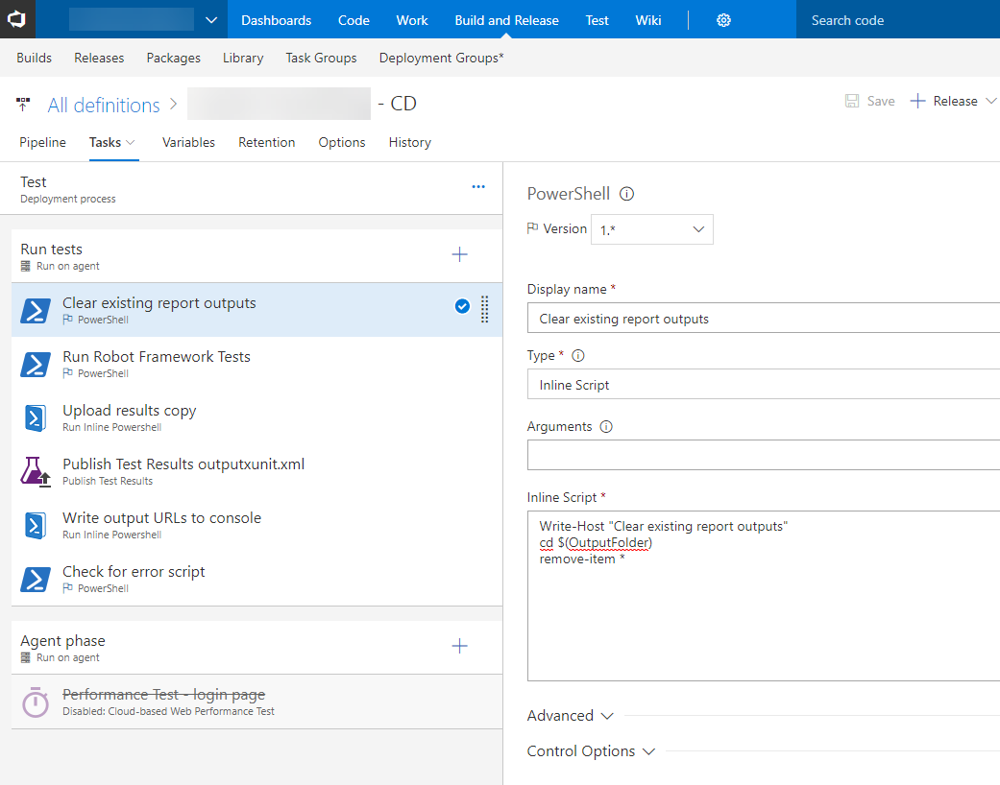](https://liftcodeplay.files.wordpress.com/2017/11/releasetest1.png)

### Run Robot Framework Tests

This is another PowerShell task, type `Inline`.  I'm running a particular test here but, in your case, I would suggest you include a PowerShell script (file) to it runs all tests. Up to you how precisely you do it.

You'll notice in my script below that I have a lot of parameters. That's because I'm explictly stating the path of the output.xml, log.html and report.html.

I'm also asking it to generate an xunit output file. This is important as I will later upload this file to VSTS. Feel free to come up with a more sensible filename :)



[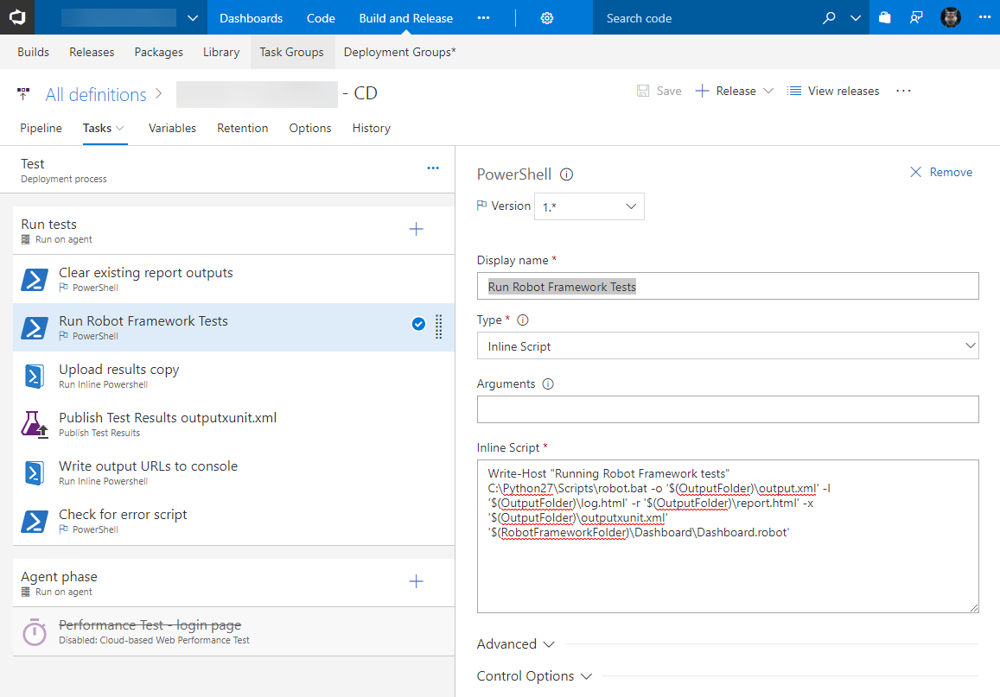](https://liftcodeplay.files.wordpress.com/2017/11/releasetest3.png)

### Upload results to Azure blog storage

At this point I want to upload all the resulting output files to blob storage. Could be useful later on.

Please note that I had to install a special add-on for inline PowerShell scripts. You can find it in the marketplace. The default one has a character limit of 500 characters.



[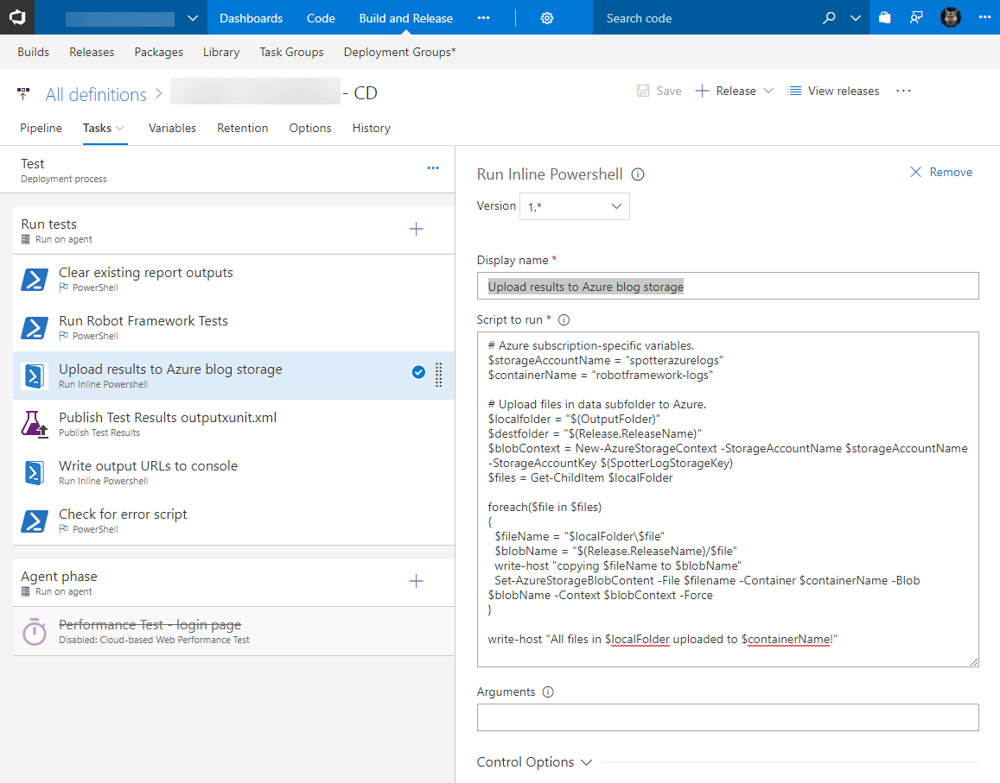](https://liftcodeplay.files.wordpress.com/2017/11/releasetest4.png)

### Publish Test Results

The purpose of this step is to upload the resulting file to display it in the summary and screens provided by VSTS.

Robot Framework allows you to generate an "XUnit" output file. If you select XUnit as the test format, it won't work - parsing error. Oddly enough, selecting JUnit format will work.

[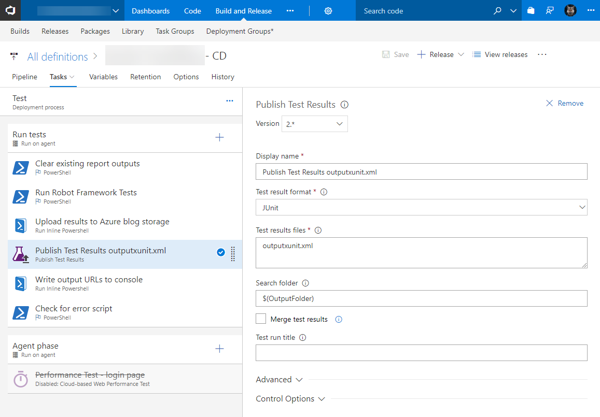](https://liftcodeplay.files.wordpress.com/2017/11/releasetest5.png)

### Write output URLs to console

This is an optional one. I decided to use the Write-Host PowerShell command to write out the full blob storage path for result files I uploaded. They're warnings, which means they'll show up on the summary page.

Not at all required; purely a nice-to-have in terms of the log.

### Check for error script

This is a small but important step.

Release steps can have four statuses:

- Waiting for the user approval (gray with the little person icon)
- Passed (green)
- Partial success (orange)
- Failed (red). Note this means the process / steps failed i.e. couldn't run the Robot Framework tests at all. Not the same as "Robot Framework ran but a few tests failed"

Let's say all the tests ran but one of the tests failed. By default VSTS will mark the whole release as green - all passed. The way to get around it is to either:

1. run a script with `exit 1`, in which case the entire release will be red
2. write an error log message, in which case the block will be orange

I found it was far better to use the orange icon. Red is best left for something major failing. With Selenium tests, you want to say "everything ran but something is wrong... better check it out"

[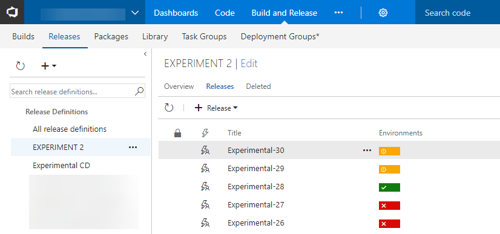](https://liftcodeplay.files.wordpress.com/2017/11/releasestatuses.png)

This step is just a PowerShell task running a script.

[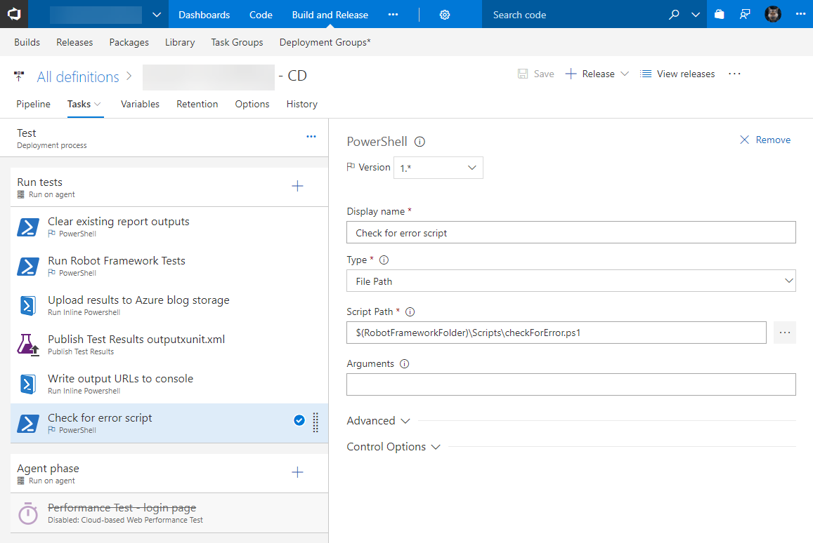](https://liftcodeplay.files.wordpress.com/2017/11/releasetest6.png)

Here's my script



# Sample Output

So we got it all working. Here's a sample output. In this case I only have one test and it failed.

Enjoy!

[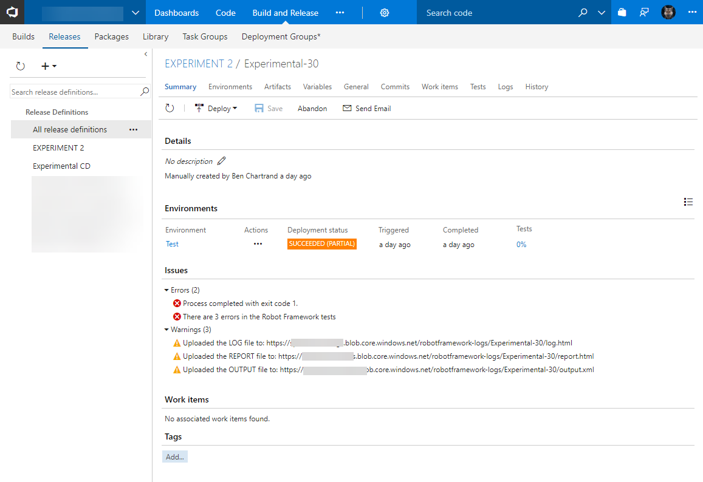](https://liftcodeplay.files.wordpress.com/2017/11/results1.png)

[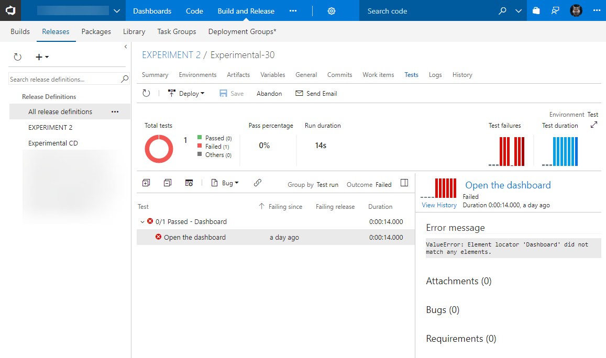](https://liftcodeplay.files.wordpress.com/2017/11/results2.png)[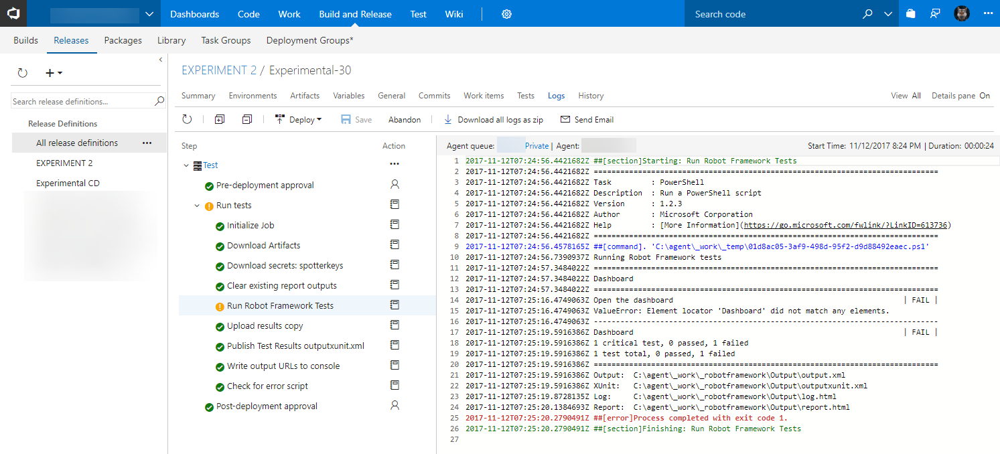](https://liftcodeplay.files.wordpress.com/2017/11/results3.png)
