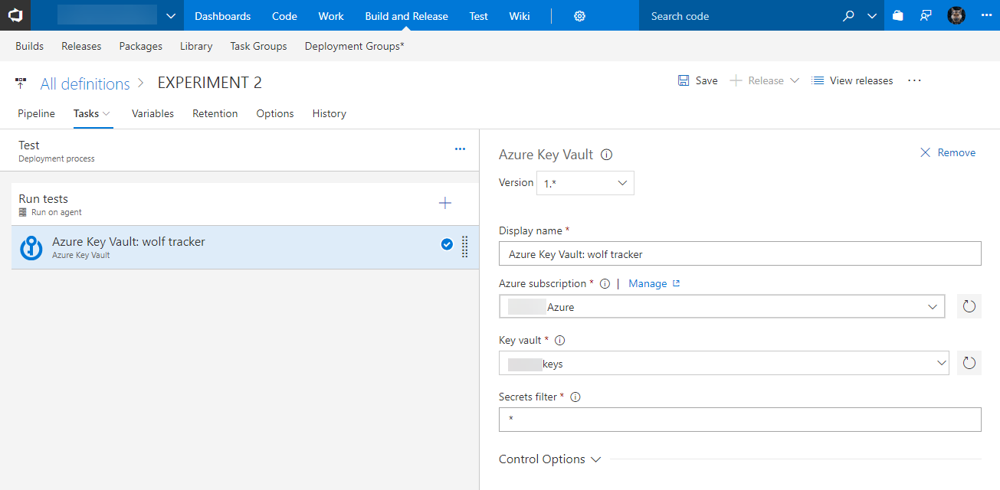
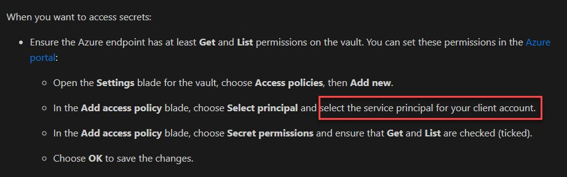
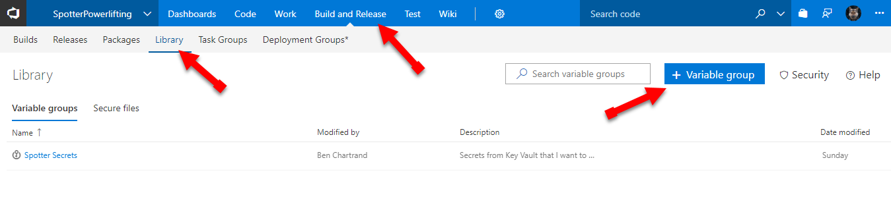
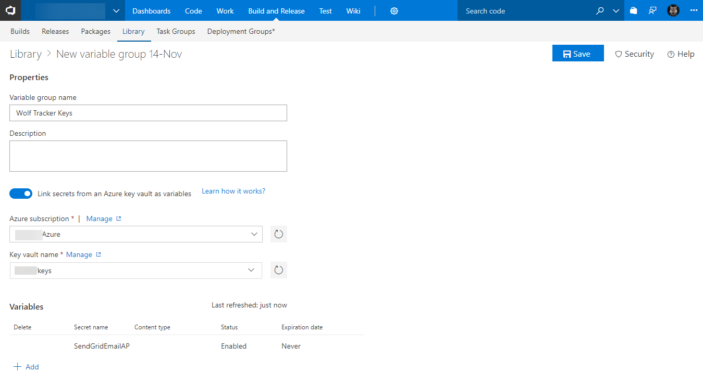

Are you trying to use the Azure Key Vault task but recieving a message: "Access denied. Specified Azure endpoint needs to have Get, List secret management permissions on the selected key vault..."? I'll show you how you get past this

## Pre-requisites

- Visual Studio Team Services (VSTS) account
- Azure account
- Azure Key Vault setup in your Azure account with some secrets

## The Problem

So you want to be good and avoid storing your secrets in your build or release steps. A great solution is to use Azure Key Vault. It's pretty easy - you can setup something like this...

Trouble is, when I ran it failed. I got a message Access denied. Specified Azure endpoint needs to have Get, List secret management permissions on the selected key vault..."???

The Microsoft document says something about setting up a service principal. It's as clear as mud.

## Work-around

We can create a variable group. This will enable us to add the secrets and then re-use them in our release pipeline as variables.

- Open VSTS
- Click **Build and Release**
- Click **Library**
- Click **\+ Variable Group**

- Enter a **variable group name**
- Select the **Azure subscription** and **Key vault name**
- Click **\+ Add** to select one or more variables
- Click Save. Follow any prompts

To use the keys in your script, use the secret name.

In the example above I have​ ​`SendGridEmailAPIKey`. To use it in my tasks I would write `$(SendGridEmailAPIKey)`.

By doing this globally you don't need the individual Azure Key Vault entry
