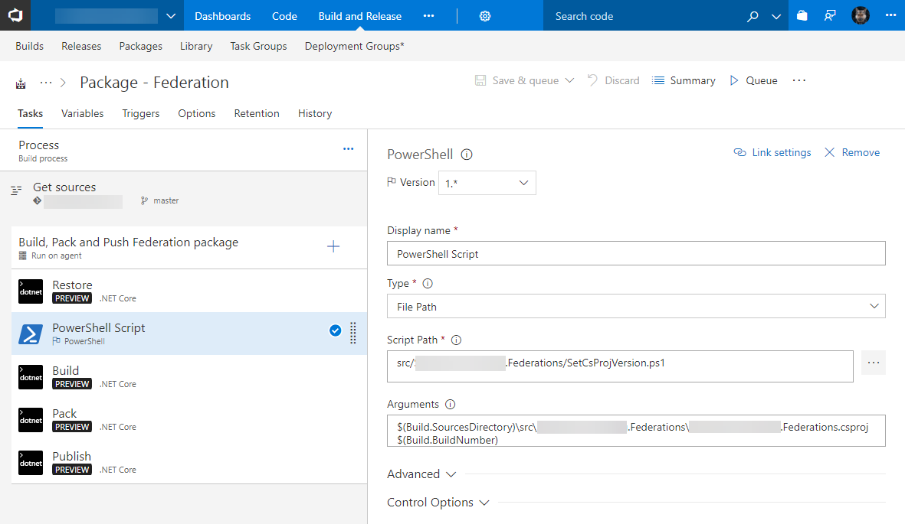

Magic ensues. Let me show you how to be a VSTS wizard.

\[caption id="attachment\_media-21" align="alignnone" width="840"\] Art by [Chase Stone](http://ego-alterego.com/magic-gathering-wizards-coast-project-chase-stone/#.Wg876EqWb-g)\[/caption\]

# Background

I had two libraries I wanted to deploy to a private NuGet feed in VSTS. They uses .NET Standard 2.0 and .NET Core 2.0 respectively.

I also wanted the build number to automatically increment so that, when I enabled Continuous Integration, it would build and deploy every time.

[When I first tried to do this](http://liftcodeplay.com/2017/03/23/how-to-build-and-host-a-nuget-package-using-vs2017-and-net-standard-in-vsts/), I barely got it working. At the time there was a bit of growing pains with the new .NET Core and .NET Standard. Now it's pretty much sorted and easy to do.

## Few Important notes

- You will need a VSTS account and [packages](https://www.visualstudio.com/team-services/package-management/) (free for up to 5 users)
- These instructions work equally well for .NET Standard 2.0 and .NET Core 2.0
    - Will also likely working for older versions (i.e. .NET Standard 1.6)
- I choose to deploy to VSTS package feed but these instructions should work fine for other destinations, such as MyGet

# Setting up Build and Deploy

Start by going into **Builds**, create a **blank** build and give it a name. I called mine `Package - Federation`

Start by adding four .NET Core tasks (click the blue +)

### Process step

- Select your **Agent Queue**. I have a private build server. If you don't have a build server use the VS2017 agent
- Set the path to your .csproj in **Project(s) to restore and build**. By entering it once here it saves you typing it again later

### Get sources step

- Select your **Repository** 
- Select your **Branch**

### Agent Phase

- OPTIONAL: Enter a nice display name. I called mine `Build, Pack and Push Federation Package`

### Restore task

- Set the **Version** to `2.* (preview)`
- Set the **Command** to `restore`
- OPTIONAL: Give it a nice display name, like `Restore`

### Build task

- Set the **Version** to `2.* (preview)`
- Set the **Command** to `build`
- OPTIONAL: Give it a nice display name, like `Build`

### Optional: Test task

You can add another .NET Core task for test. I don't have any at the moment; they're part of a bigger suit so I need to seperate them out.

### Pack task

- Set the **Version** to `2.* (preview)`
- Set the **Command** to `pack`
- In **Path to csproj or nuspec file(s) to pack** enter the path to your csproj
- OPTIONAL: Give it a nice display name, like `Pack`

### Publish task

- Set the **Version** to `2.* (preview)`
- Set the **Command** to `publish`
- In **Target feed location** select your feed.
    - If you don't have a feed, click on the packages tab near the top to get setup
- OPTIONAL: Give it a nice display name, like `Publish`

## OPTIONAL: Automatically set a version number

I wanted the build number to automatically increment so that, when I enabled Continuous Integration, it would build and deploy every time.

These packages are internal-only packages. I generally don't care what the package version is so long as it increments.

### Project Setup

Go into your project properties, **Package** tab.

- Click **Generate NuGet package on build**
- Enter a **Description**. This will show up in the package feed
- You can enter a version but we won't be using it

### PowerShell Script

I added the following file to my project. A few key things:

- It takes two parameters
    - Path to the csproj
    - The version generated by VSTS
- It uses the major, minor and revision number
- It generates the build number by using the date. It was a way of getting a unique, incrementing number that would remain under the 65,534 limit
- Once it has the details it opens the XML, inserts the build number
- Writes to the console, which is useful to see in the logs

I added this file to my project. You could have this script all run inline, purely from VSTS, but the advantage of a file is you can manage it via git and you can easily make changes to this script without having to change anything in VSTS.

https://gist.github.com/bcnzer/f8d50699c5bf7614923bff733662cb1a

Here's the PowerShell task. Note the two arguments. The first is the path to the csproj, which the script will update. The other is the current build number

`$(Build.SourcesDirectory)\src\<your project name>\<your project name>.csproj $(Build.BuildNumber)`

### Release Number Variables

My script updates the third part of the version number - the patch. It gets the major and minor from variables in VSTS. Why variables? My logic was:

- Once again, I'm internal and just want the patch number to increment. Don't often care about major/minor changing
- If it is a big change I will go in and either update the variable in VSTS or do a one-off build and tell it the new major/minor version.
- If it's a major new version I may need to keep the old version around a bit longer so I'd likely start by cloning the existing build task and then updating the major variable in the cloned build task

Here's what you need to do:

- Click the **Variables** tab
- Click **\+ Add**
- Add a MajorVersion and MinorVersion variable. Set the value to whatever you want

### Build Number Format

Under the **Options** tab, enter the following build number format. The script will replace the yyyyMMdd with the number.

`​​​$(MajorVersion).$(MinorVersion).$(Date:yyyyMMdd)$(Rev:.r)`

# Done!

Click **Save & Queue**. Notice how you can set the major and minor versions here if you want to

Once the build is done here's what it looks like in your Packages feed

And here's what it looks like in Visual Studio. If you're not sure how to set it up in Visual Studio, go to the Packages tab in VSTS, click Connect feed and follow the instructions.

