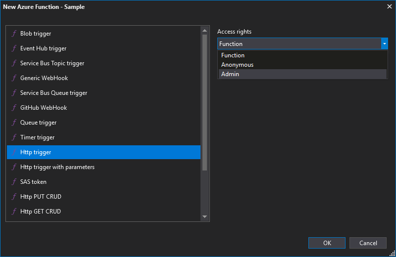
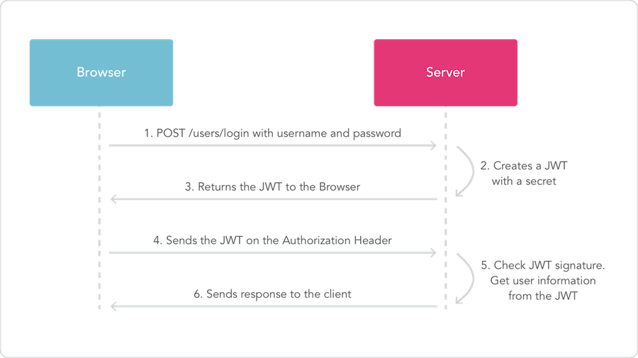
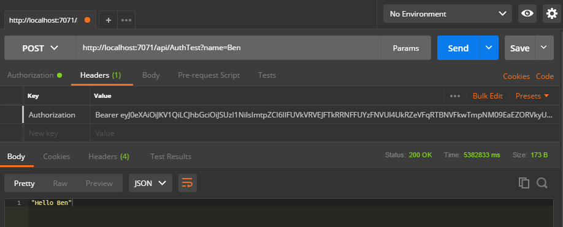
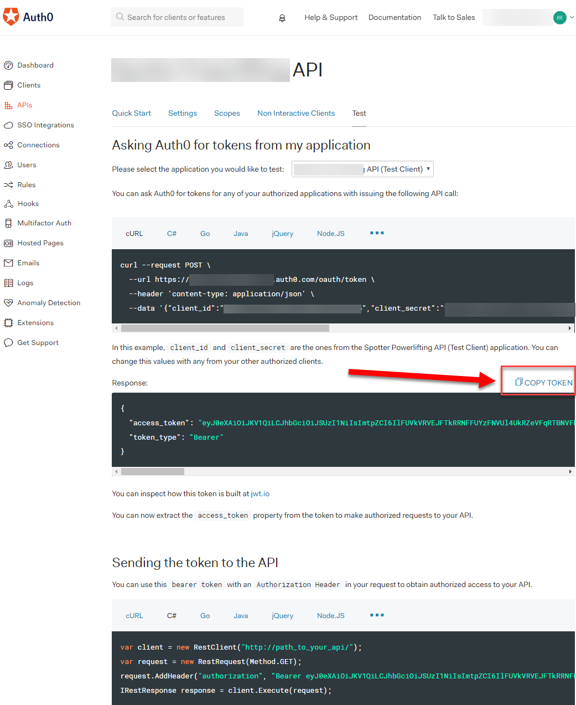
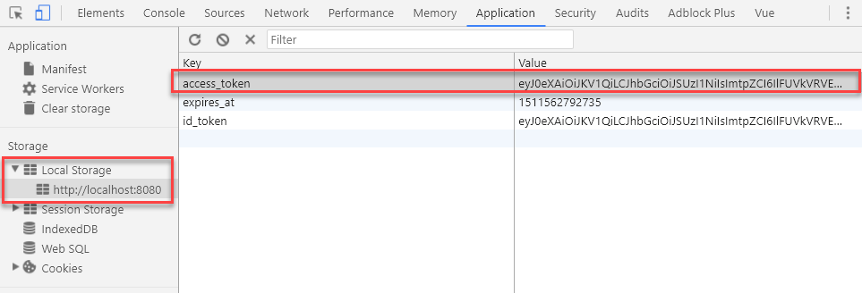
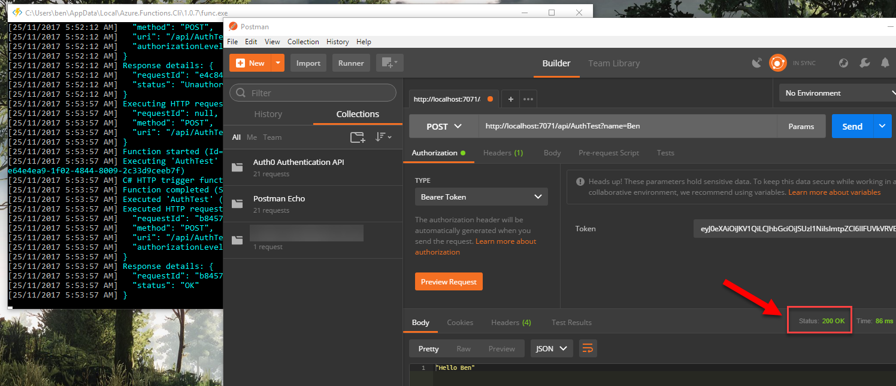

Would you like to know how to authenticate / authorize Auth0 users in your Azure Function? Let me show you how.

# Scenario

I have a [Vue.js](https://vuejs.org/) Single Page Application (SPA). The API uses ASP.NET Core.  Once the user logs in client-side with Auth0 I can send auth details (specifically the access token) to the API endpoints that require authorization.

That all works great but I'd really like to use Azure Functions for a bunch of reasons, primarily:

- It's cheap
- Massively scalable
- I can implement a Micro-service architecture

I was dead keen to use but it wasn't obvious how to do this with Azure Functions - especially with C#.

# Pre-requisites

- I'm assuming you have some form of application that has authenticated with Auth0.
    - I followed [this tutorial](https://auth0.com/blog/vuejs2-authentication-tutorial/) to setup the Auth0 widget in my Vue.js project.
- [Auth0 account](https://auth0.com/). They have a free tier
- [Azure account](https://azure.microsoft.com/en-us/)
- I suggest you get [Postman](https://www.getpostman.com/), to help with testing

## Why not just use the Azure Function API Keys?

For certain types of Azure Functions, there is the concept of Access rights. The levels include:

- `Anonymous`. So long as you have the URL you can use it
- `Function`. You need to pass a key generated as a parameter
- `Admin`. Similar to function but you need to pass the admin-level key

\[caption id="attachment\_4560" align="alignnone" width="800"\] Azure Function access rights levels\[/caption\]

These are OK but they're primarily used to prevent access to the endpoint (if you don't have the key you can't run). I would also argue this is security-by-obscurity.

This has nothing to do with authentication or authorization. The latter can be especially important i.e. is this user's scope mean they have read-only or write access to records?

## What am I trying to achieve? The technical version

If you're not familiar with the concept of JWT check out [Auth0's article on the subject](https://auth0.com/docs/jwt).

In a nutshell: I want Azure Functions to do step 5 as seen in the picture from Auth0.

\[caption id="attachment\_4558" align="alignnone" width="900"\] Diagram from [https://auth0.com/docs/jwt](https://auth0.com/docs/jwt)\[/caption\]

In Step 4 my SPA will be sending a request to an endpoint. In the header there will be an `Authorization` key with a value of `Bearer <some long string>`. You can see what I mean below from Postman.

\[caption id="attachment\_4559" align="alignnone" width="918"\] Example of a JWT being sent in the header, as part of a request\[/caption\]

Before I run the code in my Azure Functions endpoint I want to ensure that token is valid.

In ASP.NET Core it's as simple as adding an attribute and possibly defining a scope. In the Azure Function it will be a bit more involved.

# Create your Function

I'm going to assume you have created your function locally using Visual Studio 2017. By doing this you can debug locally and write code with all the Intellisense goodness of VS.

## Required NuGet Packages

You will need the following packages:

- Microsoft.IdentityModel.Protocols
- Microsoft.IdentityModel.Protocols.OpenIdConnect
- System.IdentityModel.Tokens.JWT

## Security class (yes, I suck at naming things)

In my Azure Function project I added a class simply called Security.cs. I hate naming things.

Note the use of `static`. **This is really important!** You don't want every instance of your function to call Auth0 asking for details such as the keys, to verify the token. Aside from slowing things down, Auth0 could limit responses to you. You only want to do this once.

https://gist.github.com/bcnzer/8338b0a6edb7e45dc3e10b29e6e6c646

### What is it doing?

We're using the `ConfigurationManager` to get the signing keys from Auth0, which will be used to verify the token. This is why we want to use `static` for the class as we don't want to call Auth0 with every single request.

As of line 37 you can see we require a fair bit of validation - of the issuer, audience, the signing keys and more.

On line 57 we try to validate the token. If it's successful we return the `ClaimsPrincipal`. If we're not successful we either return null or, if it's a case of the security key not being found, we retry.

## My Function - AuthTest

And here's my function with my `AuthTest`. The code is the standard HttpTrigger C# code except for lines 22-26, which I added, as well as some additional using statements.

Note the use of `AuthorizationLevel.Anonymous`. You could require the use of the API key but it's not necessary.

https://gist.github.com/bcnzer/44dfea610975780abd6b7277eb040138

## Testing

Let's put it all together. There's two ways you can get a token.

The first is to get Auth0 to create a test token as follows

- Go into your Auth0 account, under APIs and created an API entry.
- Open the API you created
- Go to the `Test` tab
- Click the `COPY TOKEN` text

Alternatively, you can get it via local debugging tools. I got the token from my Vue.js application by debugging it locally and grabbing the key which I stored in the browser's local storage.

Once you have the key you can test with Postman. I did the following:

- Opened a new tab
- Entered my URL. In this function there's a parameter of `name`
- Under the `Authorization` tab I selected `Bearer Token`
- Entered my token
- Clicked Send

\[caption id="attachment\_4570" align="alignnone" width="1492"\] Note the **401 Unauthorized** status. I intentionally added an invalid character in my token, which caused the token validation to fail\[/caption\]

\[caption id="attachment\_4571" align="alignnone" width="1496"\] Success! Note the **200 OK** status\[/caption\]

# Done!

There we go - we got it all working.

Going forward, in my Vue.js application, all I need to do is send that access token in the Authorization key.

## Big thank you Boris Wilhelms

It was [Boris' blog post](https://blog.wille-zone.de/post/secure-azure-functions-with-jwt-token/) that finally showed me how basically to do this. I decided to write my blog post to explain it a bit more and specifically show you how to use it with Auth0.
