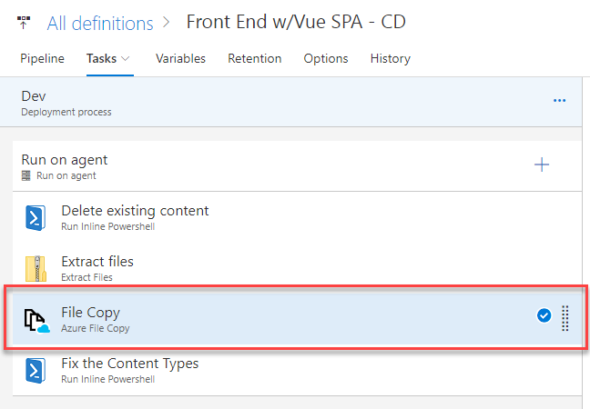
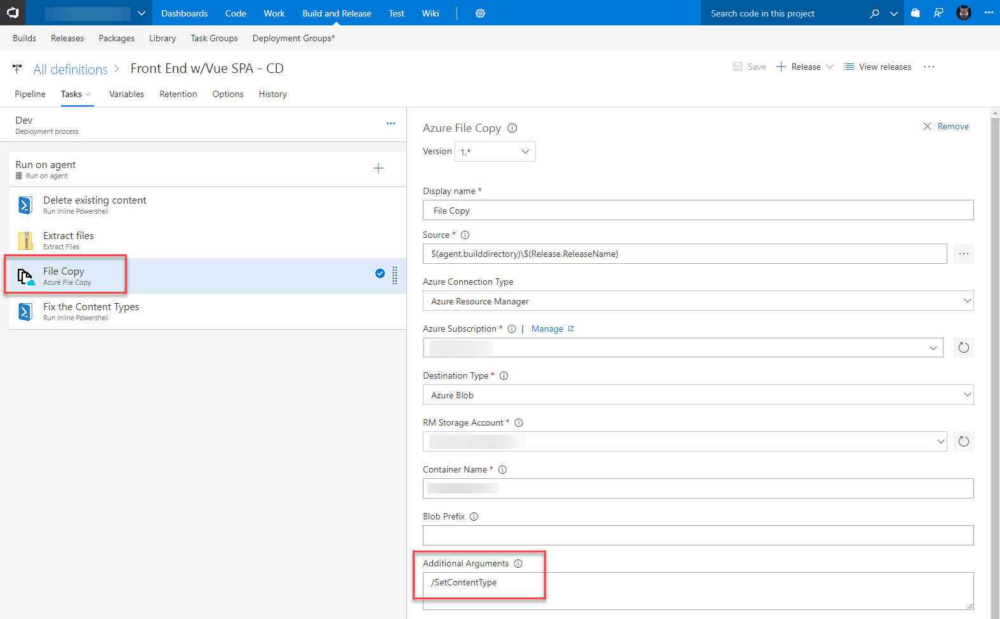
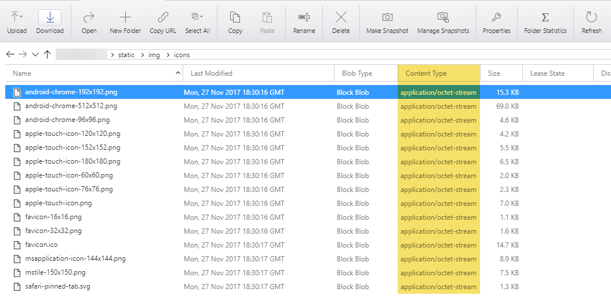
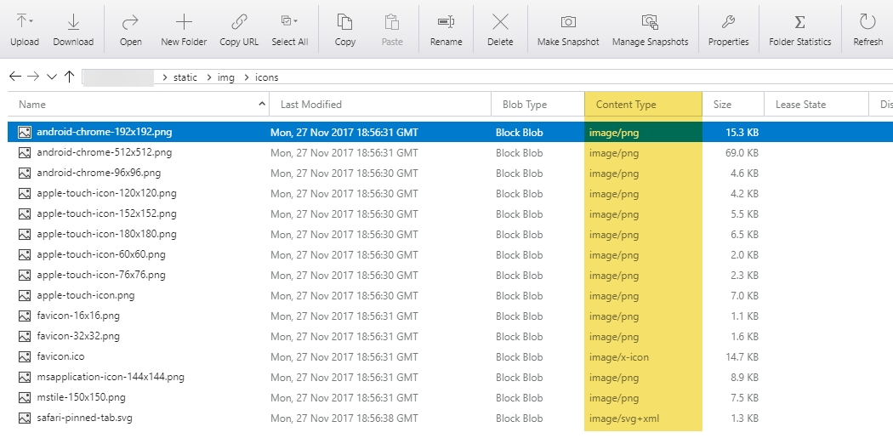

Ever noticed how Azure Storage (blobs) can set all your files as Content Type `application/octet-stream`? This can be a real pain. Below is how I fixed this, using a command line parameter and a bit of PowerShell.

# The Problem(s) with AzCopy

[AzCopy](https://docs.microsoft.com/en-us/azure/storage/common/storage-use-azcopy) is a utility for copying data to/from Azure Storage. In VSTS the Azure [File Copy Task](https://github.com/Microsoft/vsts-tasks/blob/master/Tasks/AzureFileCopy/README.md) is actually using AzCopy under the hood.

AzCopy two major problems:

1. By default it does not set the **Content Type** of uploaded files. Everything gets set to `application/octet-stream`
2. There is a command line parameter of `/SetContentType` but it doesn't set the content type of numerous file types i.e. json, SVG

Worth noting the [Azure Storage Explorer](https://azure.microsoft.com/en-us/features/storage-explorer/) does a great job setting the Content Types. It's useful for manual work but not so useful when we need to automate things.

# Fixing the Content Types

## Step 1 - /SetContentType

The first thing to do is use the `/SetContentType` parameter if you're uploading new content. It will set most of content types.

Here's what it looks like in my VSTS Azure File Copy task.

## Step 2 - Run this script

I've got a simple PS script that iterates through the blobs in a container, fixing the Content Types.

If you were running this against an existing blob container of files, you'd have to add more types manually.

https://gist.github.com/bcnzer/aa97b3399601b61b85c81ab3f8c89876

I added this as a step in VSTS to fix everything I uploaded. As mentioned in the script, if you're using VSTS I strongly suggest you store the blob key in [Azure Key Vault](http://liftcodeplay.com/2017/08/07/setting-up-azure-key-vault-with-an-asp-net-core-app-and-the-new-azure-portal/).

## Example

Here's the before and after pictures

