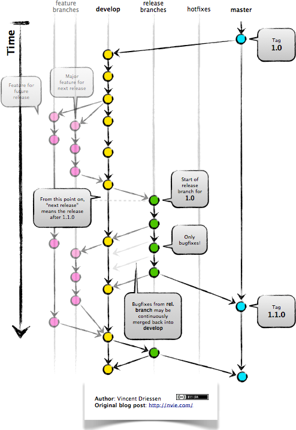
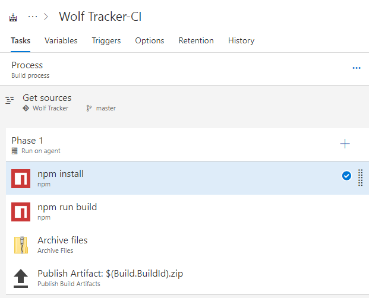
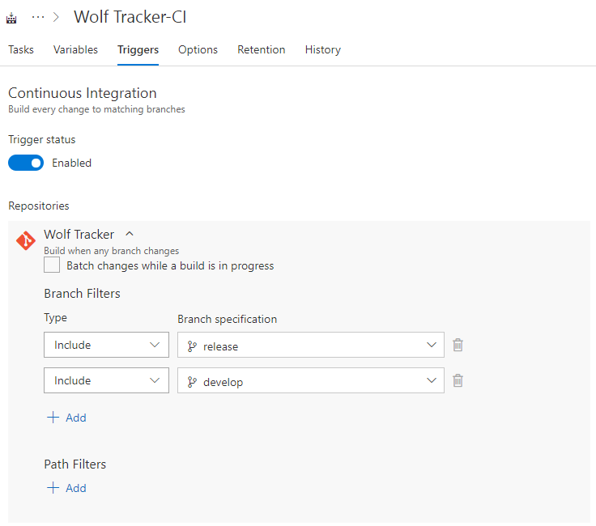
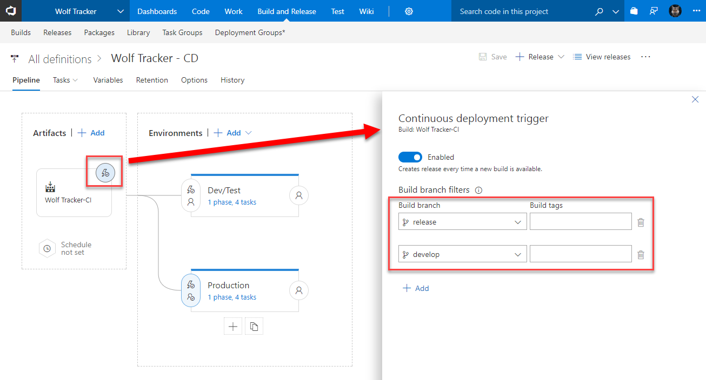
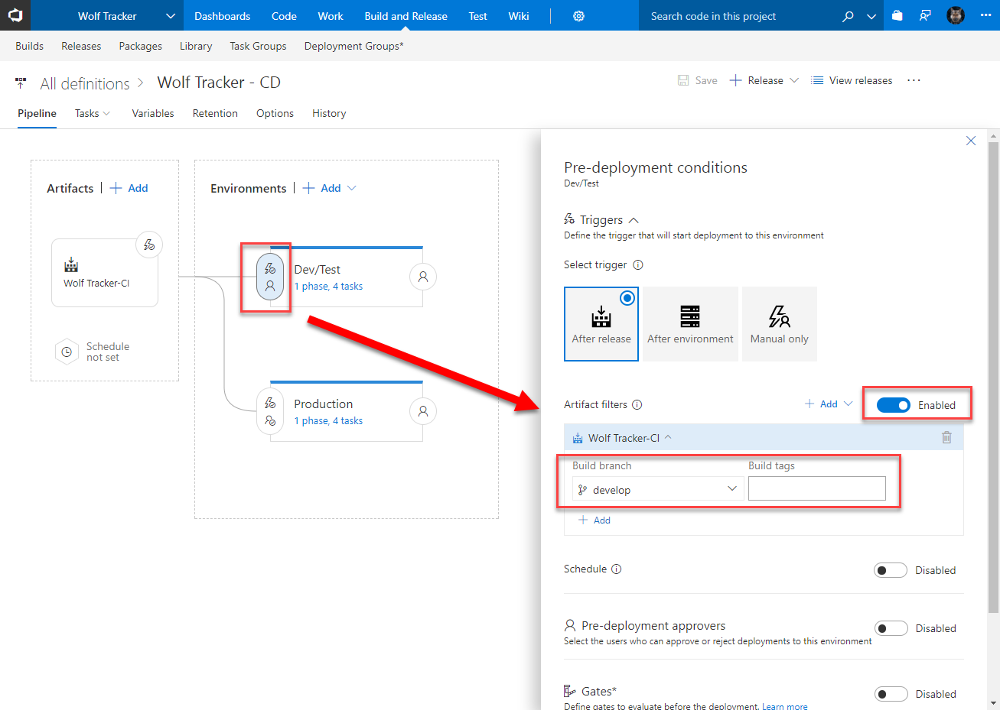
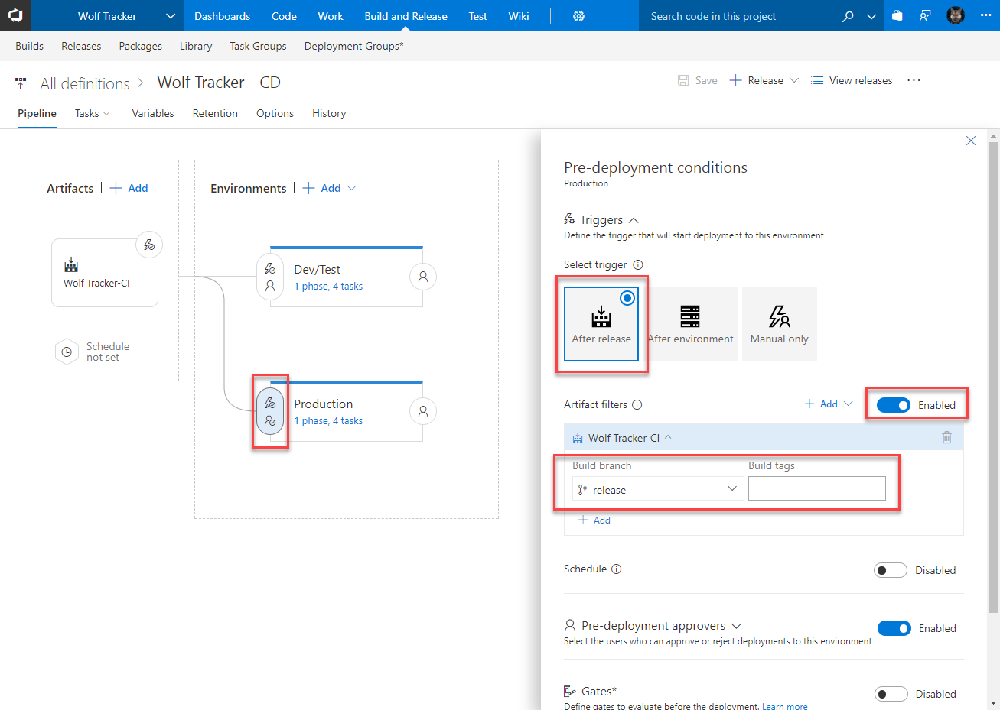
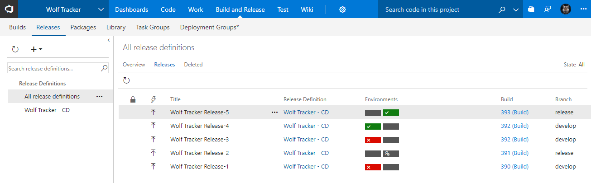

With a few tweaks we can enable the use of GitFlow in our Continuous Integration (CI) and Continuous Deployment (CD) pipelines in Visual Studio Team Services (VSTS).

# Background

GitFlow a branching strategy. You can read all about it [here](https://datasift.github.io/gitflow/IntroducingGitFlow.html).

\[caption id="attachment\_4591" align="aligncenter" width="494"\] We are only interested in the `develop` and `release` branches\[/caption\]

From a CI/CD point of view, we only want to build and deploy the `develop` and `release` branches respectively.

The `develop` branch should be sent to a dev and/or test environments. The `release` branch ends up in production.

# Setting up the Build (Continuous Integration)

To start, get the build working for whatever language / project type you have. In my case I have a Vue app, which looks like this.

The real fun is in the **Triggers** tab.

- Click the **Triggers** tab
- Enable the checkbox for **Continuous Integration**
- In the **Branch Filters** include `release` and `develop`

What this means is we'll kick off a build if we get a commit to either branch but commits to any other branch will be ignored.

Once done it should look like this:

# Setting up the Release (Continuous Deployment)

I'm going to assume I have only two environments, to keep it simple: a dev/test area and production.

- Create a new, blank release
- Selected my **Wolf Tracker-CI** as the artifact
- Clicked the thunder bolt in the top-right to open the **Continuous deployment trigger** pane
- Set the checkbox to **Enabled**
- In the Build branch filters create two rows, selecting `release` and `develop`

At this point rename the current environment to Dev/Test. click the little thunderbolt / person icon to the left of the environment to bring up the **Pre-deployment conditions.**

- Enable **Artifact filters**
- Select the `develop` branch.
    - This means this environment will only use builds that originated from the `develop` branch.
- Make sure the trigger is set to **After release**

Within the environment set whatever tasks you like. Mine are relatively mundane: just copying files.

Now we need to create the Production environment:

- I started by clicking **Clone** on the Dev/Test environment.
    - You can click **\+ Add** instead.
    - Don't worry if it appears to the right of (after) the Dev/Test environment
- Click the **Pre-deployment conditions** icon as before, to open the pane
- Click the **After release** trigger
- Similar to before, enable the **Artifact filters** but this time select the `release` branch

Optional: I'm a bit paranoid about deploying to production so I enabled the **Pre-deployment approvers** and set myself. This means VSTS will wait until I explictly provide approval before it proceeds with the deployment.

# Done!

Once you start using it, under the releases tab will look something like this. The release will either go to one of the two environments.

Have noticed how, in the second-to-last row, that there is a little person icon? That means it's awaiting approval.

 If you found this post useful let me know in the comments! :)
