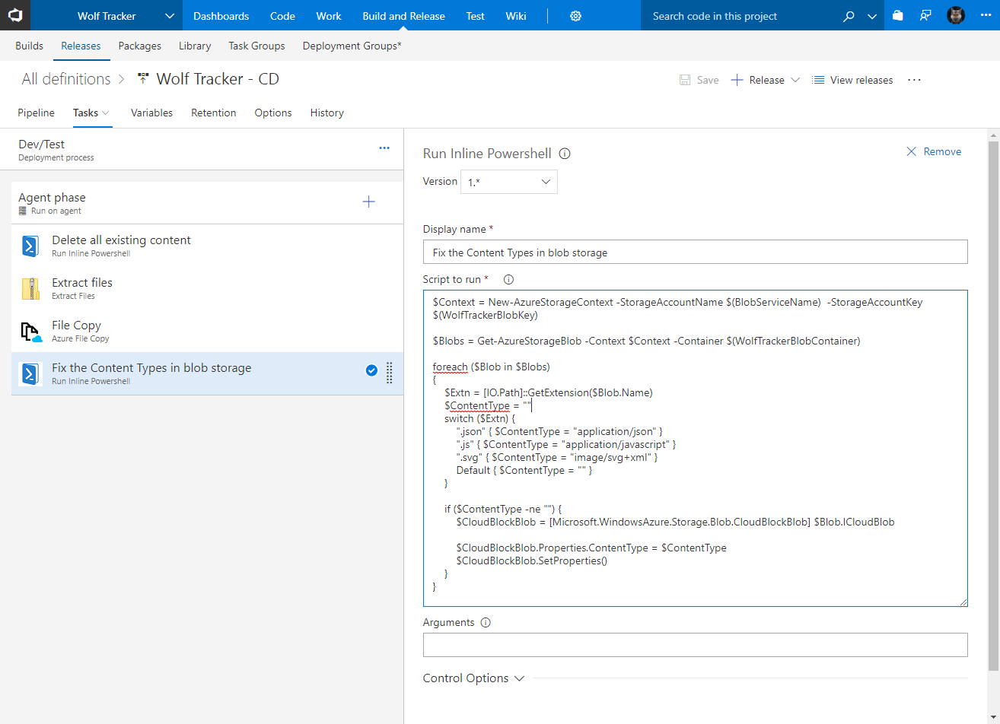

Let me show you how I created a Continuous Integration (CI) and Continuous Deployment (CD) pipeline for Wolf Tracker - my Vue.js single page app (SPA).

# Prerequisites

I'm assuming you already have your code in Visual Studio Team Services (VSTS) and that your Azure account is also hooked up to you.

If you're new to VSTS checkout my blog post series: [VSTS for the Lone Wolf](http://liftcodeplay.com/2017/04/16/vsts-for-the-lone-wolf-developer/).

# Background

I want to build my application and deploy it to Azure blob storage automatically, whenever I commit code.

I'm using a GitFlow process so:

- If I commit to the `release` branch I want it to go to production
- If I commit to the `develop` branch I want it to go to dev/test

\[caption id="attachment\_4627" align="alignnone" width="875"\] You can see my devtest and production blob containers. Both hold a version of my Vue.js SPA\[/caption\]

# Build Definition

The build definition is available in VSTS under your project, in the **Build and Release** tab.

## Tasks

- Under **Builds** click **\+ New.** You can select an empty project or use the NodeJS as your starting point
- Enter a **name**. I called mine **Wolf Tracker-CI**
- If you click **Get sources** select your repo

- Add an **npm** task.
    - Display name: **npm install**
    - Command: **install**

- Add another **npm** task
    - Display name: **npm run build**
    - Command: **custom**
    - Command arguments: **run build**

- Add an **Archive** task
    - Display name: **Archive files**
    - Root folder (or file) to archive: **dist**
    - Archive file to create: **$(Build.ArtifactStagingDirectory)/$(Build.BuildId).zip**

- Add a Publish Artifact task
    - Display name: **Publish Artifact**
    - Path to publish: **$(Build.ArtifactStagingDirectory)**
    - Artifact name: **$(Build.BuildId).zip**

Once you're done click **Save & Queue**

## Triggers

 

Checkout the first half of this article: [Implementing CI/CD with GitFlow in VSTS](https://liftcodeplay.com/2017/12/01/implementing-ci-cd-with-gitflow-in-vsts/).

## Continuous Deployment

### Dev/Test Environment

- Create the + button to **Create release definition**
- Select the **Empty** template, click Apply
- Rename the first environment to **Dev/Test**
- Click the **\+ Add artifact** icon and select your build you created earlier
    - If you don't see it, could be because it didn't build successfully
- Click **Add**

- For Dev/Test, click where it says **1 phase, 0 task**
- Click the + icon to an **Inline Powershell** task
    - NOTE: if you don't see this task, [download it here](https://marketplace.visualstudio.com/items?itemName=petergroenewegen.PeterGroenewegen-Xpirit-Vsts-Build-InlinePowershell). It's an add-on for VSTS
- Set the following properties.
    - I set the display name: **Delete all existing content**
    - Enter the following **Script to run**



- Next up add an Extract Files task
    - Display name: **Extract files**
    - Archive file patterns: **\*.zip**
    - Destination folder: **$(agent.builddirectory)\\$(Release.ReleaseName)**

- Add an **Azure File Copy** task
    - Display name: **File Copy**
    - Source: **$(agent.builddirectory)\\$(Release.ReleaseName)**
    - Azure Connection Type: **Azure Resource Manager**
    - Azure Subscription: **(select your subscription; I'm assuming it's already setup)**
    - Destination Type: **Azure Blob**
    - RM Storage Account: **(your blob storage account, for your SPA)**
    - Container Name: name of your container. I'm using a variable, so it's the same in both the scripts and here
    - Additional Arguments: **/SetContentType**

The last is an attempt to set the content type. It doesn't work well, hence the next step which will set the content type for all the files /SetContentType missed

- Add another **Inline Powershell** task
    - Display name: **Fix the Content Types in blob storage**
    - Script to run is below



## Production Environment

- In Environments, select Dev/Test and click **Clone**
- Rename it **Production**
- In your scripts change the container name to your production container
- Go back to the **Pipeline** tab
- Click the little thunder bolt icon to the left of your Production tab
- In the window that opens tot he right click **After release**

You should now have something that looks like the following, at a high level

# Setup the Triggers

From here you need to follow the steps described in this blog post: [Implementing CI/CD with GitFlow in VSTS](https://liftcodeplay.com/2017/12/01/implementing-ci-cd-with-gitflow-in-vsts/)

# Done!

At this point you're done.

If you deploy to `develop` it will go to your dev/test environment. Commits to `release` will ultimately end up in your production environment.
