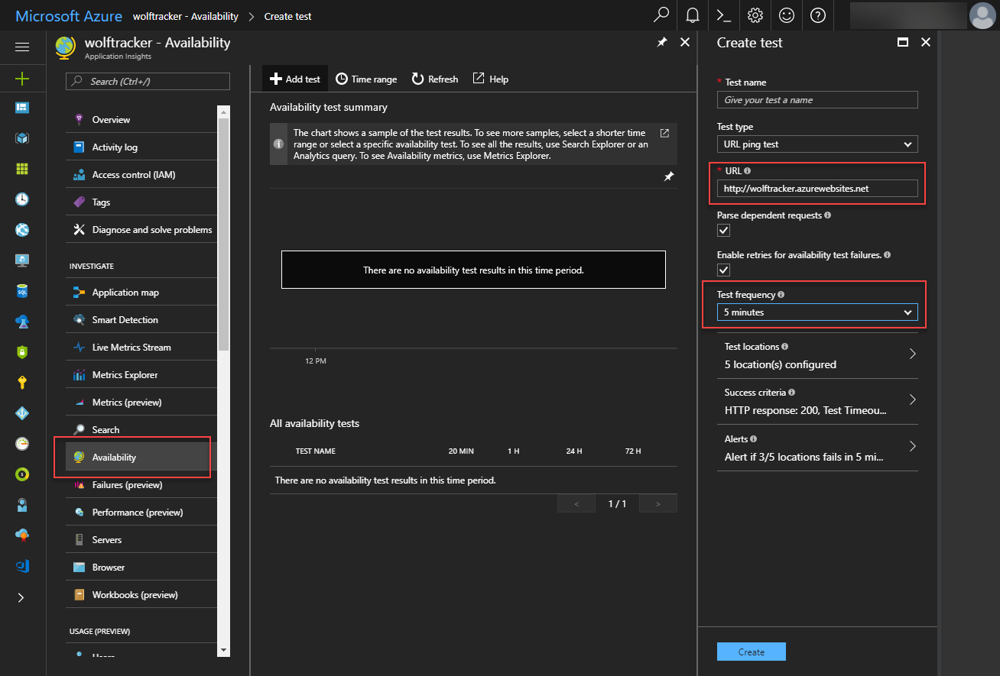

Let's walk through a few strategies for dealing with cold starts in Azure Functions.

# Background

When you setup a new Azure Function app plan you can choose to have it as a Consumption plan or have it as part of an App Service.

The latter means the Azure Function will use the resources defined in the App Service plan. It has the additional benefit of always staying warm/loaded if the **Always On** setting that is available or if there's always traffic.

I reckon most of us prefer to use Azure Functions via the Consumption plan. You get 1 million free executions and afterwards pretty much pay for what you use. It can also scale massively, which is very appealing.

The downside of using the Consumption plan is that, if there is no activity after (roughly) five minutes, Azure Functions will unload your code. The next time there is an execution it will need to load up your function from scratch.

In my case I've experienced start up times ranging from two seconds to over a minute.

## Example Cold Start

If you want to see the cold start first hand do the following:

- Create an Azure Function app plan. Make sure to create an accompanying Application Insights account
- Create an HTTP trigger. The default code will do fine
- Open your App Insights account and click **Live Metrics Stream**
- Hit the URL for the HTTP trigger. You'll see, under Servers, how it will light up and how CPU will spike to 100% for a while

\[caption id="attachment\_4635" align="alignnone" width="1713"\] Before. Notice how there's nothing under Servers\[/caption\]

\[caption id="attachment\_4636" align="alignnone" width="1713"\] After. Notice how there's now an item under Servers. This picture didn't capture the spike in CPU\[/caption\]

Here's a video of it in action. You'll notice how the CPU spikes to 100% as it loads. Note that, in my case, I'm loading a C# precompiled function. Took about 2.5 seconds

\[wpvideo DnLqlHXv\]

# Strategies for Improving/Eliminating Cold Start

## Minimize your dependencies

Let's say you're writing your function with NodeJS. When your application starts from cold it's doing an `npm install` from clean. That's a slow operation. The more dependencies you add, the worse it can be.

Same goes with other languages. The more dependencies (i.e. packages added to the C# script file) the slower it is to initially load.

## Use C# Precompiled Functions

If you are writing a C# function in the Azure Functions web UI you may have noticed the .CSX extension and the different way of importing packages. That's because it's a C# script file, which are not much different from Javascript.

C# pre-compiled function is a binary (more specifically, a library), which loads faster. Note that it still needs time to load the binary and any dependencies.

## Keep it loaded / warm

One option is to keep the Azure Function instance warm, so it doesn't deload. Recall that it 'goes cold' (deloads) after 5 minutes of no activity.

Keeping it warm depends on the content of your functions.

### Ping it!

You can setup a service to ping / hit a URL in your Azure Function regularly.

Try Application Insights. It has an **Availability** feature where it will repeatedly hit a URL. The lowest frequency is 5 minutes so that should work.

Note that this only works if you have some form of HTTP endpoint. Not so great if, say, you only have queue or blob trigger functions.

 

### Azure Function Timer function to Ping URLs

You can write an Timer function that runs every minute. You can get it hit whatever URL you like. Below is an example.

Beware that, on a consumption plan, you get 1 million free executions. This timer function will use some of those executions. The cost is:

- Of the timer itself. It will run 15/hour \* 24 hours \* 30 days = 10,800 executions
- Each function endpoint you hit will be another 10,800 in a month

If your Azure Function has issues with cold start then I imagine you're likely well below the 1 million executions per month. That's the case for me.

In the example below I'm using an Azure Functions proxy for my Vue.js SPA at [https://wolftracker.nz](https://wolftracker.nz). I need to keep it warm, hence the GET call.



### Just setup an Azure Function Timer

In my C# precompiled functions, if I setup a timer function for 4 minutes the instance always remains active/warm. It never deloads. Appears I could literally have it doing nothing and it would do the trick.

The benefit of this scenario is I'm only paying for the 10,800 executions (1 execution every 4 minutes). I'm not having to hit the other endpoints. 10,800 executions is well within my free allocation of 1 million free executions per month.

The other benefit is that if your functions are not HTTP endpoints (i.e. queue triggers) this should do the job.

Overall, it seems that whatever functions that are in the same function app plan are loaded in that 'server' instance and should all be kept warm.

**NOTE**: I've only really tested with the C# precompiled functions. I also tested this for a few days, thought it was all good, then it wasn't working, so I'm not 100% sure is working but conceptually it should work... if it has to work periodically that means the method should always remain loaded.

# Any feedback?

If you have any suggestions or discover the above article isn't quite right at certain points then please let me know.

And if this helped, please let me know in the comments! It's always appreciated.
