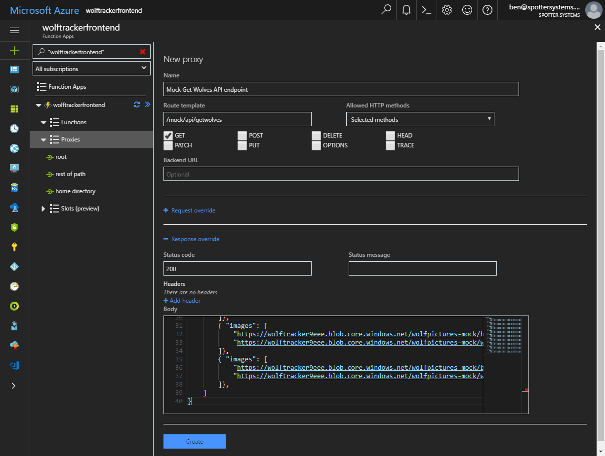
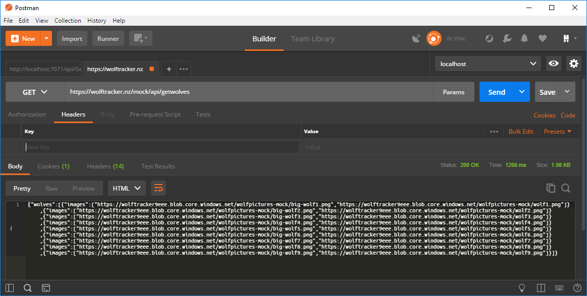
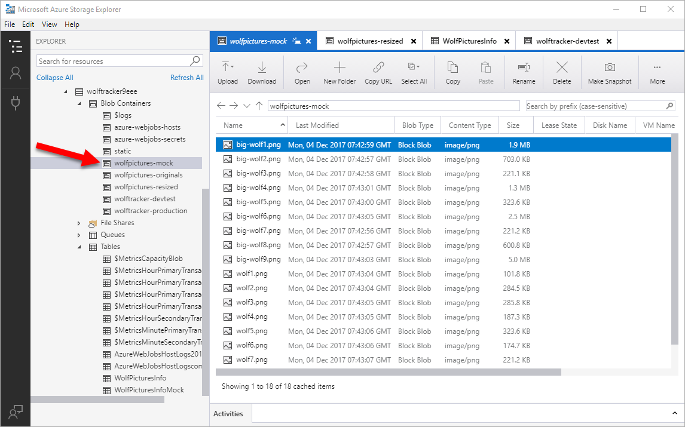
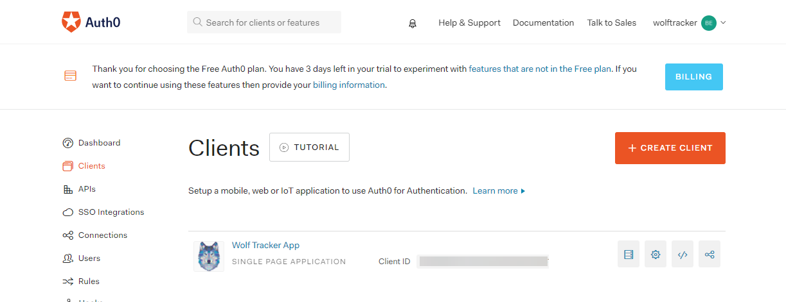
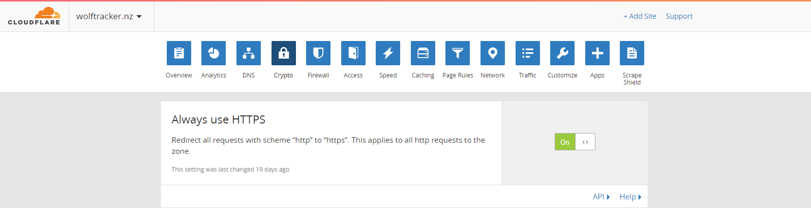

Let's go through the SPA in more detail.

# Vuetify.js

I started my project using the [Vuetify.js PWA quick start template](https://vuetifyjs.com/vuetify/quick-start). Specifically:

- Opened my favourite command line
- Copied command line for the PWA template `vue init vuetifyjs/pwa`
- Ran the above command
- Opened VS and an integrated command prompt
- Ran `npm run dev` to see the template in action.

In my case it ran at **http://localhost:8080**, which is an important to note for the next step.

Just wanted to stress how awesome Vuetify.js is. It gave me an excellent template with Webpack and a service worker. Out of the box it's mobile-friendly, looks great, I have access to plenty of components, their documentation is great and it continues to improve. Really impressed with it. Oh, and it's all free.

# Vue.js code

The best thing to do is checkout the source code. There's nothing terribly fancy in here:

- I'm using Vue router, so that I have `wolves`, `uploadwolves`, `about` and `callback` paths
- I'm using [axios](https://alligator.io/vuejs/rest-api-axios/) to upload my image (see the upload.js file)
- I customized all the images, so they match my logo. I used a PWA template but I chose to disable the service worker as I was having problems with it... and frankly I don't understand service workers (yet)
- I haven't written any unit or e2e tests. It's just a demo app. If it wasn't I most definitely would be making use of it

You can find the code here: [https://github.com/bcnzer/wolftracker](https://github.com/bcnzer/wolftracker)

# Mock API using Azure Function Proxies

When I started development on the "all wolves" page I wanted an API and some real images to display. Trouble is I wasn't ready to build that API.

Turns out I could easily create a mock endpoint using Azure Function Proxies. Please note I deleted my mock endpoint once I got my actual API in-place.

Under my Azure Function I clicked **Proxies**. Click Add and you get a New Proxy screen. Key things are:

- Give it a name. This is something purely for you
- Specify the route template. Notice I called mine `/mock/api/getwolves`
- Optional: choose allowed HTTP methods. I only wanted to allow GET
- Expand **Response override**. I entered:
    - Status code of 200
    - Body was a bunch of JSON (see the gist below)

\[caption id="attachment\_4610" align="alignnone" width="1225"\] My mock endpoint. Note that I created the actual endpoint under a different Azure Function account. I did the above purely for the purpose of taking this picture\[/caption\]

https://gist.github.com/bcnzer/2e1e392e355dc95b7f3da98a0b2ade9d

Here's what it looks like in Postman. Note that this wasn't actually my URL for my mock endpoint. I setup the proxy in a different Azure Function. I've since deleted the mock proxy.

\[caption id="attachment\_4611" align="alignnone" width="1163"\] Response from my mock endpoint\[/caption\]

For the images I went into Azure Storage Explorer, **Blob Containers** and created `wolfpictures-mock`. In that container I uploaded some pictures. For each image I store the original and thumbnail. Starting out I put them all into that one container.

# Auth0 Setup

I'm using Auth0 to handle my authentication. I wanted people to login with their Twitter, GitHub or Google accounts.

Auth0 has a great free tier and you do not need to provide a credit card.

## Logo

I wanted to use my wolf tracker logo in Auth0 and elsewhere.

- Opened Azure Storage Explorer, logged in with Azure account
- Went to my storage account
- Created a container called `static`
- Upload several variations of my logo, in different dimensions

\[caption id="attachment\_4604" align="aligncenter" width="150"\] My logo\[/caption\]

## Auth0 Configuration

- Setup a new tenant called **wolftracker**
- Clicked **Clients** > **Create Client**
- Entered a name **Wolf Tracker**
- Selected **Single Page Web Applications**
- Clicked **Create**

\[caption id="attachment\_4606" align="alignnone" width="1223"\] My Wolf Tracker client in Auth0\[/caption\]

## Connection settings

Clicked the Settings tab and entered:

- Set **Description** to "Wolf Tracker demo application"
- Entered a **URL** to my logo, which happened to be in Azure Storage
- In **Allowed Callback URLs** I entered
    - http://localhost:8080/callback
    - https://wolftrackerfrontend-test.azurewebsites.net/callback
    - https://wolftrackerfrontend.azurewebsites.net/callback
    - https://wolftracker.nz/callback
- In **Allowed Logout URLs** I entered
    - http://localhost:8080
    - https://wolftrackerfrontend-test.azurewebsites.net
    - https://wolftrackerfrontend.azurewebsites.net
    - https://wolftracker.nz

I'll come back to those other URLs later, as I set everything up properly.

## Social Connections

To allow people to login with their Google, GitHub or Twitter accounts I did this:

- Clicked **Connections** > **Social**
- Clicked one of the connections
- Followed the instructions on how to obtain an App ID and Secret for each service
- Repeated for the other services
- Went back to the client, clicked **Connections** and ensured all three were enabled. I also deselected the default `Username-Password-Authentication` database, as I didn't want to create / manage usernames, deal with password resets, etc

 

\[gallery ids="4607,4608" type="slideshow"\]

## Hosted Pages

I don't want to build my own login page. I'd much rather let Auth0 do as much of the heavy-lifting as possible.

I went into **Hosted Pages**, clicked **Customized Login Page** and changed a few things such as:

- Set the Window title (line 6)
- Primary color, so it better matches my look & feel (line 50)
- Path to the logo (line 51)

https://gist.github.com/bcnzer/7818f58613f5494e00d727eb50eeb320

## Auth0 Integration in my Vue.js Application

At this point I followed the instructions from Auth0. There are two tutorials:

- [https://auth0.com/docs/quickstart/spa/vuejs/01-login](https://auth0.com/docs/quickstart/spa/vuejs/01-login)
- [https://auth0.com/blog/vuejs2-authentication-tutorial/](https://auth0.com/blog/vuejs2-authentication-tutorial/)

If you want to use my source you will need to go into `auth0-variables.js` and enter your own `domain`, `clientId` and `callbackUrl`.

Once again you can view all my source here: [https://github.com/bcnzer/wolftracker](https://github.com/bcnzer/wolftracker)

# Cloudflare

I bought a URL: wolftracker.nz. I wanted to use that and set it up behind Cloudflare.

Setting up the URL is pretty easy in Cloudflare. Just a matter of messing with DNS from what I recall.

Once that's done you need to go into your function, **Platform Features** > **Custom Domains**. I followed the instructions to map wolftracker.azurewebsites.net to wolftracker.nz. Just a matter of creating a CNAME record.

## But wait, there's more cool stuff

Once that boring bit is setup we can get to the really cool part!

I don't want to pay for an SSL cert yet I want to require it for all traffic. I can use Cloudflare's cert and enable it easily by

- Opening Cloudflare for my wolftracker.nz URL
- Clicking the **Crypto** heading
- Enable **Always use HTTPS**

The added benefit of Cloudflare is that it acts as a CDN. It's auto-magical. I don't need to do anything special for it to work.

# Next Up - Part 2

In Part 2 we talk about [Distributing the SPA](http://liftcodeplay.com/2017/12/20/wolf-tracker-part-2-distributing-the-spa/)
