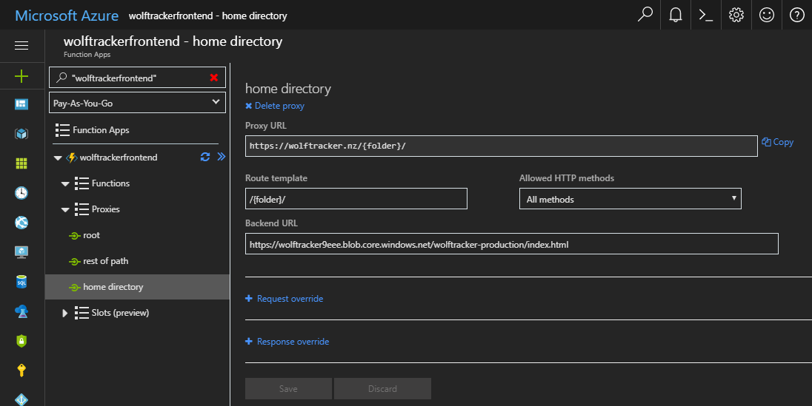

I managed to use Azure Storage (blobs) to store my SPA, Azure Function Proxies to help deliver it and Cloudflare to hande DNS, CDN and HTTPS. Let me show you how I put it all together.

# Azure Function Proxy and Blob Storage

To host your SPA in Azure blob storage you need to use Azure Function Proxies, which will define how the URLs are mapped to the files in your blob storage.

- Setup a Azure Function app.
    - I called mine `wolftrackerfrontend`.
    - Note that I chose to create a new Azure Function app, which will be seperate to my API. More on that in a moment
- Expand **Proxies**
- Click Add (the blue + button). I needed to create three

## Why create a separate Azure Function app for your proxies?

Because I'm cheap.

Azure Functions give you 1 million free executions. Every hit to my site, via the proxy, will use one or more executions. Having a separate function app for my front end proxies and my API means I'm less likely to actually pay anything.

## Blob Containers

I created two containers in Azure Storage Explorer: `wolftracker-devtest` and `wolftracker-production`.

Once created, right click each container and select **Set Public Access Level** to **Public read access for blobs only**. Do this for both containers

Why am I creating two containers? Because I'm using a GitFlow process so anything in `develop` branch should end up in `devtest` and anything in the `release` branch ends up in `production`.

## Proxy #1

The purpose of this proxy is redirect traffic coming to the root. It needs to go to index.html. Note that the name field below can be anything; it's purely for you

- **Name:** root
- **Proxy URL**: https://wolftracker.nz/
- **Route template**: /
- **Allowed HTTP methods**: All methods
- **Backend URL**: https://wolftracker9eee.blob.core.windows.net/wolftracker-production/index.html

## Proxy #2

- **Name:** rest of path
- **Proxy URL**: https://wolftracker.nz/{\*restOfPath}
- **Route template**: /{\*restOfPath}
- **Allowed HTTP methods**: All methods
- **Backend URL**: https://wolftracker9eee.blob.core.windows.net/wolftracker-production/{restOfPath}

## Proxy #3

If you go to a path like https://wolftracker.nz/uploadwolves/ it will assume it's a folder unless we explictly tell it to go to index.html

- **Name:** home directory
- **Proxy URL**: https://wolftracker.nz/{folder}/
- **Route template**: /{folder}/
- **Allowed HTTP methods**: All methods
- **Backend URL**: https://wolftracker9eee.blob.core.windows.net/wolftracker-production/index.html

# Uploading my SPA to blob storage

## IMPORTANT: Content Types in Blob Storage

By default the uploaded content type in blob storage is `application/octet-stream`. This is a problem. Your app won't work if we don't set the actual content types.

The three solutions are:

1. Upload your SPA using Azure Storage Explorer. This will set the content types
2. Use a script to change the types. I've documented it in a separate blog post: [How to Fix Azure Storage Blob Content Types](http://liftcodeplay.com/2017/11/28/how-to-fix-azure-storage-blob-content-types/). This option is useful for a CI/CD process
3. Manually change the content types using Azure Storage Explorer. This option is only really useful for a one-off change

Below is an example of the Content Type issue. They are before-and-after images.

\[caption id="attachment\_4581" align="alignnone" width="1054"\] Before, where everything is application/octet-stream\[/caption\]

\[caption id="attachment\_4580" align="alignnone" width="1050"\] After: with it fixed\[/caption\]

## Easy / quick way - Azure Storage Explorer

- Build your app using `npm run build`
- Open the **dist** folder in your source code
- Open Azure Storage Explorer
- Simply drag & drop the contents of the dist folder into a container

This works great for the occasional build. It also handles the content types.

## Using Visual Studio Team Services (VSTS)

I would highly recommend that, if you're writing a serious app, that you setup a CI/CD pipeline.

Included is a blog post describing how I did it for this app: [Wolf Tracker: Create a CI/CD Pipeline with VSTS](http://liftcodeplay.com/2017/12/18/wolf-tracker-create-a-ci-cd-pipeline-with-vsts/)

# Next Up - Part 3

In the next post we'll discuss the [Azure Functions API backend.](http://liftcodeplay.com/2017/12/20/wolf-tracker-part-3-azure-function-backend/)
