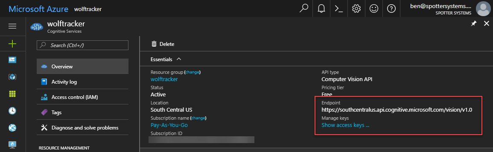

Let's go through the API layer, which is powered by Azure Functions.

# Azure Function as my API Layer

My SPA needed an API, to get all the wolves, upload wolf pictures and more.

I would normally write something like an ASP.NET Core WebAPI or Node.js. That's great and but the major problem is I have to pay for hosting. Take Azure Web Apps as an example:

- Azure Web Apps starts at $70 USD for their Basic 1 plan. Essentially I have to pay for a minimum amount of performance, even if I don't use it at all
- Azure Web Apps can scale up - but only to a point (i.e. basic can go up to 5 instances, standard level up to 10). If I outgrow basic I have to manually change it between basic & standard levels
- The auto-scaling can take time - up to 5 minutes

Azure Functions gives me endpoints that scale massively. If I get 10,000 visitors all at once, no problem! AF also gives me triggers, such as triggering on blob creation and on queue message. Plus I can make use of Azure Logic Apps to easily hook up other services. The end result is I can build something resembling a micro-service.

## Why use C# precompiled functions?

You have a choice of many languages with Azure Functions. C# precompiled functions made the most sense to me:

- It's a binary so it will load faster, from cold, and will likely execute faster that, say, something written in Node.js
- I can debug locally in Visual Studio
- I can easily publish to Azure (right click the project, Publish)
    - Note: right-click > Publish is fine for early test
- I can remotely debug my code (more info below)

Checkout the [Azure Functions Developer Guide](https://docs.microsoft.com/en-us/azure/azure-functions/functions-reference) for more info.

\[caption id="attachment\_4647" align="alignnone" width="1676"\] Visual Studio running in Debug mode, Azure Functions tools running in the background and Postman for hitting my endpoints\[/caption\]

# Creating my Azure Functions

This is pretty straightforward to do in the Azure Portal. Choose a name, location and resource group. The key things for me were:

- Select **Consumption** plan
- Create the App Insights instance. This is incredibly valuable

# My Azure Functions

You can view all the source here: [https://github.com/bcnzer/wolftrackerapi](https://github.com/bcnzer/wolftrackerapi)

I created three functions, all of which are in the same code.

1. **GetWolves**. Simple GET which returns some JSON of the latest 100 wolves - including both their thumbnail and original image
2. **UploadWolfImage**.
    - Confirms the JWT (JSON Web Token) from Auth0 is valid. Essentially this is authentication, to confirm someone is logged in
    - Uploads the picture to blob storage
    - Passed the URL of the uploaded image to Cognitive Services
    - Writes the results from Cognitive Services into table storage
    - If it is a wolf (has to be at least 60% certain) I put the image onto a queue to resize
3. **ResizeImage**. Triggers on queue messages. Uses Cognitive Services to intelligently crop the image, based on the focal point of the image

### Cognitive Services

I'm using [Cognitive Services Vision API](https://azure.microsoft.com/en-us/services/cognitive-services/computer-vision/) to analyse the image and later, for the smart cropping.

In the Azure Portal I created the Cognitive Service Vision API item. I chose the free tier, which gives me 20 calls per minute and allows me to upload 5,000 images per month. Once created I needed the URL to the vision API and a key.

I chose to store both these values in my Application Settings, to keep them out of code.

Locally that meant putting them in my `local.settings.json` file. Note that this file is only for local dev. It doesn't go in source control. By default the project, in Visual Studio, lists that file in the .gitignore.



### Azure Table Storage

I'm using Azure Table Storage as my data store. It's a fast. cheap NoSQL store.

I write an entry in the following conditions:

- When an image is intially uploaded
- If an image is a wolf but needs to be resized
- Once the image is resized

# Deploying my API

There are two ways to do it.

## Method 1: Publish from Visual Studio

You can right click your project and select **Publish**. Follow the prompts to select your Azure Function account. Very easy and quick.

## Method 2: CI/CD Pipeline in VSTS

I remember someone one told me "friends don't let friends use right-click Publish".

In my opinion, once you're past that initial development phase I highly recommend you setup a CI/CD pipeline. It's relatively easy and the VSTS / Azure Portal teams keep making it easier.

I strongly suggest you make use of the slots in Azure Functions. That allows you to deploy to a test/staging slot and, if that's all good, you can then simply swap what's in production.

In the CORS list below you'll see https://wolftrackerfrontend-test.azurewebsites.net. The `-test` indicates it's the test slot.

I was going to write a blog post about it but this following video covers it: [https://channel9.msdn.com/Events/Connect/2017/T183](https://channel9.msdn.com/Events/Connect/2017/T183)

# CORS

You can specify your allowed origins easily in Azure Functions. Once you open the function you will see **CORS Rules**.

My application came with a bunch of origins pre-defined. I added one for localhost (for development purposes) and the others for the URLs are my front end.

# Cold Start Considerations

Be aware that, once you use Azure Functions in a consumption plan, you have the issue of cold starts (takes time to load from cold).

I've written a blog purely on this topic: [Strategies for Improving / Eliminating Azure Functions Cold Starts](http://liftcodeplay.com/2017/12/19/strategies-for-improving-eliminating-azure-functions-cold-starts/)

# Debugging

There are several options available to you.

## Built-in Logging

In your sample code you'll likely notice there is some log statements. That writes to the built-in logging. Just like any logging you can write info, error and more info.

This is a great start for debugging but I found this screen is slow in updating. Much better to use Application Insights!

## Application Insights & Live Metrics Stream

Application Insights provides lots of great information about your Azure Function.

Go into Application Insights for your function and click Live Stream.

When I was developing I usually kept this window open. It updated pretty much in real-time.

\[caption id="attachment\_4659" align="alignnone" width="1595"\] The log info shows up on the right, under the Sample Telemetry heading\[/caption\]

## Remote debugging

During development I had a dreaded production-only bug. I managed to fix it by enabling the remote debug

- In the Azure Portal, Azure Function settings, enable **Remote Debugging**

- Deploy a **debug** version of your function
- Open Cloud Explorer in Visual Studio
- Select your Azure Function instance
- Click Attach Debugger

**BE CAREFUL!** This work but:

- it's slow to start
- slow to step through
- prevents other people from using the API while you're debugging

# That's it!

I hope you enjoyed this blog post series.
