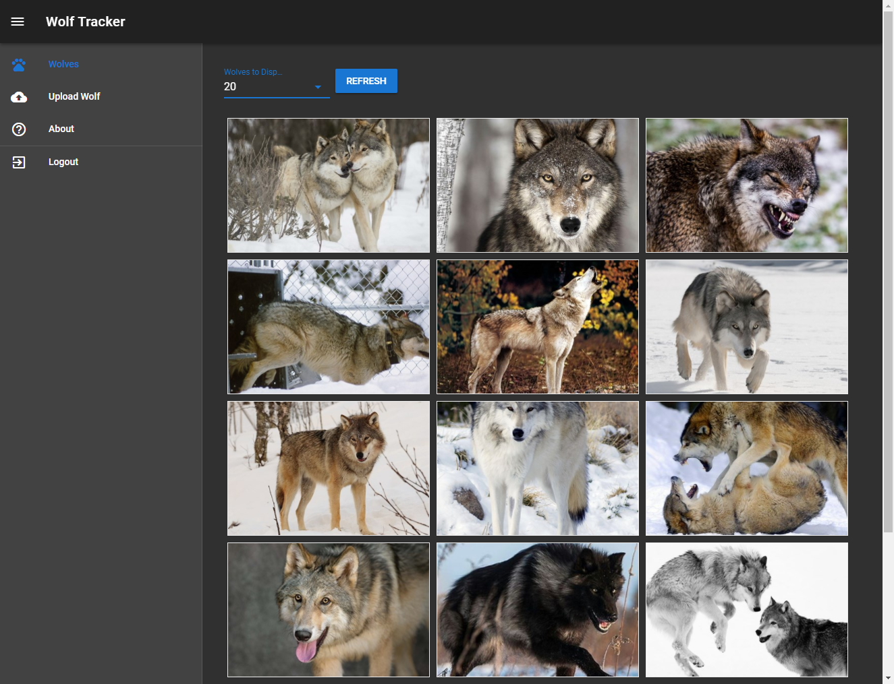

Let me show you how I built a Vue.js Single Page Application (SPA) using:

- Azure Functions proxy hooked up to blob storage - to host my app
- Azure Functions API backend
- Vuetify.js for a Material Design look & feel
- Cloudflare for DNS, CDN, HTTPS (and to enforce HTTPS)
- Auth0 for authentication
- Cognitive Services (Vision API) for artificial intelligence

In other words: how I built and hosted a secure, highly scalable site for very little cost (pretty much free).

Also include in this blog post is source code for everything.

# Wolf Tracker

## (Fictional) Purpose

I live in New Zealand (NZ). We don't have wolves. What if someone claimed they saw one? I reckon they should take a picture and send it for confirmation.

But how I can make sure it's actually a wolf? I can't be bothered to check every image. I'll use some artificial intelligence to do that.

If it is a wolf I'll add it to my database of wolves but I'm worried this may be crazy-popular so I'm keen for this to be massively scalable, fast and yet secure.

## Try it now!

[https://wolftracker.nz](https://wolftracker.nz)

\[caption id="attachment\_4603" align="aligncenter" width="1325"\] **Try it now** at [https://wolftracker.nz](https://wolftracker.nz)\[/caption\]

Alternatively you can checkout the following video demonstration

\[youtube https://www.youtube.com/watch?v=xjzLGmILedg&w=560&h=315\]

## How Does it Work?

- **User browses to https://wolftracker.nz**
    - Cloudflare handles DNS and CDN
    - Request is then sent to Azure Function proxy
    - Proxy serves up the SPA content from blob storage
- **Anyone can view the gallery of wolf images**.
    - Don't need to be logged in
    - An Azure Function HTTP endpoint is used to GetWolves
    - I only pull the 100 latest images (couldn't be bothered setting up pagination)
- **Must be logged in to load an image**
    - Login is done using the Auth0 hosted pages
- **Upload images are checked using AI**
    - Using Cognitive Services Vision API. Takes a few seconds to analyse an image
    - An Azure Function handles upload and calling Cognitive Services
    - Are they a wolf? I only accept images with a 60% certainty
    - Is it Adult (i.e. violent) or Racy (i.e. Victoria Secret's lingerie model)? I don't want naughty images uploaded
- **Display the results of the analysis**
    - I tell you if it is / is not a wolf
    - If it's a wolf I tell you the % confidence
    - I display a sentence that describes the image (i.e. a wolf in a field)
- **If it's a wolf I crop the image**
    - I put the image URL onto a queue
    - Azure Function queue triggers uses Cognitive Services Smart Cropping
- **Once cropped, thumbnail and original are available for view**
    - Blob storage holds original and thumbnail images
    - Table Storage used for storing data about the images. It's fast & cheap

## Technology Stack Overview

Development tools, all of which are free:

- [Visual Studio Code](https://code.visualstudio.com/) with the [Vetur](https://marketplace.visualstudio.com/items?itemName=octref.vetur) add-on installed. This was used for all my SPA dev
- [Visual Studio 2017 Community Edition](https://www.visualstudio.com/downloads/). Make sure to have the latest version, with the latest Azure Functions add-in. I used this for writing, testing and debugging my API written with Azure Functions
- [Postman](https://www.getpostman.com/) for API testing
- [Visual Studio Team Services](https://www.visualstudio.com/team-services/). I used it for:
    - Source control (git)
    - Task management (my to-do list)
    - Continuous Integration (CI) and Continuous Deployment (CD)
- [Azure Storage Explorer](https://azure.microsoft.com/en-us/features/storage-explorer/). Used to explore and manage my blobs, tables, queues
- [Azure Functions proxies](https://docs.microsoft.com/en-us/azure/azure-functions/functions-proxies) to create a mock API

Client side:

- [Vue.js](https://vuejs.org/) - probably my favourite
- [Vue CLI](https://vuejs.org/v2/guide/installation.html) - primarily used to setup my new project (from a template)
- [Vuetify.js](https://vuetifyjs.com/) - Material Design Component Framework. I started my app from a started template

Back-end, these are all the services I used. They are free or very cheap

- [Azure Functions](https://azure.microsoft.com/en-us/services/functions/) aka serverless compute. Using several bits and pieces here
- [Azure Storage](https://azure.microsoft.com/en-us/services/storage/). Specifically, blob storage to host my SPA and queues as part of my Azure Function API
- [Cognitive Services](https://azure.microsoft.com/en-us/services/cognitive-services/), specifically the vision API
- [Cloudflare](https://www.cloudflare.com/) to provide DNS, HTTPS (mandatory) and CDN for my front end
- [Auth0](https://auth0.com/) for authentication. Users must login with their GitHub, Twitter or Google account in order to upload an image

# Blog Posts

I've broken up all the information in to three key blog posts

[Part 1: Vue.js Front End](http://liftcodeplay.com/2017/12/20/wolf-tracker-part-1-vue-js-front-end/)

[Part 2: Distributing the SPA](http://liftcodeplay.com/2017/12/20/wolf-tracker-part-2-distributing-the-spa/)

[Part 3: Azure Function Backend](http://liftcodeplay.com/2017/12/20/wolf-tracker-part-3-azure-function-backend/)

# Source

Vue.js SPA [https://github.com/bcnzer/wolftracker](https://github.com/bcnzer/wolftracker)

Azure Functions API [https://github.com/bcnzer/wolftrackerapi](https://github.com/bcnzer/wolftrackerapi)

 

# Credits

The Wolf Tracker logo image was [Designed by Freepik](http://www.freepik.com)
