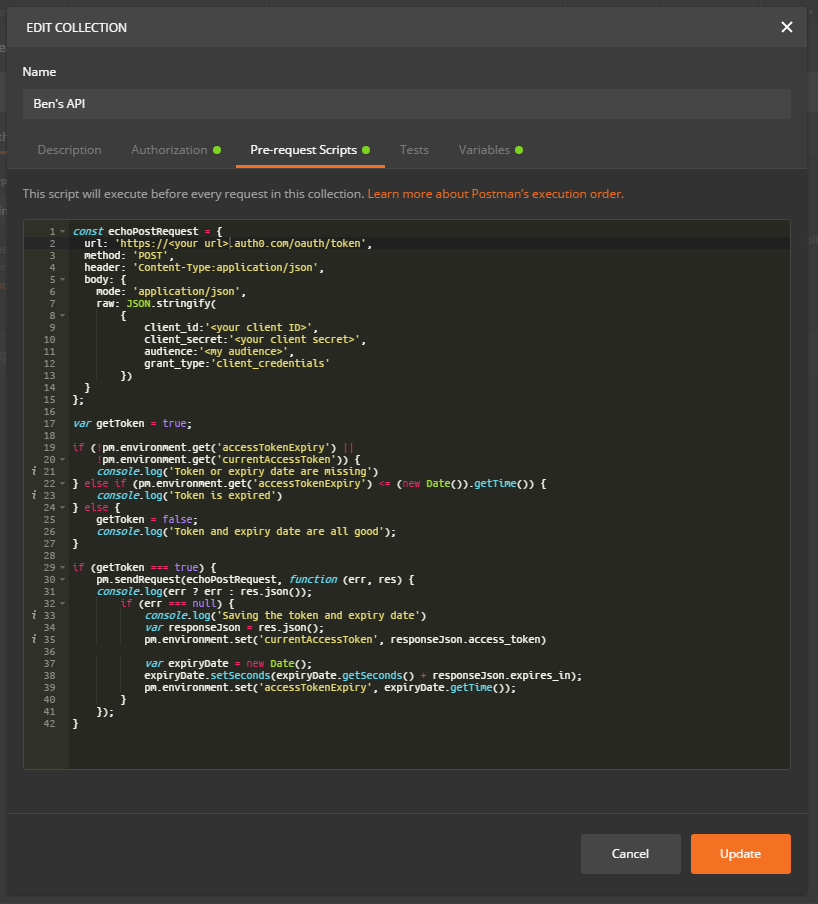

I love using Postman but it is a pain having to remember to enter a valid Bearer Token. The following is a Javascript pre-request I've used to automate the process.

# Background

I'm using [Auth0](https://auth0.com/) for auth. My app consists of a Vue.js SPA and a .NET Core API.

Pretty much every endpoint in my API requires authentication. As I write each endpoint in my API I'm writing a Postman request so I can test it.

I have a Postman request to Auth0 to request a token.

To date I've been manually entering that token whenever I wanted to use an API endpoint. As you can imagine, this isn't effective.

**I just want my requests to** **always** **use a valid bearer token!**

## Step 1 - Create some variables

We to create two variables:

1. Current bearer token
2. Expiry date of the above token

You need to think about the scope of the variables. They can be anywhere from a global (across any test you've got) to the individual test. [Checkout this article](https://www.getpostman.com/docs/v6/postman/environments_and_globals/variables) about scope in Postman.

I'm choosing to create my variables relative to the **collection**.

- Went to Ben's API
- Clicked the three dots to open the menu
- Clicked **Edit**
- Let's jump straight into the **Variables** tab and create our two variables which I've called **currentAccessToken** and **accessTokenExpiry**

## Step 2 - the Pre-request Script

I went into **Pre-request Scripts** and wrote a script that does one of three things:

- If the token or expiry date is missing I get a fresh token and set the value
- If both variables are set but the expiry date is in the past I get a fresh token
- If there is a token AND it's valid (it's only good for 24 hours) then do nothing

Here's the code



A few things to note:

- I put some console.log statements as Postman has a console and logging is always a good thing
- I did put all my secrets in this script. I'm not crazy about that but Postman doesn't have a solution for secrets management. I'm going to try and use a test account in Auth0 to mitigate any issues
- You cannot call another Postman request from a script. That would have been really useful so instead I ended up writing this
- You could should write some Tests under the test tab to confirm the token is set, it's valid, etc. I haven't yet got around to that

## Step 3 - Authorization Setup

In the **Authorization** tab I set the

- **Type** to **Bearer Token**
- Token to **{{currentAccessToken}}**. This is the token we created and set via the pre-request script

## Step 4 - Use the token!

For all your API requests do the following

- Go into the **Authorization** tab
- Under **Type** select **Inherit auth from parent**

You're done!

## But wait there's more - Console and View the variables

In the top right-hand corner there is an **eye** icon. If you click it you can see the current state of all your variables. You can also click **Edit** and change the contents.

In the bottom-left corner is a console from which you can view all the logs you've written. I found it useful for debugging.

You can also use it to confirm that the pre-request script runs before each of your individual tests in your collection.

