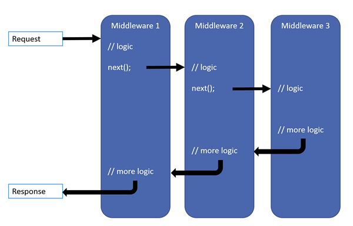

Creating middleware in ASP.NET Core is surprisingly straightforward. Let me show you how I created a custom middleware to get a value from the header of my API requests, which I later used in an authorization policy.

\[caption id="attachment\_4695" align="aligncenter" width="990"\] Art by [Jacob Rozalski](https://jakubrozalski.artstation.com/projects)\[/caption\]

# Background

I'm building an API using to manage events. We only want authenticated users to access events that they have are authorized for.

Every request in my API has a header value of `EventId`. Trouble is I can't get the context (and therefore the header value) from my authorization policy.

## Policy-based Authorization

When a user hits an endpoint in my API I'm doing two things:

1. Ensuring the user is authenticated (ensuring their JWT is valid)
2. Confirming the user is allowed access to the event

Below are two code snippets.

In the first (below, on **line 5**) I'm using my policy (via the attribute). This will apply for all the actions in my controller.

https://gist.github.com/bcnzer/0e0b848d1b5271044dab0917f3bd9bac

In the second code snippet, below, have a look at **line 12**. This is where I'm passing in the event ID using dependency injection. I need to know the event ID here so I can check that the user has access.

BTW, the following is a rough outline of my permission handler. Note that I'm using [Auth0](https://auth0.com/) for all my auth.

https://gist.github.com/bcnzer/094aa6b45c199d5ed17e1519dddf42e2

If you want to understand how this works in more detail checkout [Policy Based Authorization in ASP.NET Core](https://docs.microsoft.com/en-us/aspnet/core/security/authorization/policies).

# What's Middleware?

When a request hits your API it goes through a series of middleware (steps) defined in the `Configure` method in **Startup.cs**.

Have a look at the picture below. Imagine what I'm doing is creating  **Middleware 3** so that, during the flow of the request, I can grab and store that header value.

\[caption id="attachment\_4696" align="alignnone" width="600"\] Sample middleware flow. Picture from [docs.microsoft.com](https://docs.microsoft.com/en-us/aspnet/core/fundamentals/middleware/index?tabs=aspnetcore2x).\[/caption\]

Take a look at my `Configure` method. You'll see there's 7 pieces of middleware. They go through the precise order you see below - with my middleware being the final one at line 28.

https://gist.github.com/bcnzer/b499a89eaeb1368de5f71540f94814cb

If you'd like to read more about middleware [checkout the article from docs.microsoft.com](https://docs.microsoft.com/en-us/aspnet/core/fundamentals/middleware/?tabs=aspnetcore2x). Michał Dudak also has a [good (but long) post](https://blog.dudak.me/2014/custom-middleware-with-dependency-injection-in-asp-net-core/) that explains it all in detail. My goal is to show you more succinctly.

# The Custom Middleware

## Storing the Event Id

I need to store the ID from my middleware. In a nutshell: I created a simple POCO to store the event ID and stored it as a scoped variable using DI.

Here is the interface and the implementation. For brevity I put them in the same file.

https://gist.github.com/bcnzer/d3deeb73ad7c8bef16d28ee12e996ab8

Here's my complete Startup.cs file. Checkout **line 15** where I added the value as a Scoped variable. Note: scoped means the lifetime is that of the request.

https://gist.github.com/bcnzer/cb28db8fa518535bd87137de8c979aba

## Middleware

Here's my middleware. A few things to note:

- I'm using dependency injection (DI) to store & use the **RequestDelegate** (line 12)
- The **Invoke** method has the event ID object injected at line 17
- The event ID is being set on **line 21**

https://gist.github.com/bcnzer/410f8b94b8635156a854690deddf5a75

**That's it - we're done!** this point I can go into my Configure method and call it using `app.UseMiddleware<StoreEventIdMiddleware>();`

You can see how I'm doing that of **line 103** in my Startup.cs (above).

## But wait - there's more!

Other pieces of middleware have nice methods to invoke/use it. For example: Swagger has `app.UseSwagger();`

You can create a static wrapper method and give it a nice name, like this below.

https://gist.github.com/bcnzer/791e684f291fa680ef929ad67eed8ebc

I could now replace **app.UseMiddleware<StoreEventIdMiddleware>()** in startup.cs with **app.UseStoreEventId()**.

# Done!

By using the middleware I can get the event ID, which I can then use to confirm the user is authorized to access the content.

If you found this useful leave me a comment below!
