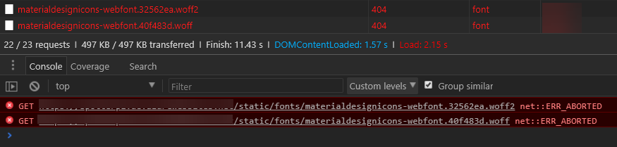

Hosting a Vue.js SPA (single page application) within a Azure Web Apps instance? Specifically, the Windows version (not the Linux container version)? Let me show you how to configure the web.config.

A web.config is required to host the content. It's for two reasons:

1. It tells IIS how to handle routing of URLs. The `vue-router` [documentation has information](https://router.vuejs.org/en/essentials/history-mode.html)
2. Your project may, like mine, may have different file types  i.e. woff and woff2 font files. The web.config can mark as known MIME types. These are lines 4 to 7 in the web.config below

\[caption id="attachment\_4705" align="aligncenter" width="875"\] The woff files will show up with a 404 status in the console, as in this picture. \[/caption\]

Below is the web.config with everyone you need to fix both cases.

https://gist.github.com/bcnzer/4cddbca5753546bd0a5f3781356f0e09
