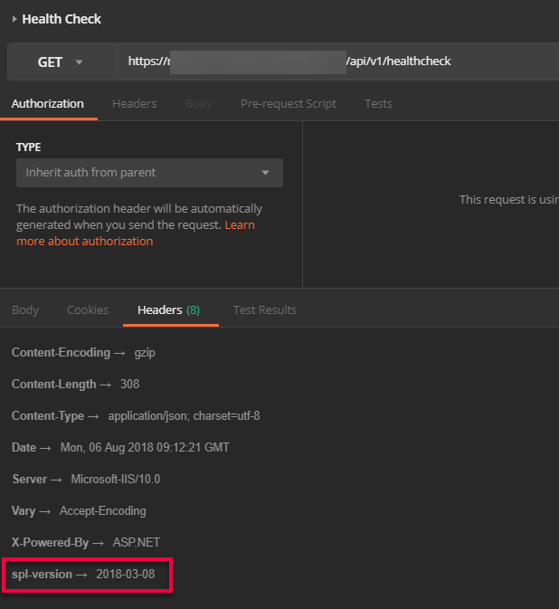

In my Azure Function project I had two problems:

1. I wanted my Azure Functions to have a path with **v1** in it
2. I wanted to always return a response header with a version identifier

Here's how I solved.

## Response Header Version Info

Let's say you want to return an API version in the response header. The response header could be something like this below.

\[caption id="attachment\_4740" align="aligncenter" width="618"\] spl-version: 2018-08-03\[/caption\]

If we were using ASP.NET Core we could write a piece of middleware to return this. With Azure Functions we don't have this full framework goodness but we do have a useful tool: Proxies.

You can edit the proxies via the web UI or locally, if you have a local project. If it's the latter you need a proxies.json file at the root of your project.

The key piece is line 10. What we're doing is setting a response override. In other words: always return this. In my case I choose to return a date. You can enter whatever you like.



## Version Number in Path

By default Azure Functions will give you a URL line this:

**https://<your name>.azurewebsites.net/api/<your endpoint>**

I wanted it to have a version number in the path. I want something like this:

**https://<your name>.azurewebsites.net/api/v1/<your endpoint>**

To do this, I need to two things:

1. Define a route. You can see it in line 6. What this is saying it "anything ending with /api/v1/" send it to the path at line 8. The value **{\*restOfPath}** is a variable
2. Line 8 has the destination. I'm saying: "take whatever was after v1 and put it here.

Note how I am using `https://localhost`. Using this means I can avoid a round trip to my destination URL.

Voila - all done!
