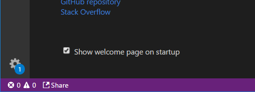
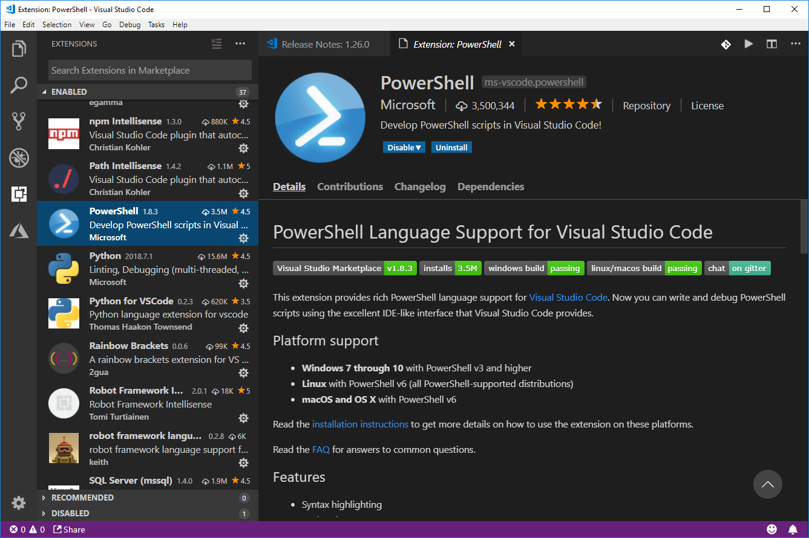
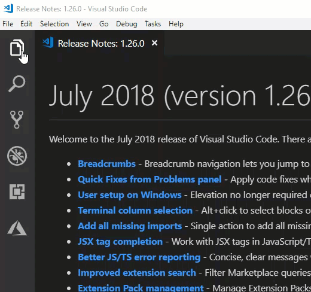
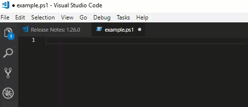
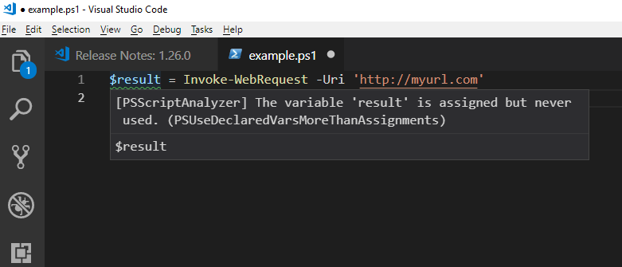
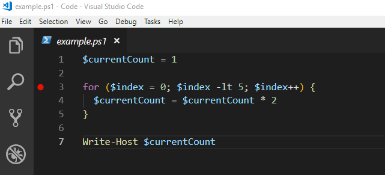
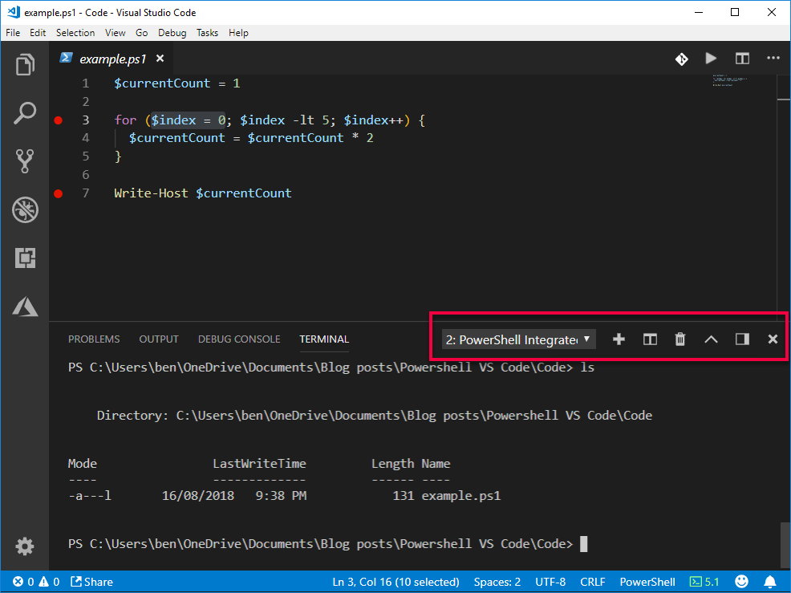

Are you familiar with Powershell but new to Visual Studio Code (aka VS Code)? Let me show you my top tips to get started.

Art by [Jakub Rozalski](https://www.artstation.com/jakubrozalski).

## Background

I find VS Code really helpful for for writing and debugging my Powershell scripts. It helps me with basic syntax, allows me to step through my code and helps me prevent some silly errors.

The following are my top tips for those familiar with Powershell but new to VS Code.

## Tip 1 - Ensure your VS Code is up to date

If you don't have Visual Studio Code, [download it here](https://code.visualstudio.com/download).

Already have it? Make sure you stay up to date. Visual Studio Code updates every month. I find it annoying to be bugged about updates.

If you see a blue 1 in the bottom left, as seen below, it's time to update. Click on the gear icon and select **Install Update...**

If you don't see that blue 1, you can click the gear icon > Check for Updates...

## Tip 2 - Install the Powershell Extension

Go here to install the [Powershell extension for VS Code](https://marketplace.visualstudio.com/items?itemName=ms-vscode.PowerShell).

You may already have it if you're already written Powershell in VS Code.

You can confirm it's installed by clicking the Extension icon on the left and scrolling down in the list.

## Tip 3 - Hiding the left-hand menus

On the left hand side of VS Code is a menu with options for Explore, Search, Source Control, Debug, Extensions and potentially more (I've got an extra Azure icon).

It's great that you can see all this info but if it bugs you, just click the button again and it'll disappear.

## Tip 4 - Opening a Folder

This feature is so useful - I use it all the time, for many different languages.

If you click on **File > Open Folder** it display the contents of the folder in the Explorer. This is a nice, easy way to access and work on a bunch of files. For example: you can open your folder with your scripts.

## Tip 5 - Snippets

Visual Studio Code can be give you a bunch of pre-created chunks (snippets) of code. Or as I like to think of it: how do I write a **foreach** loop in this language??

- Start typing the command name
- A menu should pop up with suggestions
- Scroll up / down to select the snippet. It has a small square'ish icon
- Once selected, press tab
- Bonus tip: you can press tab to go between the individual bits and pieces of the snippet. In my case below - the instance variable and the collection variable

## Tip 6 - Intellisense

What we say in Tip 4 was intellisense in action. We used it to select the snippet. Intellisense is super handy as it helps you find commands and use them properly.

- You can start typing and it should display a menu of options
- When the menu pops up select an item using **Tab** or **Enter**
- If it doesn't press **CTRL + space**

In the example below I want to use **Invoke-WebRequest**. Note how I typed Invoke-Request but gave me a suggestion.

## Tip 7 - Watch for squiggly lines

If you see a squiggly line, that's VS Code telling you of a warning or potentially of an error.

In the case below I created a variable called **$result** but I never used it anywhere. It's green as it's a warning. Red squiggly lines are errors you need to fix.

## Tip 8 - Debugging!

I wrote the script below. Initially I couldn't figure out why it wasn't working. I could put a whole bunch of Write-Host statements everywhere but that's not very effective. I wanted to step through my code, to see what certain chunks are doing, line by line.

### Debugging Terminology

- **Debugging** - we will use VS Code's debugging tools to see what exactly is going on
- **Breakpoint** - we'll tell the code to run up to a certain point - then stop! "Take a break at this point"
- **Stepping through code** - sometimes we want to see what exactly is going on, line by line, for a chunk of code. We call this _stepping_ through the code

### Code We Will Debug

The red dot is my breakpoint. You can set them by clicking to the left of the line number.

### Before you start Debugging...

Make sure you go **File** > **Open Folder**. VS Code likes to know what folder you're operating out of.

The first time you launch the debugger VS Code may ask you about some configuration for the debugger (a .json file). The defaults are all fine. You can close that; it's a one-time setup. Try restarting the debugger and you'll be fine.

### Starting the Debugger

Click **Debug > Start Debugger** or press **F5**.

### Video of me Debugging some code

Here I am stepping through my code. Here are some key take-aways:

- Once I started the debugger I opened the Debug menu. This gave me information about some of the variables:
    - **Auto** variables are whatever is relevant at your breakpoint. You can see at the start that my _$currentCount_ variable is showing up
    - **Watch** is where you can set your own variables to keep an eye on. I used it to explicitly keep track of _$currentCount_
- The debug menu at the top allows you to step into, over and out of code. **Step Over (F10)** is the most common
- After a while I just wanted to jump to the end so I
    - Set a breakpoint on line 7
    - Clicked **Continue** (F5) which ran all the way up to that next break point
- To stop debugging you can click the red square or let the script finish running

 

\[wpvideo MXZZ3iSd\]

## Tip 9 - The built-in Terminal!

VS Code allows you to have built-in terminals. No need for a separate Powershell window.  In fact, you can have MULTIPLE terminals!

To open the terminal click **View > Terminal** or **CTRL + ~**

I highly suggest you get familiar with the menu I've highlighted in red, below. From left-to-right they are:

- View your different terminals.
- Add a terminal
- Kill a terminal
- Maximize panel size
- Move to right
- Close Panel

## Have fun!

Once you have got the hang of the basics, have fun and explore. You'll be amazed how much more you can do. Make sure to checkout the wealth of extensions and add-ons.

Just remember: once you learn these basics of VS Code you're well on way to being able to use it for a variety of other languages and projects such as Javascript, Python, C#, Machine Learning, Azure Functions and more!
