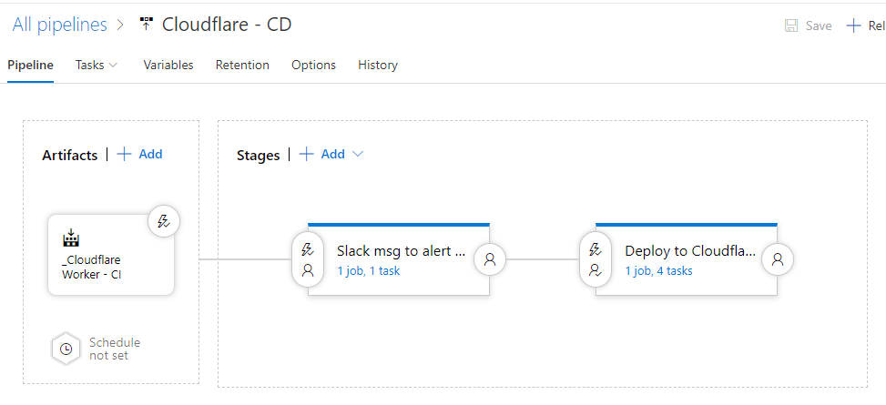

# Gather around and let me tell you a scary story

We use Cloudflare and, for one host, have a Cloudflare Worker. There's a fair bit of code in it.

I was testing a new Cloudflare worker against a different host. My code was in **Preview** mode. When I switched the the other hostname my code was... exactly... the... same... **WHAT HAPPENED TO THE EXISTING CODE**

I nervously clicked **Revert** and all the code came back. Thank goodness!

I can't let this happen again! I need this code in source control and to setup a CI/CD pipeline!

# Cloudflare Workers

A worker is a small piece of code, written in Javascript, that run when a request hits your hostname.

For example: if mycats.com was setup in Cloudflare and the Cloudflare proxy was enabled, you could modify headers, redirect the traffic - whatever you want.

[More information here](https://developers.cloudflare.com/workers/about/).

# Deploying Workers

The [Cloudflare Worker](https://developers.cloudflare.com/workers/deploying-workers/serverless/) docs suggests two methods of deploying your workers:

1. Serverless framework
2. Terraform

There is a third, unmentioned, option is the [Cloudflare API](https://api.cloudflare.com/#worker-script-properties).

I decided to go with the [Serverless framework for Cloudflare](https://github.com/serverless/serverless).

Before you jump into code, there's several key pieces of info you need from Cloudflare.

## Account Id

You can get this from the URL of your hostname. It will look something like this

`https://dash.cloudflare.com/**205080a2myfakezoneid8b75436e70c**/mycats.com`

## Zone Id

You can get this by clicking on the Overview button for your hostname

## Auth Key

This is your global API key. You get this by:

- Clicking the Profile icon in the top right
- Click **My Profile**
- Scroll down - you'll see **Global API Key**
- Click View. You'll need your password

## Email Address

You'll need the email address for your account. If you're unsure what it is you can see it by clicking the profile icon in the top right.

## Serverless Framework

I chose this as it involved YAML and looked pretty straightforward. Here's what I did

1. Created a directory
2. From the command line
    1. Go to your directory
    2. `npm install serverless -g`
    3. `serverless create --template cloudflare-workers`
    4. `npm install`

It will create a few files

- .npmignore
- helloWorld.js
- package.json
- serverless.yml

I opened the folder in Visual Studio Code and did the following

1. Entered my details in package.json (name, description, removed the license, etc)
2. Ran `git init`
3. Entered my Account ID and Zone ID in `serverless.yml`
4. Entered my worker code into the javascript file

It could look something like this

### Gotchas

There are a few issues I encountered

- You cannot enter a wildcard in the prefix of your hostname i.e. `*.mycats.com/hello/*` is fail but `mycats.com/hello/*` is ok
- You must enter at least one route. Can't have it blank or missing
- In a Cloudflare worker you can define both routes you want to enable and disable this worker for (useful if you don't want the worker to operate on, say, `mycats.com/privacy`). In the YML file you can only define the routes you **enable**

I really needed a wildcard and some routes to disable the worker. I decided to just enter those in manually, via the web UI.

I still needed to enter a value in the route so I entered a dummy route and added some logic to my Powershell script to delete it, using the Cloudflare API.

https://gist.github.com/bcnzer/98afd2635efe31ca9673fec65c4fde83

The above script is as my complete deployment script. Note that my auth key and email are NOT in the script.

You can try running the Powershell script with two parameters: the API key, then the email address.

### Storing it all in a repo

I created a new repo in Azure DevOps just for my Cloudflare workers.

I committed everything, included my Powershell script.

# Setting up an CI / CD Pipeline

## Build (aka CI)

- Created a new build
- Selected empty template
- Chose to use the **Hosted VS2017** agent. Could be whatever agent you like, including an internal one, so long as it has npm
- Added three tasks
    1. npm install
        - Command: install
        - Working folder: the folder in my repo containing the project.json
    2. Copy files
        - Contents is **\*\***
        - Targer Folder is **$(Build.ArtifactStagingDirectory)**
    3. Publish Build Artifact. All the default values
        - Path to Publish is **$(Build.ArtifactStagingDirectory)**
        - Artifact name is **drop**

## Key Vault - Optional but Highly Recommended

The API key is your **global** API key capable of changing pretty much anything in Cloudflare.

It is highly recommended that you enter your secrets into Key Vault and then reference them as variables.

Or at a very minimum, enter the values in your build process as variables marked as secrets.

## Release Step

You can run Powershell script in the build step but I chose to use a release so I can explicitly request approval before it went anywhere. I added two environments.

The first environment only sends a message to Slack, to give people a heads-up approval is required.

With the second environment I setup pre-approval as a requirement and defined who should be allowed to approve it. If you're not familiar with how to do this: click the little lighting bolt/person icon on the left hand side of the environment.

In the deployment environment I two main steps:

1. npm
    - Command: **custom**
    - Command and arguments: `install serverless -g`
        - This will install the Serverless tool. I need to do this each time as I'm using the hosted build agent. Takes about a minute
2. Powershell
    - In Script path I selected the Powershell script
    - Arguments: the API key, then the email address
        - I got the key and email address from key vault so I entered them as variables

# Wrapping Up

I won't experience this nightmare again!

- Continuous integration (CI) setup
- Continuous deployment (CD) setup with a built-in approval step and ability to easily rollback (just select a previous release and click deploy or a new release with a previous build)
- All the code is backed up and version controlled in a git repo
