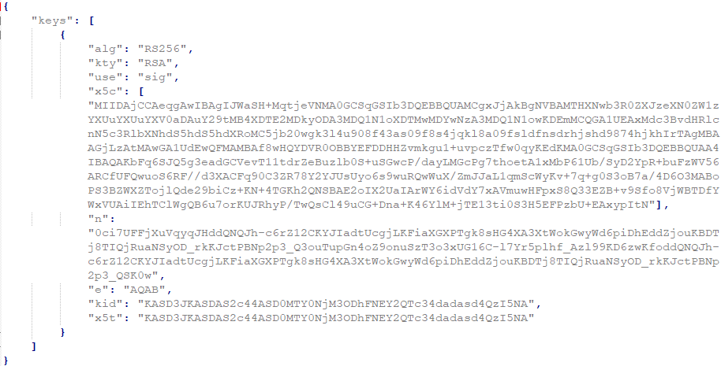
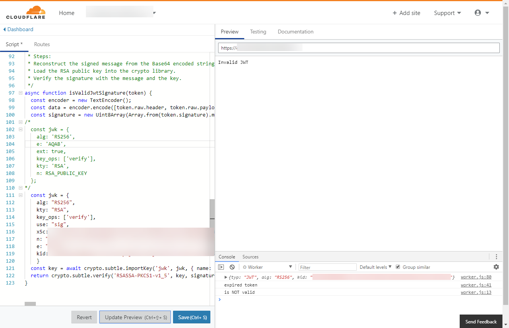
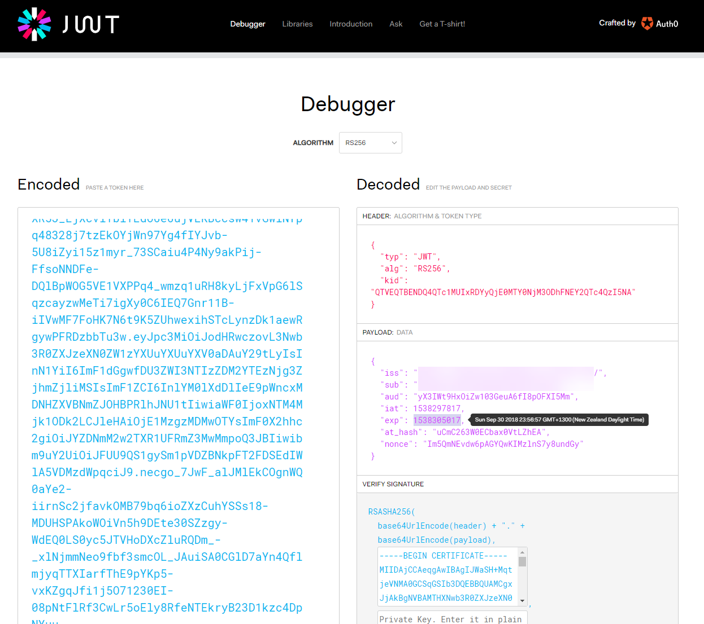

Cloudflare has an excellent blog post about a customer that uses a [Cloudflare worker to decode JWTs](https://blog.cloudflare.com/dronedeploy-and-cloudflare-workers/).

This blog post uses the code from that sample but extends it so you can use it with the JWTs from [Auth0](http://auth0.com).

# Requirements

- Cloudflare account. You can get started with a [free account](https://www.cloudflare.com/plans/)
- Purchase of a Cloudflare worker. As of this writing, they are $5 USD per month
- Your target hostname setup in Cloudflare as the DNS provider
- **NOTE**: to use the worker you will need proxying (the orange Cloudflare cloud) enabled for the hostname in the DNS tab
- A source of JWTs with which to test. I get mine from the SPA I've written (I login and grab the JWT from local storage, using Chrome dev tools)
- Your RSA public key (more on that in a mo)

## Your RSA Public Key from Auth0

In the code we will be using your public key to decrypt token. You can get this from a .pem or jwks.json file. [Information can be found here](https://community.auth0.com/t/where-is-the-auth0-public-key-to-be-used-in-jwt-io-to-verify-the-signature-of-a-rs256-token/8455) on where to find these.

What you need to do is:

- Go to **`https ://[your_domain].auth0.com/.well-known/jwks.json`**
- Download the .json file
- You want everything in the innermost curl braces - from **"alg"** down to **"x5t"**

# Code

The following is the code. The only real differences from the Cloudflare blog is:

- RSA public key info is structured differently
- I added a check to ensure the JWT is not expired

If your JWT contains authorization info, add that as well as any other standard checks or logic you'd like to avoid your API doing.

Here's the code. You need to include your public key information at the bottom.

https://gist.github.com/bcnzer/e6a7265fd368fa22ef960b17b9a76488

Once you got the code and your public key info, try it out in the Cloudflare Worker UI. Make sure to try out a variety of tokens including valid tokens, expired tokens and tokens made invalid by changing/adding a single character.

I tested initially by replacing the code that had the logic to get the bearer token with a hard-coded string that is a token.

Also feel free to add **console.log** statements to help with debugging.

## Extra for Experts

I highly recommend the website [jwt.io](https://jwt.io/). It's great for seeing the individual components of the JWT and the tooltips are handy for explaining the different items or translating tick values into a human readable date format.

You can also get a [Chrome JWT Debugger add-on](https://chrome.google.com/webstore/detail/jwt-debugger/ppmmlchacdbknfphdeafcbmklcghghmd). The same website except this tool will easily get the JWT info from your browser's local storage or cookies.

